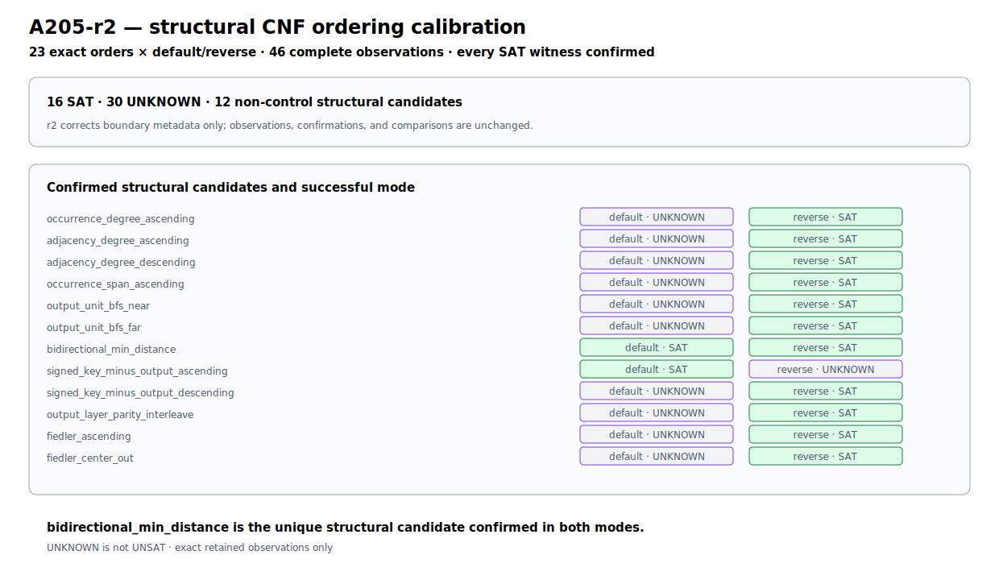
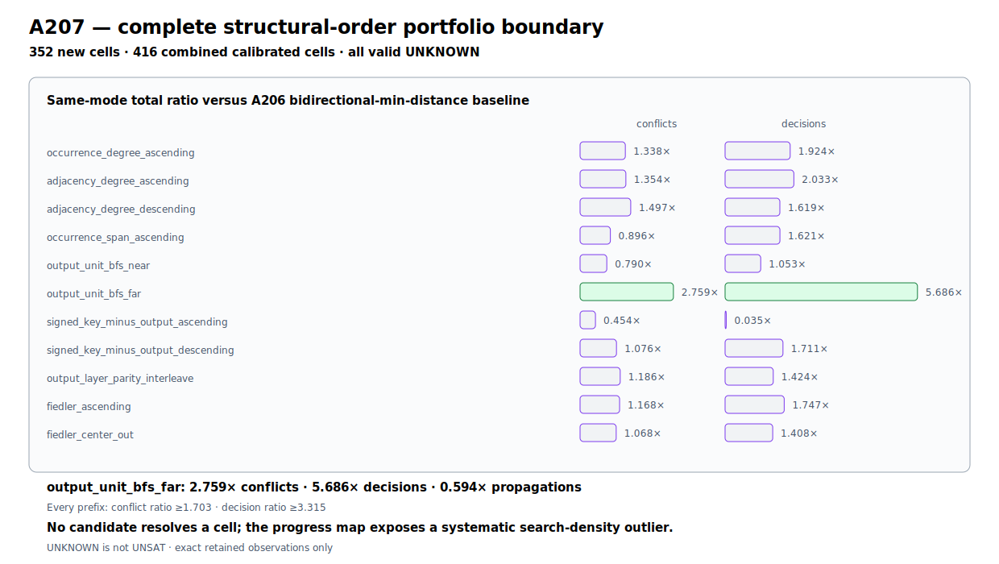

# F8-Causal

**Full-Round Distinguishers, Causal Readers, and Reproducible Cryptanalysis**

F8-Causal is David Tom Foss's executable research archive for cross-round F8,
CASI/LiveCASI, and CryptoCausal Reader analysis. It preserves the twelve
original full-round F8 configurations, the Nanjing and Rome conference
evidence, and the complete public A107--A458 chain as code, typed `.causal`
graphs, result JSON, controls, tests, and SHA-256 manifests.

Its headline recovery record is **46 verified full-round residual-key recovery
executions on a base Apple M4 Mac mini with 16 GB unified memory**: eighteen
complete-domain records across thirteen primitive families and 28
strict-subset ChaCha20-R20 executions. Every row reconstructs the complete
master key in its declared known-key model, confirms the full public relation
independently, and rejects its frozen control.

## Main results: complete full-round recovery record

### Eighteen complete-domain records

Every assignment in every declared domain was executed without early stopping.
Each factual relation returned exactly one model; each one-bit-flipped control
returned none.

| Record | Primitive / standard endpoint | Residual key | Executed domain | Factual / control | Independent confirmation |
|---|---|---:|---:|---:|---:|
| A184 | ChaCha20, 20 rounds + feed-forward | 40 / 216 bits | `2^40` complete | 1 / 0 | 512 bits |
| A237 | Speck32/64, 22 rounds | 42 / 22 bits | `2^42` complete | 1 / 0 | 96 bits |
| A240 | Threefish-256, 72 rounds | 38 / 218 bits | `2^38` complete | 1 / 0 | 256 bits |
| A244 | Speck64/128, 27 rounds | 44 / 84 bits | `2^44` complete | 1 / 0 | 128 bits |
| A246 | SIMON64/128, 44 rounds | 43 / 85 bits | `2^43` complete | 1 / 0 | 128 bits |
| A248 | RC5-32/12/16, 12 rounds | 40 / 88 bits | `2^40` complete | 1 / 0 | 128 bits |
| A253 | PRESENT-80, 31 rounds | 38 / 42 bits | `2^38` complete | 1 / 0 | 128 bits |
| A256 | Ascon-AEAD128, complete 12/8/12 operation | 40 / 88 bits | `2^40` complete | 1 / 0 | 384 bits |
| AES-W41 | AES-128, 10 rounds | 41 / 87 bits | `2^41` complete | 1 / 0 | 256 bits |
| A264 | Salsa20/20, 20 rounds + feed-forward | 42 / 214 bits | `2^42` complete | 1 / 0 | 512 bits |
| P128R1 | PRESENT-128, 31 rounds + K32 whitening | 38 / 90 bits | `2^38` complete | 1 / 0 | 128 bits |
| AES256R1 | AES-256, 14 FIPS 197 rounds | 41 / 215 bits | `2^41` complete | 1 / 0 | 256 bits |
| CHACHA20KR43 | ChaCha20, 20 rounds + feed-forward | 43 / 213 bits | `2^43` complete | 1 / 0 | 8,192 bits |
| B3KR1 | keyed BLAKE3, all 7 standard rounds | 43 / 213 bits | `2^43` complete | 1 / 0 | 256 bits + official `b3sum` confirmation |
| SIPKR1 | SipHash-2-4, complete 2/4 operation | 43 / 85 bits | `2^43` complete | 1 / 0 | 128 bits |
| TEAKR1 | TEA, 32 cycles / 64 Feistel updates | 43 / 85 bits | `2^43` complete | 1 / 0 | 128 bits |
| XTEAKR1 | XTEA, 32 cycles / 64 Feistel updates | 43 / 85 bits | `2^43` complete | 1 / 0 | 128 bits |
| TF1024KR1 | Threefish-1024, 80 rounds + final subkey | 39 / 985 bits | `2^39` complete | 1 / 0 | 2,048 cross-implementation bits |

### Twenty-eight strict-subset ChaCha20-R20 executions

All rows execute the standard 20 rounds plus feed-forward against eight public
output blocks unless noted. Their schedules were frozen before candidate
execution under the declared information boundary; target-blind,
zero-refit-transfer, and prospectively public-output-conditioned protocols are
labeled in their artifacts. Every execution remains below its full residual
domain. A281 and the four A286 targets use post-model one-bit control rejection
(`O0`); A294--A374 run the same grouped candidate search against the control
and accept zero control candidates (`S0`).

| Record / target | Residual key | Frozen discovery point | Executed assignments | Recovered / control accepted | Confirmation |
|---|---:|---:|---:|---:|---:|
| A281 | 20 / 236 bits | rank 37 / 256 | 151,552 / 1,048,576 | 1 / 0 | 4,096 bits |
| A286/t01 | 20 / 236 bits | fallback, rank 254 | strict subset | 1 / 0 | 4,096 bits |
| A286/t02 | 20 / 236 bits | top-128, rank 55 | strict subset | 1 / 0 | 4,096 bits |
| A286/t03 | 20 / 236 bits | top-128, rank 107 | strict subset | 1 / 0 | 4,096 bits |
| A286/t04 | 20 / 236 bits | global retained solve | strict subset | 1 / 0 | 4,096 bits |
| A294 | 24 / 232 bits | rank 202 / 4,096 | 827,392 / 16,777,216 | 1 / 0 | 8,192 bits |
| A295 | 24 / 232 bits | rank 2,605 / 4,096 | 10,670,080 / 16,777,216 | 1 / 0 | 8,192 bits |
| A296/w24_t00 | 24 / 232 bits | rank 2,750 / 4,096 | 11,264,000 / 16,777,216 | 1 / 0 | 8,192 bits |
| A296/w24_t01 | 24 / 232 bits | rank 2,948 / 4,096 | 12,075,008 / 16,777,216 | 1 / 0 | 8,192 bits |
| A296/w24_t02 | 24 / 232 bits | rank 1,485 / 4,096 | 6,082,560 / 16,777,216 | 1 / 0 | 8,192 bits |
| A296/w24_t03 | 24 / 232 bits | rank 213 / 4,096 | 872,448 / 16,777,216 | 1 / 0 | 8,192 bits |
| A296/w28_t00 | 28 / 228 bits | rank 1,144 / 4,096 | 74,973,184 / 268,435,456 | 1 / 0 | 8,192 bits |
| A296/w28_t01 | 28 / 228 bits | rank 2,113 / 4,096 | 138,477,568 / 268,435,456 | 1 / 0 | 8,192 bits |
| A296/w28_t02 | 28 / 228 bits | rank 520 / 4,096 | 34,078,720 / 268,435,456 | 1 / 0 | 8,192 bits |
| A296/w28_t03 | 28 / 228 bits | rank 3,019 / 4,096 | 197,853,184 / 268,435,456 | 1 / 0 | 8,192 bits |
| A297/w32_t00 | 32 / 224 bits | rank 2,867 / 4,096 | 3,006,267,392 / 4,294,967,296 | 1 / 0 | 8,192 bits |
| A297/w32_t01 | 32 / 224 bits | rank 2,032 / 4,096 | 2,130,706,432 / 4,294,967,296 | 1 / 0 | 8,192 bits |
| A297/w32_t02 | 32 / 224 bits | rank 926 / 4,096 | 970,981,376 / 4,294,967,296 | 1 / 0 | 8,192 bits |
| A297/w32_t03 | 32 / 224 bits | rank 3,932 / 4,096 | 4,123,000,832 / 4,294,967,296 | 1 / 0 | 8,192 bits |
| A303 | 32 / 224 bits | rank 3,801 / 4,096 | 3,985,637,376 / 4,294,967,296 | 1 / 0 | 8,192 bits |
| A302/A304 | 43 / 213 bits | rank 2,473 / 4,096 | 5,310,727,061,504 / 8,796,093,022,208 | 1 / 0 | 8,192 bits |
| A305 | 43 / 213 bits | rank 2,114 / 4,096 | 4,539,780,431,872 / 8,796,093,022,208 | 1 / 0 | 8,192 bits |
| A309 | 43 / 213 bits | rank 4,044 / 4,096 | 8,684,423,872,512 / 8,796,093,022,208 | 1 / 0 | 8,192 bits |
| A313 | 44 / 212 bits | rank 2,753 / 4,096 | 11,824,044,965,888 / 17,592,186,044,416 | 1 / 0 | 8,192 bits |
| A322 | 45 / 211 bits | rank 1,459 / 4,096 | 12,532,714,569,728 / 35,184,372,088,832 | 1 / 0 | 8,192 bits |
| A325 | 46 / 210 bits | rank 77 / 4,096 | 1,322,849,927,168 / 70,368,744,177,664 | 1 / 0 | 8,192 bits |
| A350 | 46 / 210 bits | rank 445 / 4,096 | 7,645,041,786,880 / 70,368,744,177,664 | 1 / 0 | 8,192 bits |
| A374 | 48 / 208 bits | rank 102 / 4,096 | 7,009,386,627,072 / 281,474,976,710,656 | 1 / 0 | 8,192 bits |

The compact verification package, exact per-record mapping, and immutable
reconstruction gate are published in
[`DT-Foss/fullround-key-recovery`](https://github.com/DT-Foss/fullround-key-recovery).
The originating reports and artifacts remain hash-pinned in this repository.
The exhaustive [recovery completeness audit](docs/FULLROUND_RECOVERY_COMPLETENESS_AUDIT.md)
also inventories the earlier A178--A183 breadth ladder, alternate target-blind
solver recoveries, exact same-target implementation replays, and post-barrier
label executions without mixing those evidence classes into the 46-record
headline frontier.

## A326--A458: complete W52 Reader frontier

The current frontier compiles target-blind execution geometry for the complete
`2^52` residual domain. A456 and A458 each evaluate every registered schedule
and emit a complete permutation of all 16,777,216 W52 pair cells.

| Result | Schedule census | Selected schedule | Remaining-96 aggregate gain | Minimum block gain | Pair-stream SHA-256 |
|---|---:|---|---:|---:|---|
| A456 | 878 schedules / 86 cyclic orbits | `BOOOOOOHHHHHH` | `0.489437610231` bit | `0.176347721941` bit | `9a3af1cfb71f96d186815086170127cd5340e7ac102a5fe9dc65414c14df7352` |
| A458 | 405 paired B1/B0 schedules / 18 cyclic orbits | `OOOOOOOOHHHHHHHHHHHHHHHBOOOOOOO` | `0.495787645250` bit | `0.205050504927` bit | `5220aa319ab75f7e5e77717802f248512ecdb04531a5d660ac48302f428a1138` |

Both schedules have positive gain on all eight fixed blocks, zero W52 labels,
zero refits, zero candidate assignments, and exact component bounds over the
entire pair domain. A455 and A457 are the hash-frozen eight-worker recovery
executors with production disabled. The public release contains no live worker
state or recovery outcome.

- [A326--A458 release record](docs/RELEASE_A326_A458_FRONTIER.md)
- [One-command frontier verifier](scripts/verify_a326_a458_frontier.py)
- [935-file SHA-256 manifest](research/results/v1/A326_A458_FRONTIER_SHA256SUMS)
- [A456 result](research/results/v1/chacha20_round20_w52_no_refit_frequency_ray_portfolio_a456_v1.json) and [AI-native Causal graph](research/results/v1/chacha20_round20_w52_no_refit_frequency_ray_portfolio_a456_v1.causal)
- [A458 result](research/results/v1/chacha20_round20_w52_no_refit_frequency_ray_extension_a458_v1.json) and [AI-native Causal graph](research/results/v1/chacha20_round20_w52_no_refit_frequency_ray_extension_a458_v1.causal)
- [Integrity-checking Causal Reader](src/arx_carry_leak/_dotcausal/io.py) and [repository-wide Reader gate](scripts/validate_causal_artifacts.py)

The wider archive contains full-round, exactly checkable relations spanning
block ciphers, hash compression functions, stream-cipher permutations, and
Keccak-f[1600]. It uses four precise result classes: distinguishers separate a
registered relation from its controls; Readers execute relations stored in
audited `.causal` graphs; state reconstruction recovers declared internal
coordinates; and key recovery is used only when a residual key is actually
recovered.


## Complete A107--A458 result landscape

| Evidence | Primitive / endpoint | Full-round result | Attack model and known variables | Recovered object | Primary evidence |
|---|---|---|---|---|---|
| Original anchors | Speck, Threefish, GIFT, PRESENT, TEA, RC5 | 12 full-round F8 configurations across four mechanisms | Known-key internal `state(R)` / `state(R+1)`, matched inputs | Cross-round distinguisher cells | [anchor suite](provenance/fullround_anchors/f8/README.md), [audit](research/reports/SESSION_FULLROUND_IMPORT_AUDIT_V1.md) |
| A107--A109 | PRESENT-128 R31→R32 | Seven-cell exact population support; all five confirmation keys beat every BvN route | Known key, matched plaintext, adjacent internal boundary | Exact F8 support and MI | [report](research/reports/FULLROUND_CAUSAL_PRESENT128_V1.md) |
| A110--A112 | SHA-256 / SHA-512 compression | Exact same-lane feed-forward relation after 64/80 steps and full carry spectrum | Compression input/chaining state known | Eight post-round words; exact carry classes | [report](research/reports/FULLROUND_CAUSAL_SHA2_FEEDFORWARD_V1.md) |
| A113--A114 | FEAL-32X R30→R32 | Reader reconstructs 40,000/40,000 complete 32-bit state halves | Known two-byte round subkey and cross-round left-half difference | R30 right half | [report](research/reports/FULLROUND_CAUSAL_FEAL32X_V1.md) |
| A115 | SHACAL-2 R63→R64 | Shared-`T1` cancellation reconstructs 40,000/40,000 complete words | Known key; internal full-round endpoint | `d63` word | [report](research/reports/FULLROUND_CAUSAL_SHACAL2_V1.md) |
| A116 | SPARKLE-256/384/512 | Exact endpoint projection plus complete-basis linear-order proofs | Public permutation; final state | Pre-final-step left half and full-step inverse state | [report](research/reports/FULLSTEP_CAUSAL_SPARKLE_V1.md) |
| A117--A118 | BLAKE3 compression | Full 64-byte output plus known CV reconstructs all 512 post-round bits; exact coupled-borrow spectrum | Complete compression output and input CV | Post-round compression state | [report](research/reports/FULLCOMPRESSION_CAUSAL_BLAKE3_V1.md) |
| A119--A120 | ChaCha20 block | Public inputs reconstruct eight core lanes; known key reconstructs all sixteen; exact conditional carry spectrum | Standard block output plus constants/counter/nonce; key only for key lanes | Post-round-20 core | [report](research/reports/FULLROUND_CAUSAL_CHACHA20_FEEDFORWARD_V1.md) |
| A121 | SHAKE128 / SHAKE256 | Complete first squeeze block reconstructs every post-permutation rate lane | Public output block | 1,520,000 exact 64-bit lanes over confirmations | [report](research/reports/FULLROUND_CAUSAL_SHAKE_RATE_V1.md) |
| A122 | SHAKE next-block Jacobians | Ten capacity-to-rate Boolean Jacobians have full rank 256/512 | Fixed first-squeeze base; single capacity-bit intervention | Intervention coordinate | [report](research/reports/FULLROUND_CAUSAL_SHAKE_CAPACITY_JACOBIAN_V1.md) |
| A123--A127 | SHAKE consecutive-block windows | Unique exact 8--32-coordinate consistency through all 24 Keccak rounds | Complete first state except declared capacity window; next rate block | Window assignment; 8,589,934,592 candidates at 32 bits | [report](research/reports/FULLROUND_CAUSAL_SHAKE_NATIVE_WINDOW_V1.md) |
| A128--A129 | SHAKE Boolean constraints and prefix frontier | Exact CNF reconstruction at 4/8/12 coordinates; R3 collapse of single-coordinate branch certificates; 32 output bits uniquely identify both tested 16-bit windows | Known first-squeeze-state complement; A128 complete next-rate constraints; A129 one deterministic `2^16` window per variant | Exact assignment and mechanistic solver/observability boundaries | [report](research/reports/FULLROUND_CAUSAL_SHAKE_SOLVER_FRONTIER_V1.md) |
| A130 | SHAKE affine-hull prefix distinguisher/Reader | Exact 128-coordinate GF(2) hull membership leaves only the actual 10-bit prefix in both variants | Known first-squeeze-state complement; one complete 16-bit window truth space per variant; 128 next-rate coordinates | Exact 10-bit window prefix | [report](research/reports/FULLROUND_CAUSAL_SHAKE_AFFINE_HULL_V1.md) |
| A131 | SHAKE algebraic-degree frontier | Restricted coordinate ANFs reach full degree 16 and random-like density at R5, remaining saturated through R24 | Known first-squeeze-state complement; one complete 16-bit window truth space per variant; first 128 rate coordinates | Exact round-localized ANF degree and density | [report](research/reports/FULLROUND_CAUSAL_SHAKE_ALGEBRAIC_DEGREE_V1.md) |
| A132 | SHAKE Boolean-influence frontier | R3 is nearly all-to-all; measured R4, R5, and R24 are completely coupled and influence-balanced in all six exhaustive trials | Known first-squeeze-state complement; three complete 16-bit windows per variant; all 1,600 state coordinates | Exact round-localized 16x1,600 influence matrices | [report](research/reports/FULLROUND_CAUSAL_SHAKE_BOOLEAN_INFLUENCE_V1.md) |
| A133 | SHAKE shared-ANF compression | Formula-space transform yields 20.44x/19.84x R3 advantage over best raw compression; disk Reader reconstructs 419.43M truth values | Known state complement; complete `2^16 x 1,600` restricted truth spaces | Exact shared formula dictionary and coefficient matrix | [report](research/reports/FULLROUND_CAUSAL_SHAKE_ANF_COMPRESSION_V1.md) |
| A134 | SHAKE direct symbolic R2 | Complete 256-/512-coordinate capacity interfaces compile exactly without truth-table materialization | Known starting-state complement and Keccak round equations | All 1,600 exact R2 coordinate formulas | [report](research/reports/SHAKE_SYMBOLIC_R2_ANF_FRONTIER_V1.md) |
| A135 | SHAKE native-XOR full-round Reader | Exact unique reconstruction at 4/8/12 coordinates with 3.53%/17.02%/5.98% of canonical-CNF decisions | Known first-state complement; complete next-rate observation | Exact capacity-window assignment | [report](research/reports/FULLROUND_CAUSAL_SHAKE_SYMBOLIC_R2_SMT_V1.md) |
| A136 | SHAKE partitioned full-round Reader | Ground-truth-blind 16-branch schedule reconstructs assignment 35,837 and independently matches all 1,344 rate bits | Known first-state complement; complete next rate; exhaustive low-four prefix partition | Verified 16-coordinate model | [report](research/reports/FULLROUND_CAUSAL_SHAKE_SYMBOLIC_R2_PARTITION_V1.md) |
| A137 | SHAKE symbolic split frontier | R1 minimizes decisions against R2/R3; width-12 R1 is 196.46x below canonical CNF | Matched full-round query; verified width-16 model branch for split comparison | Exact minimum-decision handover interface | [report](research/reports/FULLROUND_CAUSAL_SHAKE_SYMBOLIC_SPLIT_FRONTIER_V1.md) |
| A138 | SHAKE monolithic R1 Reader | Unpartitioned width 16 returns assignment 35,837 in 4,701 decisions and independently matches 1,344/1,344 bits | Known first-state complement; complete next rate; no supplied prefix | Verified 16-coordinate model | [report](research/reports/FULLROUND_CAUSAL_SHAKE_SYMBOLIC_R1_SCALING_V1.md) |
| A139--A141 | SHAKE128 R1 partition topology | Complete disjoint Low-4, Upper-4, and Max-Cover-4 width-20 schedules each return 16 `unknown` statuses at the stored 60-second/five-worker limits | Known first-state complement; complete next rate; all 16 branches per four-coordinate plan | Exact representation/resource boundary; no model returned | [report](research/reports/FULLROUND_CAUSAL_SHAKE_SYMBOLIC_R1_PARTITION_TOPOLOGY_V1.md) |
| A142 | SHAKE256 monolithic R1 transfer | Widths 16/20/24 each return `unknown` at the stored 120-second single-thread limit | Known first-state complement; complete 1,088-bit next rate; A137 used only to select R1 | Exact cross-variant representation/resource boundary; no model returned | [report](research/reports/FULLROUND_CAUSAL_SHAKE256_SYMBOLIC_R1_TRANSFER_V1.md) |
| A143--A146 | SHAKE128 R1 structural-depth and Z3 frontiers | Complete Structural-6 plans retain the width-20 boundary; posthoc conditioning first resolves at `k=8`; native-XOR `QF_UF` is the verified width-16 strategy winner | Known first-state complement and complete next rate; graph-only structural plans; posthoc branch values only in the explicitly scoped depth frontier | Exact mechanism and processing boundaries | [depth report](research/reports/FULLROUND_CAUSAL_SHAKE_SYMBOLIC_R1_STRUCTURAL_DEPTH_V1.md), [strategy report](research/reports/FULLROUND_CAUSAL_SHAKE_SYMBOLIC_R1_Z3_STRATEGY_V1.md) |
| A147 | SHAKE128 width-20 assignment-free R1 Reader | Frozen graph-only `k=8` plan finds assignment 227,581 and independently matches all 1,344 next-rate bits | Known first-state complement and complete next rate; no assignment, target projection, or outcome-prioritized branch order at runtime | Verified 20-coordinate model | [report](research/reports/FULLROUND_CAUSAL_SHAKE_SYMBOLIC_R1_ASSIGNMENT_FREE_K8_V1.md) |
| A148--A151 | SHAKE128 width-24 vertex-cover Reader | Nine disjoint R1 edges force minimum cover size nine; one complete-domain uniform-budget plan finds assignment 4,845,375 in 4,734 decisions and independently matches all 1,344 bits | Known first-state complement and complete next rate; 512 planned subspaces receive the same 120-second cap; four complete waves/20 branches execute before verified early stop; same-instance, posthoc-informed, non-blind design | Verified 24-coordinate model under the stated schedule | [report](research/reports/FULLROUND_CAUSAL_SHAKE_SYMBOLIC_R1_WIDTH24_VERTEX_COVER_V1.md) |
| A152 | SHAKE128 prospective width-24 transfer | Publicly frozen unseen window has an edgeless affine R1 graph, unique empty cover, and one unconditioned `2^24` subspace; the 120-second query is `unknown` and its posthoc witness independently matches all 1,344 bits | Protocol frozen in public commit `9327e3c` before generation; witness used only after execution | Exact prospective transfer boundary | [report](research/reports/FULLROUND_CAUSAL_SHAKE_SYMBOLIC_R1_PROSPECTIVE_TRANSFER_PROTOCOL_V1.md) |
| A154--A155 | SHAKE exact R1/R2 interface | R1 is a rank-24 systematic affine embedding with zero input nullity; R2 contains all 276 quadratic pairs and has graph K24 with minimum-cover size 23 | Hash-gated A152 interface; no target, model, or instrumented assignment used for basis or graph derivation | Exact affine inverse and complete R2 interaction graph | [R1 report](research/reports/FULLROUND_CAUSAL_SHAKE_SYMBOLIC_R1_AFFINE_BASIS_V1.md), [R2 report](research/reports/FULLROUND_CAUSAL_SHAKE_SYMBOLIC_R2_PIVOT_BASIS_V1.md) |
| A156--A159 | SHAKE full-round encoder/resource frontier | Systematic R1 and shared-R2 encoders remove a generic suffix-round block and up to 285,792 formula bytes; fixed-resource replay preserves a 6,940--18,936 decision ordering across four exact weighted input orders | Same full-round relation and target; sequential one-thread Z3 4.15.4; all four fixed-resource outcomes are `unknown` without a model | Exact representation and deterministic traversal boundary | [systematic report](research/reports/FULLROUND_CAUSAL_SHAKE_SYMBOLIC_R1_SYSTEMATIC_ENCODER_V1.md), [shared-R2 report](research/reports/FULLROUND_CAUSAL_SHAKE_SYMBOLIC_R2_SHARED_ENCODER_V1.md), [weighted report](research/reports/FULLROUND_CAUSAL_SHAKE_SYMBOLIC_R2_WEIGHTED_ORDER_V1.md), [fixed-resource report](research/reports/FULLROUND_CAUSAL_SHAKE_SYMBOLIC_R2_FIXED_RLIMIT_ORDER_V1.md) |
| A160 | SHAKE exact R2 affine gauge | Complete `2^24` Walsh search proves unique optimum `0x8e26db`, reducing linear incidence from 8,698 to 8,413 while preserving all 15,972 quadratic incidences and K24 | Assignment- and target-free exhaustive gauge optimization with exact Parseval and 307,200-bit gates | Globally optimal affine polarity gauge | [report](research/reports/FULLROUND_CAUSAL_SHAKE_SYMBOLIC_R2_AFFINE_GAUGE_V1.md) |
| A161--A162 | SHAKE order-aware affine-gauge Readers | Four-order transfer exposes a deterministic gauge/order interaction; eight complete `2^24` positional Walsh landscapes select four unique semantic gauges | Same fixed full-round relation; selectors exclude the target, assignment, and solver counters | Exact gauge landscapes and frozen factorial plan | [transfer report](research/reports/FULLROUND_CAUSAL_SHAKE_SYMBOLIC_R2_AFFINE_GAUGE_SOLVER_V1.md), [Reader report](research/reports/FULLROUND_CAUSAL_SHAKE_SYMBOLIC_R2_ORDER_WEIGHTED_GAUGE_V1.md) |
| A163--A164 | SHAKE four-gauge x four-order fixed-resource matrix | All 16 cells exhaust the identical resource cap; gauge `0x4e1e28` wins every order and reaches a new 4,402-decision minimum, 24.4% below the prior best | Exact affine/permutation recovery path; sequential one-thread Z3 4.15.4 at `rlimit=500000000`; no cell emits a model | Exact traversal main effect and gauge/order interaction | [factorial transfer](research/reports/FULLROUND_CAUSAL_SHAKE_SYMBOLIC_R2_ORDER_WEIGHTED_GAUGE_SOLVER_V1.md), [completion report](research/reports/FULLROUND_CAUSAL_SHAKE_SYMBOLIC_R2_FOUR_GAUGE_FACTORIAL_V1.md) |
| A165 | SHAKE128 prospective width-24 native Reader | Complete `2^24` enumeration returns the singleton assignment 9,279,571, independently matches all 1,344 rate bits, and returns zero matches for the full-domain control | A152 public cleared template, target, and ordered coordinates; no early stop; posthoc witness read only after execution | Unique 24-coordinate full-round model | [report](research/reports/FULLROUND_CAUSAL_SHAKE_A152_NATIVE_RECONSTRUCTION_V1.md) |
| A166 | SHAKE signed-alias compiler intervention | Exact suffix-cone incidence rejects the universal-gauge explanation; normalizing one negative R2 alias produces order-dependent decision deltas and a new 3,425-decision fixed-resource minimum | Same full-round relation and four frozen orders; semantics-preserving compiler change; one-thread Z3 4.15.4 at `rlimit=500000000`; no model emitted | Exact alias/order traversal mechanism | [report](research/reports/FULLROUND_CAUSAL_SHAKE_SYMBOLIC_R2_SIGNED_ALIAS_COMPILER_V1.md) |
| A167--A168 | SHAKE alias-node decomposition | ID-preserving inlining exactly reproduces A166 decisions, while an in-place `xor(true,x)` to `not(x)` rewrite exactly reproduces the materialized controls | Same declarations, targets, orders and resource cap; disconnected-ID and connected-RHS controls | Connected alias-node effect isolated from downstream IDs and RHS spelling | [ID report](research/reports/FULLROUND_CAUSAL_SHAKE_SYMBOLIC_R2_ID_PRESERVING_ALIAS_V1.md), [RHS report](research/reports/FULLROUND_CAUSAL_SHAKE_SYMBOLIC_R2_NORMALIZED_ALIAS_V1.md) |
| A169--A170 | SHAKE alias fanout and order reversal | Exact two-consumer Mobius decomposition yields nonzero interaction in every order; complete order reversal flips two effect signs and preserves two | Eight fanout-one and eight reversed-order fixed-resource formulas; no model emitted | Joint consumer/order traversal boundary | [fanout report](research/reports/FULLROUND_CAUSAL_SHAKE_SYMBOLIC_R2_ALIAS_FANOUT_MOBIUS_V1.md), [reversal report](research/reports/FULLROUND_CAUSAL_SHAKE_SYMBOLIC_R2_REVERSED_ORDER_ALIAS_POLARITY_V1.md) |
| A172--A174 | SHAKE central alias-boundary transfers | The frozen adjacent `0/12` direction fails in Greedy-Max, remains positive in a position-matched Weighted-Descending contrast, and transfers prospectively from partner `0` to partner `22` | Four paired formulas per experiment; central positions 11/12; fixed full-round relation, gauge and resource cap | Exact compiler x adjacent-order interaction across two partners | [A172](research/reports/FULLROUND_CAUSAL_SHAKE_SYMBOLIC_R2_ADJACENT_0_12_TRANSFER_V1.md), [A173](research/reports/FULLROUND_CAUSAL_SHAKE_SYMBOLIC_R2_CENTER_POSITION_FAMILY_CONTRAST_V1.md), [A174](research/reports/FULLROUND_CAUSAL_SHAKE_SYMBOLIC_R2_CENTER_ALIAS_PARTNER_TRANSFER_V1.md) |
| A175 | SHAKE alpha-renamed central boundary | Bijective `suffix+1` renaming is byte-reversible; three decision counts reproduce exactly, the fourth changes by 398, and the positive boundary delta survives at +2,594 | Same graph, orders, semantics and resource cap under complete declared-symbol renaming | Alpha-robust boundary direction with name-sensitive trajectory | [report](research/reports/FULLROUND_CAUSAL_SHAKE_SYMBOLIC_R2_ALPHA_RENAMED_CENTER_BOUNDARY_V1.md) |
| A176 | SHAKE input-declaration-order boundary | Swapping only the `x11`/`x12` declaration lines leaves every retained solver counter and all four canonical observations bit-identical to A174 | Same assertions, symbols, graph, `get-value` order, semantics and fixed resource cap; exact second-swap inverse | Exact declaration-order invariance for the tested parser/solver scope | [report](research/reports/FULLROUND_CAUSAL_SHAKE_SYMBOLIC_R2_INPUT_DECLARATION_SWAP_BOUNDARY_V1.md) |
| A177 | SHAKE256 prospective width-32 native Reader | Complete `2^32` enumeration returns the singleton assignment 2,761,171,082, independently matches all 1,088 rate bits, and returns zero matches for the bit-flipped control | Prospectively frozen 32-bit capacity window; known state complement and complete next-rate target; no early stop or resumed packs | Unique 32-coordinate full-round model | [report](research/reports/FULLROUND_CAUSAL_SHAKE256_NATIVE_WIDTH32_RECONSTRUCTION_V1.md) |
| A178 | ChaCha20 fullround partial-key Reader | Complete `2^32` candidate execution uniquely recovers key word 0 as `0x903db747`; independent 512-bit confirmation is exact and the bit-flipped control has zero matches | Standard ChaCha20 block; other 224 key bits, counter, nonce and complete 512-bit block output known; prospectively hidden word absent before execution | Recovered 32-bit key word | [report](research/reports/FULLROUND_CAUSAL_CHACHA20_NATIVE_PARTIAL_KEY_RECOVERY_V1.md) |
| A179 | ChaCha20 vector-256 complete-domain replay | All `2^32` candidates reproduce A178's unique word and empty control while reducing native states exactly fourfold | Known A178 challenge; frozen four-sublane representation; scalar, boundary-mask and v1/v2 equivalence gates; no early stop | Exact semantic equivalence and packing advance | [report](research/reports/FULLROUND_CAUSAL_CHACHA20_VECTOR256_REPLAY_V1.md) |
| A181 | ChaCha20 Apple M4 Metal complete-domain replay | Sixteen GPU batches cover all `2^32` candidates, reproduce `0x903db747`, reject the control and confirm all 512 bits | Known A178/A179 challenge; persistent runtime-compiled Metal host; warnings-as-errors Swift build; no early stop | Exact Metal complete-domain equivalence and execution acceleration | [report](research/reports/FULLROUND_CAUSAL_CHACHA20_METAL_REPLAY_V1.md) |
| A182 | ChaCha20 fullround 36-bit partial-key Reader | Complete `2^36` execution uniquely recovers `0x3069630b3`; the control is empty and independent confirmation covers all 512 bits | Fresh frozen target; 220 known key bits; 16 complete word domains; 256 Metal batches | Recovered 36-bit partial-key assignment | [report](research/reports/FULLROUND_CAUSAL_CHACHA20_METAL_WIDTH36_PARTIAL_KEY_RECOVERY_V1.md) |
| A183 | ChaCha20 fullround 38-bit partial-key Reader | Complete `2^38` execution uniquely recovers `0x1a15b63e04`; the control is empty and independent confirmation covers all 512 bits | Fresh frozen target; 218 known key bits; 64 complete word domains; 1,024 Metal batches | Recovered 38-bit partial-key assignment | [report](research/reports/FULLROUND_CAUSAL_CHACHA20_METAL_WIDTH38_PARTIAL_KEY_RECOVERY_V1.md) |
| A184 | ChaCha20 fullround 40-bit partial-key Reader | Complete `2^40` execution uniquely recovers `0x2874913214`; the control is empty and independent confirmation covers all 512 bits | Fresh frozen target; 216 known key bits; 256 complete word domains; 4,096 Metal batches | Recovered 40-bit partial-key assignment | [report](research/reports/FULLROUND_CAUSAL_CHACHA20_METAL_WIDTH40_PARTIAL_KEY_RECOVERY_V1.md) |

### Prospective ChaCha direction and engine transfer

| Evidence | Reduced-round relation | Retained result | Frozen execution scope | Recovered object | Primary evidence |
|---|---|---|---|---|---|
| A185 | ChaCha4 directional SMT transfer | Split1 and split2 independently return `0x230f1aee2d` and each confirms all 512 target bits; forward, inverse, and split3 reach the fixed 30-second boundary | Fresh 40-bit challenge; five predeclared shared-DAG QF_BV views; Z3 4.15.4; complete fixed-order execution | Recovered 40-bit partial-key assignment | [report](research/reports/CAUSAL_CHACHA20_SMT_DIRECTIONAL_ROUND4_TRANSFER_V1.md) |
| A186 | ChaCha5 directional SMT boundary | Forward, inverse, and split1--split4 all return `unknown` under the identical fixed budget, with the complete six-view order retained | Fresh 40-bit challenge; six semantically matched views; 30-second internal budget and 40-second guard | Exact round-4→round-5 representation/resource boundary | [report](research/reports/CAUSAL_CHACHA20_SMT_DIRECTIONAL_ROUND5_BOUNDARY_V1.md) |
| A187 | ChaCha5 shared-key multiblock compiler | Complete b8 reduces decisions/conflicts by 20.93x/75.54x relative to b1; every fixed-total-512-bit sparse b2/b4/b8 view also beats b1 on both counters | Fresh 40-bit key shared across eight counter-related blocks; ten predeclared formulas at `rlimit=10,000,000` | Exact prospective search-shape transfer | [report](research/reports/CAUSAL_CHACHA20_SMT_SHARED_KEY_MULTIBLOCK_TRANSFER_V1.md) |
| A188 | ChaCha5 portable solver portfolio | The predeclared Bitwuzla bitblast b8 view returns `0x5345585503`; independent recomputation matches all 4,096 target bits and rejects the control | Fresh 40-bit challenge; complete eight-variant Bitwuzla/Z3/Boolector portfolio; five-second variants | Recovered 40-bit partial-key assignment and b4→b8 instance boundary | [report](research/reports/CAUSAL_CHACHA20_BITWUZLA_ROUND5_RECOVERY_V1.md) |
| A189 | ChaCha6 prospective width-20 transfer | Predicted Bitwuzla bitblast b8 and preprop b8 independently return `0x6fa70` and confirm all 4,096 bits; bitblast b1 also returns the same model with a 512-bit gate | Fresh 20-bit challenge with 236 known key bits; complete eight-variant portfolio | Recovered 20-bit partial-key assignment | [report](research/reports/CAUSAL_CHACHA20_BITWUZLA_ROUND6_WIDTH20_RECOVERY_V1.md) |
| A190 | ChaCha7 monolithic width-18 frontier | Complete nine-view portfolio returns eight `unknown` and one exact no-status parser boundary | Fresh 18-bit challenge; fixed 10/30-second views; complete execution | Exact monolithic/portfolio boundary | [report](research/reports/CAUSAL_CHACHA20_BITWUZLA_ROUND7_WIDTH18_BOUNDARY_V1.md) |
| A191--A194 | ChaCha7--9 complete partition transfers | A191 recovers low18 `0x3d051`; A192 recovers low20 `0x05eb0` with 31 UNSAT cells; A193/A194 recover `0x5a40a`/`0x8675b` with the other cells open | Pairwise-disjoint complete domains; assignment-free 15-bit cells; fixed ten-second budgets | Confirmed reduced-round partial-key assignments | [A191](research/reports/CAUSAL_CHACHA20_BITWUZLA_ROUND7_PARTITION_RECOVERY_V1.md), [A192](research/reports/CAUSAL_CHACHA20_BITWUZLA_ROUND7_WIDTH20_PARTITION_RECOVERY_V1.md), [A193](research/reports/CAUSAL_CHACHA20_BITWUZLA_ROUND8_WIDTH20_PARTITION_RECOVERY_V1.md), [A194](research/reports/CAUSAL_CHACHA20_BITWUZLA_ROUND9_WIDTH20_PARTITION_RECOVERY_V1.md) |
| A195--A198 | ChaCha10 partition/resource frontier | Split8, split9, width-12 refinement, and eight-block 10/30-second covers all retain complete UNKNOWN frontiers | Same complete `2^20` challenge; 32--256 disjoint cells; no early stop | Exact representation/resource boundaries | [A195](research/reports/CAUSAL_CHACHA20_BITWUZLA_ROUND10_WIDTH20_PARTITION_BOUNDARY_V1.md), [A196](research/reports/CAUSAL_CHACHA20_BITWUZLA_ROUND10_SPLIT9_CUT_BOUNDARY_V1.md), [A197](research/reports/CAUSAL_CHACHA20_BITWUZLA_ROUND10_WIDTH12_REFINEMENT_BOUNDARY_V1.md), [A198](research/reports/CAUSAL_CHACHA20_BITWUZLA_ROUND10_B8_COMPLETE_PARTITION_BOUNDARY_V1.md) |
| A199--A203 | Formula/operator and compiler transfers | Formula-atlas operators expose exact public structure; geometry, CSE, and lane-major variants retain the round-10 frontier; phase holdout attributes the dominant factor-40 contrast to known layout conjugacy | Public operator computation plus complete retained ChaCha10 covers | Exact operator and representation boundaries | [A199](research/reports/CAUSAL_CHACHA20_FORMULA_OPERATOR_ATLAS_V1.md), [A200](research/reports/CAUSAL_CHACHA20_ROUND10_PUBLIC_GEOMETRY_PARTITION_BOUNDARY_V1.md), [A201](research/reports/CAUSAL_CHACHA20_PHASE_CONJUGACY_HOLDOUT_V1.md), [A202](research/reports/CAUSAL_CHACHA20_ROUND10_B8_GLOBAL_CSE_BOUNDARY_V1.md), [A203](research/reports/CAUSAL_CHACHA20_ROUND10_B8_LANE_MAJOR_BOUNDARY_V1.md) |
| A204 | External-CNF calibration transfer | One of 26 frozen standalone-SAT configurations confirms the A188 model; all 32 prospective ChaCha10 cells remain valid UNKNOWN | Exact DIMACS export, 70-probe literal map, complete ten-second cover | Confirmed calibration and round-10 boundary | [report](research/reports/CAUSAL_CHACHA20_ROUND10_EXTERNAL_CNF_REVERSE_BOUNDARY_V1.md) |
| A205-r2 | A188 structural CNF ordering | Complete 46-cell matrix has 16 SAT, 30 UNKNOWN, and 12 confirmed structural candidates; one succeeds in both solver modes | Known-positive A188 calibration; 23 exact graph orders; default/reverse CaDiCaL | Robust structural ordering outlier | [report](research/reports/CAUSAL_CHACHA20_A188_CNF_STRUCTURAL_ORDERING_V1.md) |
| A206 | ChaCha10 robust-order transfer | Both modes of all 32 cells return valid UNKNOWN; exact transforms and progress counters retained | Prospectively selected `bidirectional_min_distance`; complete 64-cell-mode execution | Exact structural-transfer boundary | [report](research/reports/CAUSAL_CHACHA20_ROUND10_BIDIRECTIONAL_MIN_DISTANCE_BOUNDARY_V1.md) |
| A207 | ChaCha10 complete structural portfolio | All 352 new and 416 combined calibrated cell modes are valid UNKNOWN; `output_unit_bfs_far` is a systematic 2.759x-conflict/5.686x-decision progress outlier | Prospectively frozen 12-order archive; 11 remaining modes; complete 32-prefix cover; no early stop | Exact structural-order boundary and progress map | [result](research/reports/CAUSAL_CHACHA20_ROUND10_STRUCTURAL_PORTFOLIO_BOUNDARY_V1.md), [preflight](research/reports/CAUSAL_CHACHA20_ROUND10_STRUCTURAL_PORTFOLIO_PREFLIGHT_V1.md) |
| A208 | ChaCha10 BFS-far long-budget transfer | All 32 cells remain valid UNKNOWN at 60 seconds; exact integer counters show an all-prefix transition from conflict/decision work toward propagation/restart work after the first ten seconds | Same complete partition, eight-block global-CSE CNF, `output_unit_bfs_far`, reverse CaDiCaL; no early stop | Exact temporal search-phase boundary | [report](research/reports/CAUSAL_CHACHA20_ROUND10_BFS_FAR_LONG_BUDGET_BOUNDARY_V1.md) |
| A209 | ChaCha10 BFS-far Width-12 composition | All 256 cells remain valid UNKNOWN, while complete refinement restores a decision-rich phase: decisions, propagations, and restarts rise in 256/256 children and decision/propagation density rises in 32/32 parent groups | Complete `2^20` Width-12 cover; eight-block global CSE; rederived multi-source BFS-far order; ten seconds per child | Exact phase-reset composition boundary | [report](research/reports/CAUSAL_CHACHA20_ROUND10_BFS_FAR_WIDTH12_BOUNDARY_V1.md) |
| A210 | ChaCha10 incremental sibling learning | Both independent 256-cell covers remain valid UNKNOWN, while retained clauses reduce aggregate decisions to 14.1% and conflicts to about 29% of fresh A209 cells; the first child dominates every later sibling in all 64 parent-mode groups | Native CaDiCaL 3.0 assumptions; complete Numeric and three-bit Gray covers; solver state retained only within each eight-child parent | Exact learned-state transfer mechanism | [report](research/reports/CAUSAL_CHACHA20_ROUND10_INCREMENTAL_SIBLING_LEARNING_BOUNDARY_V1.md) |
| A211 | ChaCha10 global retained-state recovery | Numeric and reflected-Gray8 independently recover low20 `0x7c596`; both complete all 256 cells and confirm all 4,096 target bits | One common CNF; learned clauses retained across the entire Width-12 cover; ten seconds per cell | Confirmed 20-bit reduced-round partial-key assignment | [report](research/reports/CAUSAL_CHACHA20_ROUND10_GLOBAL_INCREMENTAL_RECOVERY_V1.md) |
| R20 transfer | Standard ChaCha20 retained-state recovery | Numeric and Gray8 independently return low20 `0xe4934` at positions 228 and 184 and confirm eight full output blocks | Standard 20 rounds plus feed-forward; 236 key bits known; one common CNF; complete two-mode cover | Confirmed 20-bit full-round partial-key assignment; uniqueness not adjudicated | [report](research/reports/CAUSAL_CHACHA20_ROUND20_GLOBAL_INCREMENTAL_TRANSFER_V1.md) |
| A212--A213 | Formula schedule and exact backprojection | A212 derives a public trajectory schedule without solver execution; A213's exact five-view propagation intersection leaves all `2^20` candidates and zero forced key relations | Public structure and exact CNF closure only | Exact schedule plus hard-propagation boundary | [A212](research/reports/SOLVER_TRAJECTORY_FORMULA_ATLAS_V1.md), [A213](research/reports/CAUSAL_CHACHA20_ROUND20_PCR_BACKPROJECTION_V1.md) |
| A214--A216N | Known-key propagation, key-contrast and harmonic Readers | A214 target ranks remain below concentration; A215 localizes R3 degree saturation; A216's apparent validation gain does not survive its selection-matched null | Disjoint known-key training/validation, prereveal target barriers and complete-domain postseal ranks | Three exact representation boundaries and a retained selection-bias control | [A214](research/reports/CAUSAL_CHACHA20_ROUND20_KNOWNKEY_PROPAGATION_ATLAS_V3.md), [A215](research/reports/CAUSAL_CHACHA20_ROUND20_KEY_CONTRAST_MOBIUS_ATLAS_V1.md), [A216](research/reports/CAUSAL_CHACHA20_ROUND20_MULTIFREQUENCY_GROUP_READOUT_V1.md), [A216N](research/reports/CAUSAL_CHACHA20_ROUND20_MULTIFREQUENCY_SELECTION_MATCHED_NULL_V1.md) |
| A217 | R20 operator-diversity audit | Numeric and Gray8 have nearly identical aggregate work but low same-prefix rank correlation, low affine predictability and CKA `0.043672083` | Same common CNF, solver build, budget, complete cover and recovered model | Traversal order changes the retained-state path; operators are not scaled replicas | [report](research/reports/CAUSAL_CHACHA20_ROUND20_OPERATOR_DIVERSITY_AUDIT_V1.md) |
| A218--A219 | Target-blind trajectory Reader and ranked execution | A218's selected Reader has selection-matched null `p=0.953846154` and target rank 211/256; A219 executes the frozen complete order and returns 256 UNKNOWN cells | Secret/correct prefix unopened until after the target-blind result was atomically written | Exact across-key Reader and ten-second solver boundaries; no A219 recovery | [A218](research/reports/CAUSAL_CHACHA20_ROUND20_KNOWNKEY_TRAJECTORY_ATLAS_V1.md), [A219](research/reports/CAUSAL_CHACHA20_ROUND20_RANKED_TARGET_RECOVERY_V1.md) |
| A220P | R20 multi-horizon factorial preflight | Twelve fresh processes show staged retained re-solve and one-shot trajectories are neither byte-identical nor scaled copies; forward/reverse same-prefix correlations are also low | One explicit known key; six directions by two schedules; 3,072 cells and 7,680 stages; no target/model selection | Direction and solve schedule are distinct solver interventions | [report](research/reports/CAUSAL_CHACHA20_ROUND20_MULTIHORIZON_PREFLIGHT_V1.md) |
| A220 frozen | Factorial trajectory transfer protocol | Fit/select collection, Reader freeze, exact holdout inference, crash-safe selected-bundle collection, strict evaluation, and label-free prospective scoring are implemented and hash-pinned; no A220 outcome is claimed | 52 fit/select keys under all 12 trajectories, then 92 untouched holdouts after Reader freeze | Preregistered protocol and tested infrastructure only | [protocol](research/configs/chacha20_round20_factorial_trajectory_transfer_v1.json) |
| A220B / A222 frozen | Boundary router and eight-block Reader ensemble | Exact factorial contrasts route every retained/boundary state deterministically; the same frozen Reader is overlaid with equal weight across all eight counter blocks | No A220 outcome input at freeze; A222 uses a disjoint, exactly balanced 32-key 8-by-4 ledger and all `2^8` paired cluster sign flips | **Pre-outcome protocol/infrastructure only; no A220/A222 outcome claim** | [protocol record](research/reports/CAUSAL_CHACHA20_ROUND20_A220B_A222_PROTOCOLS_V1.md) |
| A223--A235 | R20 capacity and region-ranking chain | A223 completes seven frozen arms without a model; A224/A225 recover the withheld W32/W40 labels by complete Metal enumeration; A227/A229 retain restricted-region boundaries; A232 corrects tied ranks to `[64,4,136,188,38,17,37]`; A233 places 1/7 disjoint labels in the Top 64 under its registered uniform baseline | Standard R20, eight blocks, explicit pre/post barriers | Exact capacity/representation boundaries and post-barrier labels | [release record](docs/RELEASE_A223_A277.md) |
| A237--A264 plus AES-W41 | Cross-family full-round residual-key recovery | Complete `2^38`--`2^44` Metal domains return one factual and zero control models for nine primitive configurations | 38--44 unknown master-key bits; remaining key material and public relation known; no early stop | Complete master key in each declared known-key model | [release record](docs/RELEASE_A223_A277.md) |
| A242/A249--A272 | Fresh-state and learned-clause Reader progression | Candidate, clause, topology, flow, frequency, overlay, and trajectory-shape views use exact shared-XOR controls; A267 gives +1.329883 bits (`p=0.01953125`), and frozen A272 gives +1.618752 bits on 20 new keys (`p=0.00390625`) | Nested unseen-prefix validation followed by a disjoint 5,120-candidate prospective panel without refit | Prospectively retained selected-channel ranking signal | [A272 report](research/reports/CAUSAL_CHACHA20_ROUND20_SELECTED_CHANNEL_PROSPECTIVE_VALIDATION_V1.md) |
| A273--A277 | Target-blind R20 recovery chain | A273 freezes a full order without the target label; A274 finds low20 `0x987f0` after 90/128 selected cells; A275 repeats on distinct material; A276 resolves the selected half UNSAT; A277 recovers low20 `0x5a770` in one global retained solve without complete remaining-half enumeration | Standard 20 rounds plus feed-forward, 236 key bits known, eight output blocks | Two confirmed 20-bit target-blind full-round partial-key assignments and one exact replication boundary | [A274](research/reports/CAUSAL_CHACHA20_ROUND20_SELECTED_CHANNEL_TARGET_RECOVERY_V1.md), [A277](research/reports/CAUSAL_CHACHA20_ROUND20_REPLICATION_RESIDUAL_TWO_PASS_V1.md) |
| A278--A281 | Cross-material strict-subset R20 recovery | A278 freezes a public-material schedule; A279 discards the target label; A280 freezes the complete order; A281 recovers low20 `0xbf9f3` at rank 37 after 36 exact-UNSAT cells and 151,552/1,048,576 assignments | Standard 20 rounds plus feed-forward, 236 key bits known, eight output blocks; no complete residual-domain enumeration | Confirmed target-blind 20-bit partial-key assignment; 4,096 output bits | [release record](docs/RELEASE_A278_A286_RECORDS.md) |
| A282--A286 | Four-target cross-material R20 panel | Four fresh public-material targets produce four confirmed recoveries; discovery modes `fallback/top128/top128/global`; applicable frozen ranks 254/55/107; third-reference recomputation covers 16,384 bits and all four controls are rejected | Same frozen 20-round, eight-block, W20 known-key model; zero target-label use; zero Reader refits; no complete residual-domain enumeration | Four independently confirmed 20-bit partial-key assignments | [A286 root](research/reports/CHACHA20_ROUND20_MULTITARGET_PANEL_ROOT_CONFIRMATION_A286_V1.md), [release record](docs/RELEASE_A278_A286_RECORDS.md) |
| P128R1 / AES256R1 | New full-round complete-domain records | PRESENT-128 executes `2^38` through 31 rounds plus K32; AES-256 executes `2^41` through all 14 FIPS 197 rounds; each returns one factual and zero control models | 38/41 unknown master-key bits; 90/215 known key bits; two blocks; no early stop | Complete master key in each declared known-key model | [release record](docs/RELEASE_A278_A286_RECORDS.md) |
| CHACHA20KR43 / A294--A313 | W24--W44 full-round recovery batch | One complete `2^43` ChaCha20-R20 residual domain plus 19 strict-subset executions: W24 replication, zero-refit W28/W32 transfer, and grouped W43/W44 recovery | Standard 20 rounds plus feed-forward; 24--44 unknown key bits; eight complete output blocks; matched controls; dual independent confirmation | 19 executions across 18 new targets, plus one complete-domain W43 record | [release record](docs/RELEASE_A287_A325_CRYPTANALYSIS.md), [gap audit](docs/PUBLISH_GAP_AUDIT_A287_A325.md) |
| A326--A458 | W46--W52 proof-native Reader and pair-stream frontier | Exact W46 calibration and target-blind W52 transfer culminate in five complete 16,777,216-cell pair permutations; A456 and A458 extend the frequency ray to period 13 and period 31, raising the fixed remaining-96 minimum gain from `0.160759081` to `0.205050505` bit | Standard ChaCha20 R20 plus feed-forward; known-key training is disjoint from W52 application; zero W52 labels, refits, or candidate executions in every released schedule | Complete target-blind `2^52` recovery schedules, solver-native proof Reader, and exact rank guarantees | [release record](docs/RELEASE_A326_A458_FRONTIER.md), [manifest](research/results/v1/A326_A458_FRONTIER_SHA256SUMS) |





A152 was frozen on public `main` before its unseen instance was generated, then
executed under that exact protocol. A154--A184 follow the resulting affine
interface through an exact basis, the R2 K24 transition, three full-round
encoder frontiers, deterministic fixed-resource replay, complete affine-gauge
optimization, a four-gauge by four-order factorial, native full-domain model
reconstruction, an exact alias/order solver-graph decomposition, complete
SHAKE256 width-32 native reconstruction, prospectively frozen ChaCha20
partial-key recovery, vector-256 equivalence, Metal replay, and fresh
36-/38-/40-bit Metal recoveries. A171 and A180 are intentionally unused. The full sequence,
including A153's phase-flag control, is
indexed in the [research report matrix](research/reports/NIGHTRUN_DIRECT_CAUSAL_MATRIX_V1.md)
and the append-only [attempt log](research/ATTEMPT_LOG.md). The earlier
A107--A151 class ledger remains in [docs/RESULTS.md](docs/RESULTS.md).

A185--A220P form a prospective solver-representation progression: a fresh
ChaCha4 directional recovery, its exact ChaCha5 fixed-budget boundary, a
prospectively retained eight-block search-shape change, a fresh ChaCha5
cross-engine 40-bit recovery, complete ChaCha7--9 recoveries, and a sequence of
exact ChaCha10 representation and structural-order boundaries. Their
configs, portable formula bytes, result JSON, typed graphs, figures, reports,
and focused no-solver replay tests are committed and hash-pinned together.
A207 completes that calibrated structural-order portfolio under the separately
published preflight: 352/352 new observations and all 416 combined A206/A207
cell modes are valid `unknown`. The exact progress map identifies a systematic
search-density outlier without converting the boundary into a recovery claim.
A208 transfers that outlier to 60 seconds on every prefix and isolates a
systematic late propagation/restart phase. A209 composes the retained mechanism
with the complete Width-12 cover and systematically resets the search toward
decision-rich work across all 256 children, while retaining the exact UNKNOWN
status boundary. A210 then retains globally valid learned clauses across each
eight-child sibling family: all 512 cells remain UNKNOWN, but decisions collapse
after the first child in every one of the 64 parent-mode groups. The independent
Numeric/Gray control shows that retained state, not local traversal order,
dominates this transfer.

A211 removes the remaining inter-parent resets and converts the same round-10
cell into two independently confirmed models. The unchanged mechanism then
transfers to standard ChaCha20-R20: Numeric and Gray8 independently recover the
same 20-bit assignment while executing complete covers. A212--A219 test public
formula schedules, exact propagation, known-key Readers, selection-matched
nulls, operator diversity and a target-blind ranked run. A220P separates
traversal direction from solve-boundary scheduling; A220B/A222 retain their
original frozen pre-outcome status.

A223--A235 map retained-state capacity and restricted-region ranking, including
complete post-barrier Metal labels and authentic in-file Causal readback. In
parallel, A236--A264 extend complete-domain residual-key recovery across nine
additional primitive configurations. The fresh-reader line A242/A249--A272
moves through typed solver channels, exact learned clauses, operation topology,
continuous flow, selection-corrected overlays, scale-free trajectory shape,
and a prospectively retained eight-feature channel on twenty disjoint keys.

A273 applies the unchanged A272 Reader to a target whose generation label is
unavailable and freezes all 256 cells before recovery. A274 confirms a model
after 90 of the selected 128 cells. A275 repeats the process on distinct public
material; A276 resolves all selected top-half cells as UNSAT. A277 uses that
exact boundary in one global retained-state solve, confirms low20 `0x5a770`
across 4,096 bits with two implementations, rejects the flipped control, and
does not enumerate the complete remaining half. The complete release boundary,
hashes, and reproduction gate are in
[docs/RELEASE_A223_A277.md](docs/RELEASE_A223_A277.md).

A278--A281 then remove same-material reuse: the full schedule and symbolic
mapping are frozen before independently derived public material exists, the
generation label is discarded, and the target-blind order recovers at rank 37
after evaluating 14.453125% of the residual domain. A282--A286 repeat the
protocol on four fresh targets. The A286 root confirmation replays every target
through a third direct RFC-style implementation, checks 16,384 output bits,
rejects four controls, and reads every canonical graph with the authoritative
Causal Reader. In parallel, P128R1 and AES256R1 add complete `2^38` and `2^41`
Metal records for PRESENT-128 and AES-256. The hashes and focused reproduction
gate are in [docs/RELEASE_A278_A286_RECORDS.md](docs/RELEASE_A278_A286_RECORDS.md).

A287--A325 extend that line to W24--W46 model-free fields, exact grouped
execution engines, and a cross-width operator audit. The closed recovery set
adds CHACHA20KR43, a complete `2^43` domain execution, and 19 confirmed
strict-subset executions spanning W24, W28, W32, W43, and W44. Every recovery uses
all 20 ChaCha20 rounds plus feed-forward, eight public output blocks, an empty
matched control, and two independent confirmations. A315/A317/A319 add
pre-reveal-committed rank-only evaluations; A321 selects the unchanged W45
operator; A322 completes W45 at rank 1,459; A324 qualifies the exact W46 grouped
engine; and A325 completes W46 at rank 77. A314 remains order-only. The terminal
release supplement and exact evidence boundary are in
[docs/RELEASE_A287_A325_CRYPTANALYSIS.md](docs/RELEASE_A287_A325_CRYPTANALYSIS.md).

A326--A458 lift the same program from single-axis W46 ranking into a complete
W52 two-axis execution geometry. A432/A433 measure independent 4,096-cell
off-axis and prefix fields; A437/A439/A441 compile complete 16,777,216-cell
pair streams; A442 selects a cross-material Borda meta-Reader; and A447--A449
replace aggregate counters with exact solver-proof ancestry over billions of
nodes and edges. A451 and A453 prove pointwise factor-3 rank bounds across the
entire pair domain. A454 evaluates all 248 registered periodic schedules,
selects `BOOHH`, improves the strict remaining-96 aggregate and worst-block
gains over A451, and emits the complete hash-pinned pair permutation. A456
evaluates 878 schedules and raises the remaining-96 aggregate/minimum gains to
`0.489437610`/`0.176347722` bit. A458 evaluates 405 paired B1/B0 schedules and
raises them again to `0.495787645`/`0.205050505` bit. Both publish complete
16,777,216-cell streams with exact zero-violation component bounds. A455 and
A457 are the frozen, disabled recovery executors. The exact boundary and
portable verification gate are in
[docs/RELEASE_A326_A458_FRONTIER.md](docs/RELEASE_A326_A458_FRONTIER.md).

## Three connected methods

### F8

F8 evaluates matched states after `R` and `R+1` rounds under the same key and
input, then measures structured dependence between the round-`R` state and the
cross-round difference. The original full-round suite contains Speck32/64,
Speck48/96, Speck64/128, Speck128/256, Threefish-256, Threefish-1024, GIFT-64,
GIFT-128, PRESENT-80, TEA, RC5-32/12/16, and RC5-64/24/24.

### CASI and LiveCASI

CASI is a compression-based structural measurement over cipher outputs.
`src/arx_carry_leak/live_casi_v091/` preserves the LiveCASI 0.9.1 core, while
`src/arx_carry_leak/nano_ciphers.py` supplies the portable 41-cipher Nanjing
registry. CASI and F8 remain separate measurements with separate result
schemas and controls.

### CryptoCausal Reader

`.causal` files are typed evidence graphs, not opaque sidecars. The
`CryptoCausalReader` validates the format version, canonical graph digest,
triplets, inferred-edge provenance, parameters, and executable reconstruction
recipe. Every committed `.causal` artifact is checked by
`scripts/validate_causal_artifacts.py`.

## Reproduce from a fresh clone

```bash
git clone https://github.com/DT-Foss/f8-causal-cryptanalysis.git
cd f8-causal-cryptanalysis
python3 -m venv .venv
source .venv/bin/activate
python -m pip install --upgrade pip
python -m pip install -r requirements.txt
python -m pip install -e .
```

Ten evidence tiers make cost explicit:

| Tier | Command | Purpose |
|---|---|---|
| `quick` | `./scripts/reproduce_quick.sh` | vectors, focused tests, Reader validation, manifest verification |
| `standard` | `./scripts/reproduce_fullround_transfers.sh` | regenerate A107--A126 transfers and validate retained A129--A210 frontiers |
| `retained` | `./scripts/reproduce_a211_a220p.sh` | authenticate A211--A220P evidence and frozen A220/A220B/A222 infrastructure without a production solve |
| `frontier` | `./scripts/reproduce_a223_a277.sh` | hash-check and test completed A223--A277 Reader, recovery, Causal, and cross-family records without rerunning complete production domains |
| `records` | `./scripts/reproduce_a278_a286_records.sh` | verify A281/A286 strict-subset recoveries plus PRESENT-128 W38 and AES-256 W41 without rerunning production domains |
| `cryptanalysis` | `./scripts/reproduce_a287_a325.sh` | verify CHACHA20KR43, 21 strict-subset executions through A325, completed order/engine/audit records, and native Causal readback |
| `recovery-completeness` | `./scripts/reproduce_fullround_recovery_completeness.sh` | verify the five additional complete-domain records and A322/A325/A350/A374, their controls, independent confirmation, hashes, and native Causal readback |
| `frontier-2` | `python scripts/verify_a326_a458_frontier.py` | authenticate every released A326--A458 artifact, five complete pair streams, headline invariants, and the A455/A457 publication boundary |
| `extended` | `./scripts/reproduce_shake_native_extended.sh` | resumable A127 native 32-coordinate SHAKE enumeration |
| `solver` | `./scripts/reproduce_shake_solver_frontier.sh` | reproduce A128--A151 frontiers and validate retained A152--A177 prospective, affine, encoder, resource, native, and alias/order Readers |
| `anchors` | `./scripts/verify_anchors.sh` | hash-verify the twelve original full-round configurations without rerunning them |

Expected quick-tier terminus:

```text
anchor manifest: OK
full-round transfer manifest: OK
A211-A220P manifest: OK
A220B-A222 infrastructure manifest: OK
causal artifacts: all valid
```

The CPU-native Readers are C11/POSIX and build with Apple Clang on Apple
Silicon or GCC/Clang on Linux. The Metal Reader is retained in full as
warnings-as-errors Swift plus runtime-compiled Metal source; its native host
and synthetic mapping gates execute on Apple Silicon, while portable retention,
hash, Causal Reader and analysis gates remain active on non-Darwin CI. The
32-coordinate CPU run is bounded-memory, ten-threaded, and resumable. Full
commands, runtimes, expected files, and portability notes are
in [docs/REPRODUCIBILITY.md](docs/REPRODUCIBILITY.md).

The symbolic SHAKE tier additionally requires the external Z3 CLI at exact
semantic version 4.15.4. Explicit A188--A203 production portfolios require the
applicable hash-gated Bitwuzla 0.9.1 and Boolector 3.2.4 identities. A204--A210
add CaDiCaL 3.0.0 and use Kissat 4.0.4, CryptoMiniSat 5.14.7, and MiniSat 2.2.1
for the frozen A204 calibration matrix. `brew bundle` installs the declared
standalone-CNF CLI set on macOS; the pinned `z3-solver` wheel supplies exact Z3
4.15.4. A210 additionally compiles its committed C++17 assumptions helper
against the hash-gated CaDiCaL header and static library. Retained-artifact
tests verify identities, results, controls,
graphs, figures, order archives, and inverse mappings without launching the
production solver portfolios.

## Repository map

```text
src/arx_carry_leak/             installable F8, CASI, Reader, and cipher code
research/experiments/           executable experiments
research/results/               retained JSON, .causal, and SHA-256 manifests
research/reports/               result-level scientific interpretation
research/ATTEMPT_LOG.md         chronological A001--A431 evidence ledger
research/ATTEMPT_LOG_A432_A458.md  public A432--A458 continuation
provenance/fullround_anchors/   committed twelve-configuration F8 snapshot
provenance/dependencies/        minimal licensed source required by an experiment
data/reference/                 Nanjing/Rome reference datasets
paper/                          author-owned TeX, figures, and sanitized slide source
docs/                           methods, results, claims, prior art, publication audit
```

## Citation and authorship

Author and maintainer: **David Tom Foss**. Cite the software metadata in
[`CITATION.cff`](CITATION.cff). The associated conference works are:

- *Persistent Cross-Round Carry Leakage in ARX Ciphers: Detection, Prediction,
  and Topological Classification*, IEEE ICECET 2026, Rome.
- *Compression-Based Trust Verification of Lightweight Ciphers Deployed in
  Nano-IoT Communication Standards*, IEEE NANO 2026, Nanjing.

No DOI is asserted until one is assigned by the relevant publisher or archive.
See [docs/PRIOR_ART.md](docs/PRIOR_ART.md) for the hash- and commit-based public
record.

## License

Original repository code and documentation are BSD-3-Clause licensed. Narrow
vendored and retained historical components keep their own terms and
attribution; see [`THIRD_PARTY_NOTICES.md`](THIRD_PARTY_NOTICES.md). The short
[`PATENT_NOTICE.md`](PATENT_NOTICE.md) states that no separate express patent
license is granted and makes no filing claim. Conference paper text and slides
are included as author-owned source material; publisher-formatted PDFs and
peer-review correspondence are excluded.
