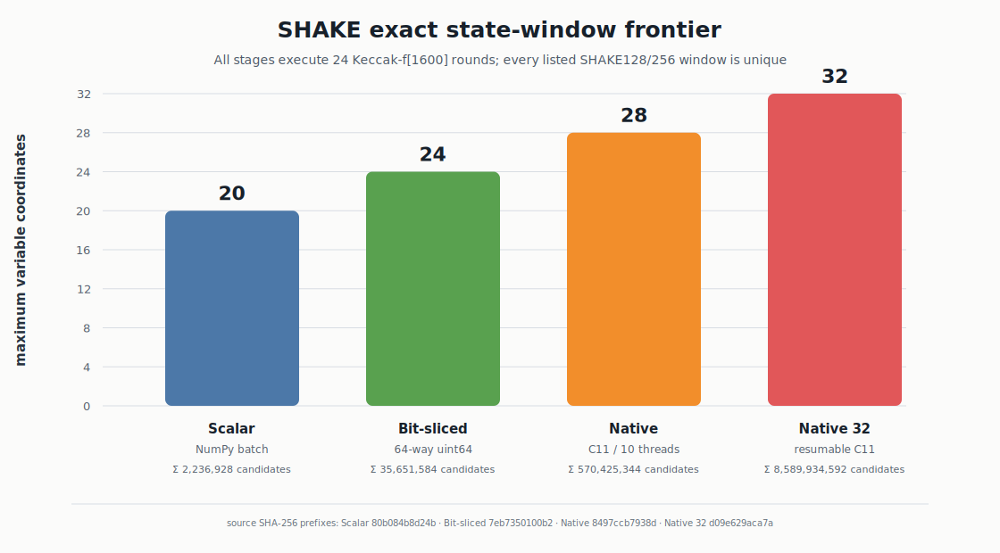

# F8-Causal

**Full-Round Distinguishers, Causal Readers, and Reproducible Cryptanalysis**

F8-Causal is David Tom Foss's executable research archive for cross-round F8,
CASI/LiveCASI, and CryptoCausal Reader analysis. It preserves the twelve
original full-round F8 configurations, the Nanjing and Rome conference
evidence, and the subsequent A107--A165 full-round relations as code, typed
`.causal` graphs, result JSON, controls, tests, and SHA-256 manifests.

The central result is a family of **full-round, exactly checkable cryptanalytic
relations** spanning block ciphers, hash compression functions, stream-cipher
permutations, and Keccak-f[1600]. The repository distinguishes four objects
precisely:

- a **distinguisher** separates a tested relation from its registered controls;
- a **Reader** executes a relation stored in an audited `.causal` graph;
- **state reconstruction** recovers the stated internal coordinates under the
  listed known variables;
- **key recovery** is named only where a key is actually recovered. None of the
  results below is relabeled as key recovery.



## Result landscape

| Evidence | Primitive / endpoint | Full-round result | Attack model and known variables | Recovered object | Primary evidence |
|---|---|---|---|---|---|
| Original anchors | Speck, Threefish, GIFT, PRESENT, TEA, RC5 | 12 full-round F8 configurations across four mechanisms | Known-key internal `state(R)` / `state(R+1)`, matched inputs | Cross-round distinguisher cells | [anchor suite](provenance/fullround_anchors/f8/README.md), [audit](research/reports/SESSION_FULLROUND_IMPORT_AUDIT_V1.md) |
| A107--A109 | PRESENT-128 R31→R32 | Seven-cell exact population support; all five confirmation keys beat every BvN route | Known key, matched plaintext, adjacent internal boundary | Exact F8 support and MI | [report](research/reports/FULLROUND_CAUSAL_PRESENT128_V1.md) |
| A110--A112 | SHA-256 / SHA-512 compression | Exact same-lane feed-forward relation after 64/80 steps and full carry spectrum | Compression input/chaining state known | Eight post-round words; exact carry classes | [report](research/reports/FULLROUND_CAUSAL_SHA2_FEEDFORWARD_V1.md) |
| A113--A114 | FEAL-32X R30→R32 | Reader reconstructs 40,000/40,000 complete 32-bit state halves | Known two-byte round subkey and cross-round left-half difference | R30 right half | [report](research/reports/FULLROUND_CAUSAL_FEAL32X_V1.md) |
| A115 | SHACAL-2 R63→R64 | Shared-`T1` cancellation reconstructs 40,000/40,000 complete words | Known key; internal full-round endpoint | `d63` word | [report](research/reports/FULLROUND_CAUSAL_SHACAL2_V1.md) |
| A116 | SPARKLE-256/384/512 | Exact endpoint projection plus complete-basis linear-order proofs | Public permutation; final state | Pre-final-step left half and full-step inverse state | [report](research/reports/FULLSTEP_CAUSAL_SPARKLE_V1.md) |
| A117--A118 | BLAKE3 compression | Full 64-byte output plus known CV reconstructs all 512 post-round bits; exact coupled-borrow spectrum | Complete compression output and input CV | Post-round compression state | [report](research/reports/FULLCOMPRESSION_CAUSAL_BLAKE3_V1.md) |
| A119--A120 | ChaCha20 block | Public inputs reconstruct eight core lanes; known key reconstructs all sixteen; exact conditional carry spectrum | Standard block output plus constants/counter/nonce; key only for key lanes | Post-round-20 core | [report](research/reports/FULLROUND_CAUSAL_CHACHA20_FEEDFORWARD_V1.md) |
| A121 | SHAKE128 / SHAKE256 | Complete first squeeze block reconstructs every post-permutation rate lane | Public output block | 1,520,000 exact 64-bit lanes over confirmations | [report](research/reports/FULLROUND_CAUSAL_SHAKE_RATE_V1.md) |
| A122 | SHAKE next-block Jacobians | Ten capacity-to-rate Boolean Jacobians have full rank 256/512 | Fixed first-squeeze base; single capacity-bit intervention | Intervention coordinate | [report](research/reports/FULLROUND_CAUSAL_SHAKE_CAPACITY_JACOBIAN_V1.md) |
| A123--A127 | SHAKE consecutive-block windows | Unique exact 8--32-coordinate consistency through all 24 Keccak rounds | Complete first state except declared capacity window; next rate block | Window assignment; 8,589,934,592 candidates at 32 bits | [report](research/reports/FULLROUND_CAUSAL_SHAKE_NATIVE_WINDOW_V1.md) |
| A128--A129 | SHAKE Boolean constraints and prefix frontier | Exact CNF reconstruction at 4/8/12 coordinates; R3 collapse of single-coordinate branch certificates; 32 output bits uniquely identify both tested 16-bit windows | Known first-squeeze-state complement; A128 complete next-rate constraints; A129 one deterministic `2^16` window per variant | Exact assignment and mechanistic solver/observability boundaries | [report](research/reports/FULLROUND_CAUSAL_SHAKE_SOLVER_FRONTIER_V1.md) |
| A130 | SHAKE affine-hull prefix distinguisher/Reader | Exact 128-coordinate GF(2) hull membership leaves only the actual 10-bit prefix in both variants | Known first-squeeze-state complement; one complete 16-bit window truth space per variant; 128 next-rate coordinates | Exact 10-bit window prefix | [report](research/reports/FULLROUND_CAUSAL_SHAKE_AFFINE_HULL_V1.md) |
| A131 | SHAKE algebraic-degree frontier | Restricted coordinate ANFs reach full degree 16 and random-like density at R5, remaining saturated through R24 | Known first-squeeze-state complement; one complete 16-bit window truth space per variant; first 128 rate coordinates | Exact round-localized ANF degree and density | [report](research/reports/FULLROUND_CAUSAL_SHAKE_ALGEBRAIC_DEGREE_V1.md) |
| A132 | SHAKE Boolean-influence frontier | R3 is nearly all-to-all; measured R4, R5, and R24 are completely coupled and influence-balanced in all six exhaustive trials | Known first-squeeze-state complement; three complete 16-bit windows per variant; all 1,600 state coordinates | Exact round-localized 16x1,600 influence matrices | [report](research/reports/FULLROUND_CAUSAL_SHAKE_BOOLEAN_INFLUENCE_V1.md) |
| A133 | SHAKE shared-ANF compression | Formula-space transform yields 20.44x/19.84x R3 advantage over best raw compression; disk Reader reconstructs 419.43M truth values | Known state complement; complete `2^16 x 1,600` restricted truth spaces | Exact shared formula dictionary and coefficient matrix | [report](research/reports/FULLROUND_CAUSAL_SHAKE_ANF_COMPRESSION_V1.md) |
| A134 | SHAKE direct symbolic R2 | Complete 256-/512-coordinate capacity interfaces compile exactly without truth-table materialization | Known starting-state complement and Keccak round equations | All 1,600 exact R2 coordinate formulas | [report](research/reports/SHAKE_SYMBOLIC_R2_ANF_FRONTIER_V1.md) |
| A135 | SHAKE native-XOR full-round Reader | Exact unique reconstruction at 4/8/12 coordinates with 3.53%/17.02%/5.98% of canonical-CNF decisions | Known first-state complement; complete next-rate observation | Exact capacity-window assignment | [report](research/reports/FULLROUND_CAUSAL_SHAKE_SYMBOLIC_R2_SMT_V1.md) |
| A136 | SHAKE partitioned full-round Reader | Ground-truth-blind 16-branch schedule reconstructs assignment 35,837 and independently matches all 1,344 rate bits | Known first-state complement; complete next rate; exhaustive low-four prefix partition | Verified 16-coordinate model | [report](research/reports/FULLROUND_CAUSAL_SHAKE_SYMBOLIC_R2_PARTITION_V1.md) |
| A137 | SHAKE symbolic split frontier | R1 minimizes decisions against R2/R3; width-12 R1 is 196.46x below canonical CNF | Matched full-round query; verified width-16 model branch for split comparison | Exact minimum-decision handover interface | [report](research/reports/FULLROUND_CAUSAL_SHAKE_SYMBOLIC_SPLIT_FRONTIER_V1.md) |
| A138 | SHAKE monolithic R1 Reader | Unpartitioned width 16 returns assignment 35,837 in 4,701 decisions and independently matches 1,344/1,344 bits | Known first-state complement; complete next rate; no supplied prefix | Verified 16-coordinate model | [report](research/reports/FULLROUND_CAUSAL_SHAKE_SYMBOLIC_R1_SCALING_V1.md) |
| A139--A141 | SHAKE128 R1 partition topology | Complete disjoint Low-4, Upper-4, and Max-Cover-4 width-20 schedules each return 16 `unknown` statuses at the stored 60-second/five-worker limits | Known first-state complement; complete next rate; all 16 branches per four-coordinate plan | Exact representation/resource boundary; no model returned | [report](research/reports/FULLROUND_CAUSAL_SHAKE_SYMBOLIC_R1_PARTITION_TOPOLOGY_V1.md) |
| A142 | SHAKE256 monolithic R1 transfer | Widths 16/20/24 each return `unknown` at the stored 120-second single-thread limit | Known first-state complement; complete 1,088-bit next rate; A137 used only to select R1 | Exact cross-variant representation/resource boundary; no model returned | [report](research/reports/FULLROUND_CAUSAL_SHAKE256_SYMBOLIC_R1_TRANSFER_V1.md) |
| A143--A146 | SHAKE128 R1 structural-depth and Z3 frontiers | Complete Structural-6 plans retain the width-20 boundary; posthoc conditioning first resolves at `k=8`; native-XOR `QF_UF` is the verified width-16 strategy winner | Known first-state complement and complete next rate; graph-only structural plans; posthoc branch values only in the explicitly scoped depth frontier | Exact mechanism and processing boundaries | [depth report](research/reports/FULLROUND_CAUSAL_SHAKE_SYMBOLIC_R1_STRUCTURAL_DEPTH_V1.md), [strategy report](research/reports/FULLROUND_CAUSAL_SHAKE_SYMBOLIC_R1_Z3_STRATEGY_V1.md) |
| A147 | SHAKE128 width-20 assignment-free R1 Reader | Frozen graph-only `k=8` plan finds assignment 227,581 and independently matches all 1,344 next-rate bits | Known first-state complement and complete next rate; no assignment, target projection, or outcome-prioritized branch order at runtime | Verified 20-coordinate model | [report](research/reports/FULLROUND_CAUSAL_SHAKE_SYMBOLIC_R1_ASSIGNMENT_FREE_K8_V1.md) |
| A148--A151 | SHAKE128 width-24 vertex-cover Reader | Nine disjoint R1 edges force minimum cover size nine; one complete-domain uniform-budget plan finds assignment 4,845,375 in 4,734 decisions and independently matches all 1,344 bits | Known first-state complement and complete next rate; 512 planned subspaces receive the same 120-second cap; four complete waves/20 branches execute before verified early stop; same-instance, posthoc-informed, non-blind design | Verified 24-coordinate model under the stated schedule | [report](research/reports/FULLROUND_CAUSAL_SHAKE_SYMBOLIC_R1_WIDTH24_VERTEX_COVER_V1.md) |
| A152 | SHAKE128 prospective width-24 transfer | Publicly frozen unseen window has an edgeless affine R1 graph, unique empty cover, and one unconditioned `2^24` subspace; the 120-second query is `unknown` and its posthoc witness independently matches all 1,344 bits | Protocol frozen in public commit `9327e3c` before generation; witness used only after execution | Exact prospective transfer boundary | [report](research/reports/FULLROUND_CAUSAL_SHAKE_SYMBOLIC_R1_PROSPECTIVE_TRANSFER_PROTOCOL_V1.md) |
| A154--A155 | SHAKE exact R1/R2 interface | R1 is a rank-24 systematic affine embedding with zero input nullity; R2 contains all 276 quadratic pairs and has graph K24 with minimum-cover size 23 | Hash-gated A152 interface; no target, model, or instrumented assignment used for basis or graph derivation | Exact affine inverse and complete R2 interaction graph | [R1 report](research/reports/FULLROUND_CAUSAL_SHAKE_SYMBOLIC_R1_AFFINE_BASIS_V1.md), [R2 report](research/reports/FULLROUND_CAUSAL_SHAKE_SYMBOLIC_R2_PIVOT_BASIS_V1.md) |
| A156--A159 | SHAKE full-round encoder/resource frontier | Systematic R1 and shared-R2 encoders remove a generic suffix-round block and up to 285,792 formula bytes; fixed-resource replay preserves a 6,940--18,936 decision ordering across four exact weighted input orders | Same full-round relation and target; sequential one-thread Z3 4.15.4; all four fixed-resource outcomes are `unknown` without a model | Exact representation and deterministic traversal boundary | [systematic report](research/reports/FULLROUND_CAUSAL_SHAKE_SYMBOLIC_R1_SYSTEMATIC_ENCODER_V1.md), [shared-R2 report](research/reports/FULLROUND_CAUSAL_SHAKE_SYMBOLIC_R2_SHARED_ENCODER_V1.md), [weighted report](research/reports/FULLROUND_CAUSAL_SHAKE_SYMBOLIC_R2_WEIGHTED_ORDER_V1.md), [fixed-resource report](research/reports/FULLROUND_CAUSAL_SHAKE_SYMBOLIC_R2_FIXED_RLIMIT_ORDER_V1.md) |
| A160 | SHAKE exact R2 affine gauge | Complete `2^24` Walsh search proves unique optimum `0x8e26db`, reducing linear incidence from 8,698 to 8,413 while preserving all 15,972 quadratic incidences and K24 | Assignment- and target-free exhaustive gauge optimization with exact Parseval and 307,200-bit gates | Globally optimal affine polarity gauge | [report](research/reports/FULLROUND_CAUSAL_SHAKE_SYMBOLIC_R2_AFFINE_GAUGE_V1.md) |
| A161--A162 | SHAKE order-aware affine-gauge Readers | Four-order transfer exposes a deterministic gauge/order interaction; eight complete `2^24` positional Walsh landscapes select four unique semantic gauges | Same fixed full-round relation; selectors exclude the target, assignment, and solver counters | Exact gauge landscapes and frozen factorial plan | [transfer report](research/reports/FULLROUND_CAUSAL_SHAKE_SYMBOLIC_R2_AFFINE_GAUGE_SOLVER_V1.md), [Reader report](research/reports/FULLROUND_CAUSAL_SHAKE_SYMBOLIC_R2_ORDER_WEIGHTED_GAUGE_V1.md) |
| A163--A164 | SHAKE four-gauge x four-order fixed-resource matrix | All 16 cells exhaust the identical resource cap; gauge `0x4e1e28` wins every order and reaches a new 4,402-decision minimum, 24.4% below the prior best | Exact affine/permutation recovery path; sequential one-thread Z3 4.15.4 at `rlimit=500000000`; no cell emits a model | Exact traversal main effect and gauge/order interaction | [factorial transfer](research/reports/FULLROUND_CAUSAL_SHAKE_SYMBOLIC_R2_ORDER_WEIGHTED_GAUGE_SOLVER_V1.md), [completion report](research/reports/FULLROUND_CAUSAL_SHAKE_SYMBOLIC_R2_FOUR_GAUGE_FACTORIAL_V1.md) |
| A165 | SHAKE128 prospective width-24 native Reader | Complete `2^24` enumeration returns the singleton assignment 9,279,571, independently matches all 1,344 rate bits, and returns zero matches for the full-domain control | A152 public cleared template, target, and ordered coordinates; no early stop; posthoc witness read only after execution | Unique 24-coordinate full-round model | [report](research/reports/FULLROUND_CAUSAL_SHAKE_A152_NATIVE_RECONSTRUCTION_V1.md) |

A152 was frozen on public `main` before its unseen instance was generated, then
executed under that exact protocol. A154--A165 follow the resulting affine
interface through an exact basis, the R2 K24 transition, three full-round
encoder frontiers, deterministic fixed-resource replay, complete affine-gauge
optimization, a four-gauge by four-order factorial, and native full-domain
model reconstruction. The full sequence, including A153's phase-flag control, is
indexed in the [research report matrix](research/reports/NIGHTRUN_DIRECT_CAUSAL_MATRIX_V1.md)
and the append-only [attempt log](research/ATTEMPT_LOG.md). The earlier
A107--A151 class ledger remains in [docs/RESULTS.md](docs/RESULTS.md).

## Three connected methods

### F8

F8 evaluates matched states after `R` and `R+1` rounds under the same key and
input, then measures structured dependence between the round-`R` state and the
cross-round difference. The original full-round suite contains Speck32/64,
Speck48/96, Speck64/128, Speck128/256, Threefish-256, Threefish-1024, GIFT-64,
GIFT-128, PRESENT-80, TEA, RC5-32/12/16, and RC5-64/24/24.

### CASI and LiveCASI

CASI is a compression-based structural measurement over cipher outputs.
`src/arx_carry_leak/live_casi_v091/` preserves the LiveCASI 0.9.1 core, while
`src/arx_carry_leak/nano_ciphers.py` supplies the portable 41-cipher Nanjing
registry. CASI and F8 remain separate measurements with separate result
schemas and controls.

### CryptoCausal Reader

`.causal` files are typed evidence graphs, not opaque sidecars. The
`CryptoCausalReader` validates the format version, canonical graph digest,
triplets, inferred-edge provenance, parameters, and executable reconstruction
recipe. Every committed `.causal` artifact is checked by
`scripts/validate_causal_artifacts.py`.

## Reproduce from a fresh clone

```bash
git clone https://github.com/DT-Foss/f8-causal-cryptanalysis.git
cd f8-causal-cryptanalysis
python3 -m venv .venv
source .venv/bin/activate
python -m pip install --upgrade pip
python -m pip install -r requirements.txt
python -m pip install -e .
```

Five evidence tiers make cost explicit:

| Tier | Command | Purpose |
|---|---|---|
| `quick` | `./scripts/reproduce_quick.sh` | vectors, focused tests, Reader validation, manifest verification |
| `standard` | `./scripts/reproduce_fullround_transfers.sh` | regenerate A107--A126 transfers and validate retained A129--A165 SHAKE frontiers |
| `extended` | `./scripts/reproduce_shake_native_extended.sh` | resumable A127 native 32-coordinate SHAKE enumeration |
| `solver` | `./scripts/reproduce_shake_solver_frontier.sh` | reproduce A128--A151 frontiers and validate retained A152--A165 prospective, affine, encoder, resource, and native Readers |
| `anchors` | `./scripts/verify_anchors.sh` | hash-verify the twelve original full-round configurations without rerunning them |

Expected quick-tier terminus:

```text
anchor manifest: OK
full-round transfer manifest: OK
causal artifacts: all valid
```

The native Reader is C11/POSIX and builds with Apple Clang on Apple Silicon or
GCC/Clang on Linux. The 32-coordinate run is bounded-memory, ten-threaded, and
resumable. Full commands, runtimes, expected files, and portability notes are
in [docs/REPRODUCIBILITY.md](docs/REPRODUCIBILITY.md).

The symbolic solver tier additionally requires the external Z3 CLI at exact
semantic version 4.15.4. Both solver reproduction scripts fail closed before
execution when this version is unavailable or different.

## Repository map

```text
src/arx_carry_leak/             installable F8, CASI, Reader, and cipher code
research/experiments/           executable experiments
research/results/               retained JSON, .causal, and SHA-256 manifests
research/reports/               result-level scientific interpretation
research/ATTEMPT_LOG.md         chronological A001--A165 evidence ledger
provenance/fullround_anchors/   committed twelve-configuration F8 snapshot
provenance/dependencies/        minimal licensed source required by an experiment
data/reference/                 Nanjing/Rome reference datasets
paper/                          author-owned TeX, figures, and sanitized slide source
docs/                           methods, results, claims, prior art, publication audit
```

## Citation and authorship

Author and maintainer: **David Tom Foss**. Cite the software metadata in
[`CITATION.cff`](CITATION.cff). The associated conference works are:

- *Persistent Cross-Round Carry Leakage in ARX Ciphers: Detection, Prediction,
  and Topological Classification*, IEEE ICECET 2026, Rome.
- *Compression-Based Trust Verification of Lightweight Ciphers Deployed in
  Nano-IoT Communication Standards*, IEEE NANO 2026, Nanjing.

No DOI is asserted until one is assigned by the relevant publisher or archive.
See [docs/PRIOR_ART.md](docs/PRIOR_ART.md) for the hash- and commit-based public
record.

## License

Original repository code and documentation are BSD-3-Clause licensed. Narrow
vendored and retained historical components keep their own terms and
attribution; see [`THIRD_PARTY_NOTICES.md`](THIRD_PARTY_NOTICES.md). The short
[`PATENT_NOTICE.md`](PATENT_NOTICE.md) states that no separate express patent
license is granted and makes no filing claim. Conference paper text and slides
are included as author-owned source material; publisher-formatted PDFs and
peer-review correspondence are excluded.
