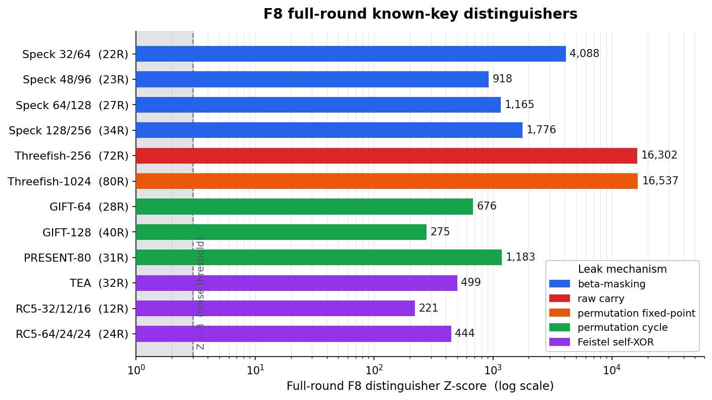
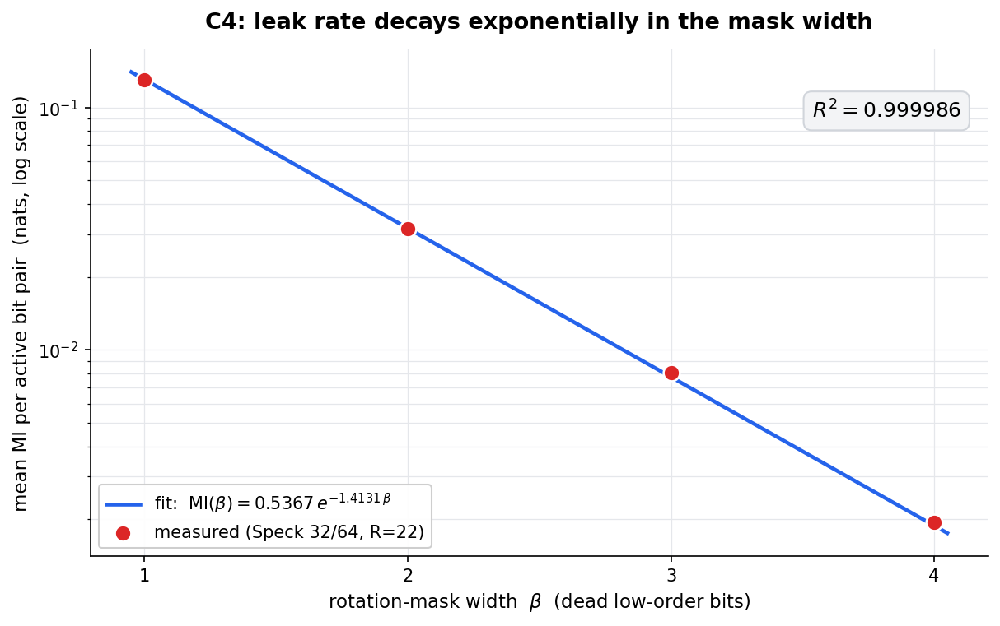

# F8 — Full-Round Known-Key Cross-Round Distinguishers

**F8** is a cross-round mutual-information test that finds structural, non-decaying signal surviving at **full round count**, across four independent architectural mechanisms and eleven ciphers.

Author: **David Tom Foss**

## The test

Generate the cipher output at round `R` and at round `R+1` with the **same key and counter**. XOR the two outputs, and measure the mutual information (MI) between the bits of the round-`R` output and the bits of that cross-round XOR difference. Score the observed MI against a permutation null to get a Z-score. A structural leak shows `Z >> 3` that **does not decay as more rounds are added**, and — critically — **grows with sample size** (a real signal scales roughly as `Z ~ sqrt(N)`; a max-over-many-cells artifact does not).

## Full-round distinguishers



| Cipher          | Rounds | Mechanism           | Z-score  | Script |
|-----------------|:------:|---------------------|---------:|--------|
| Speck 32/64     |   22   | β-masking           |  +4088   | `experiments/reproduce_core.py`, `experiments/speck_variants.py` |
| Speck 48/96     |   23   | β-masking           |   +918   | `experiments/speck_variants.py` |
| Speck 64/128    |   27   | β-masking           |  +1165   | `experiments/speck_variants.py` |
| Speck 128/256   |   34   | β-masking           |  +1776   | `experiments/speck_variants.py` |
| Threefish-256   |   72   | raw carry           | +16302   | `experiments/threefish256.py` |
| Threefish-1024  |   80   | permutation fixed-point | +16537 | `experiments/threefish1024.py` |
| GIFT-64         |   28   | permutation cycle   |   +676   | `experiments/gift.py` |
| GIFT-128        |   40   | permutation cycle   |   +275   | `experiments/gift.py` |
| PRESENT-80      |   31   | permutation cycle   |  +1183   | `experiments/present.py` |
| TEA             |   32   | Feistel self-XOR    |   +499   | `experiments/tea.py` |
| RC5-32/12/16    |   12   | Feistel self-XOR    |   +221   | `experiments/rc5.py` |
| RC5-64/24/24    |   24   | Feistel self-XOR    |   +444   | `experiments/rc5_64.py` |

Speck Z-scores are the 3-seed mean (Speck 32/64) and the full-round encrypt-direction Z (other variants). Threefish-256 reaches MI = 0.6931 = ln 2 on bit 0, the information-theoretic maximum for a single bit. Threefish-1024 reaches the same ln 2 maximum, N-scaling confirmed (Z grows +25,972 → +483,069 across N=20,000 → 400,000 at the identified cell) — see the mechanism note below on why this reverses the naive "more words in the Threefish family means more immune" reading of Threefish-256 vs. Threefish-512. GIFT and PRESENT are verified against their official test vectors ([giftcipher/gift](https://github.com/giftcipher/gift); PRESENT CHES 2007) before the F8 scan runs. TEA's and RC5's Z are confirmed by N-scaling (TEA: +40.6 at N=20,000 → +498.9 at N=200,000, 12.3× growth; RC5: +42.1 → +220.7, 5.2× growth — both well above the ~3.2× expected for a real signal at 10× the sample size, and robust across 5 independent seeds). RC5-64/24/24 doubles RC5's word width and confirms the same mechanism generalizes across w: the per-bit MI is roughly two orders of magnitude smaller than at w=32, so the signal only becomes unambiguous at larger sample sizes (Z grows +18.1 at N=8,000 → +444.0 at N=800,000, a 24.5× overall increase, with the same hit cell — the B branch feeding into A — at every sample size tested).

## Four architectural mechanisms

F8's signal always requires the same underlying condition: **a state variable meeting a transform of itself, or an addition recurring at a fixed position, across the round boundary.** Never MI(operand; raw addition output) alone — that quantity is algebraically zero for independent operands, at every bit position, regardless of cipher.

1. **β-masking (Speck).** `ROL(y, β)` masks the low β bits of the addition output. The remaining `ws − β` bits carry the addition's carry correlation uniformly, landing on an α-shifted diagonal.
2. **Raw carry + rotation-spread (Threefish-256).** The permutation keeps each MIX pair's addition at a fixed word position every round — consecutive additions over the same evolving data expose the carry directly (MI = ln 2 on bit 0), then the cipher's own rotations spread it across all 64 bit positions.
3. **Permutation fixed-point carry retention (Threefish-1024).** Bit 0 of any modular addition has no carry-in — a universal, cipher-independent fact, invisible on its own (an isolated MIX call shows no signal at bit 0). But Threefish-1024's own 16-word permutation (independently specified in the Skein v1.3 spec, not derived from the 512-bit one) has two genuine **fixed points**: two of its eight addition-sum outputs land back at their exact starting slot, every single round, for all 80 rounds. At those two slots only, the trivial bit-0 fact accumulates undisturbed instead of being scattered — reaching MI = ln 2 exactly, confirmed absent at every other slot (checked directly: slots in longer permutation cycles show zero signal, matching the mechanism precisely). This also refines this project's earlier Cross-Pair Fraction (CPF) result: Threefish-1024's permutation has CPF = 0.750 (comfortably above the 0.625 threshold that predicted immunity for Threefish-512, whose own permutation reaches CPF = 1.000) — CPF crossing pairs is necessary but not sufficient; a permutation can cross pairs on average while still fixing individual slots in place.
4. **Feistel self-XOR (TEA, RC5, RC5-64).** A single addition applied directly to a transform of the *other* branch, with its result used immediately as the new branch value — no foreign XOR interrupts between the addition and the next round consuming it. TEA: `y += (z<<4)^(z+sum)^(z>>5)`. RC5: `A = ROTL(A^B, B) + S[2i]`. Both branches occupy fixed positions and alternate roles every round, exposing the addition's carry chain the same way β-masking does. This mechanism is provably word-width-independent — RC5-64/24/24 (doubling the word width to 64 bits) shows the identical leak, just with a smaller per-bit MI that needs a larger sample size to separate from noise. (Ciphers with the *same* fixed-position self-reference but a foreign XOR *between* nested additions — XTEA, the Alzette ARX-box used in SPARKLE — do not show this signal; the foreign XOR breaks the self-reference the mechanism depends on.)

For the SPN ciphers (GIFT, PRESENT), the same cross-round MI leak is driven instead by the cycle structure of the fixed bit permutation.

**Not every cipher fits this pattern**, and the mechanism above lets you check *before measuring*: a cipher whose round permutation shifts words without ever re-exposing a word to a transform of itself, and without keeping an addition's position fixed, is structurally outside F8's reach — independent of its specific rotation amounts or key schedule.

## The F8 signal in detail (Speck 32/64)

Six properties, all reproduced by `experiments/reproduce_core.py`:

- **C1 — Full-round distinguisher.** Speck 32/64 at R=22, mean Z = +4088 over 3 seeds.
- **C2 — No round decay.** MI is flat across R = 5…22 (spread 5.3 %); the leak rate is constant, it does not diffuse away with more rounds.
- **C3 — α-shifted diagonal.** The MI concentrates on the α-shifted output diagonal (diag / off-diag ratio ≈ 1350:1), with β dead bits at positions α … α+β−1.
- **C4 — Exponential leak-rate law.** MI(β) = A·exp(−B·β) with A = 0.5367, B = 1.4131, **R² = 0.999986**.
- **C5 — Encrypt-only.** Decryption drives Z to ≈ 0; the encrypt/decrypt ratio exceeds 10⁴:1.
- **C6 — Key-schedule independent.** The MI signal is identical (spread 1.7 %) with the real key schedule, an all-zero schedule, or random independent round keys — and every mode stays strongly distinguishing.



## Quick start

```bash
pip install -e .
python reproduce.py          # runs everything, prints the summary table
```

Run a single cipher directly:

```bash
python experiments/reproduce_core.py     # Speck 32/64, properties C1–C6
python experiments/speck_variants.py     # all 4 Speck variants, full round, encrypt/decrypt
python experiments/threefish256.py       # Threefish-256, 72 rounds
python experiments/threefish1024.py      # Threefish-1024, 80 rounds
python experiments/gift.py               # GIFT-64 / GIFT-128
python experiments/present.py            # PRESENT-80
python experiments/tea.py                # TEA, 32 rounds
python experiments/rc5.py                # RC5-32/12/16
python experiments/rc5_64.py             # RC5-64/24/24
```

Each script writes a JSON result under `results/`. To regenerate the figures:

```bash
pip install -e ".[figures]"
python figures/make_figures.py
```

Dependencies: `numpy`, `scipy` (plus `matplotlib` for the figures). Every script is self-contained.

## License

MIT — see [LICENSE](LICENSE).
