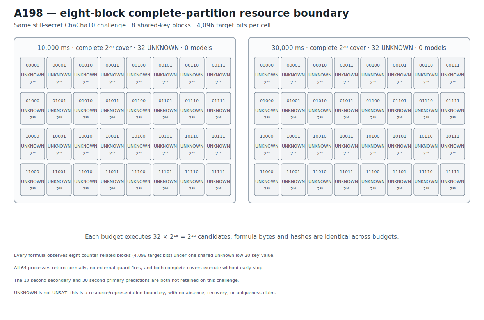

# ChaCha10 Eight-Block Complete-Partition Resource Boundary v1

## Result

A198 prospectively tests whether the shared-key eight-block compiler mechanism
retained at A187/A188 crosses the complete reduced ChaCha10 width-20 boundary
retained by A197.  It reuses the byte-identical still-secret challenge: eight
counter-related blocks share one unknown low-20 key value, so every partition
cell exposes 4,096 target bits while the other 236 key bits are known.

Two complete split8 prefix covers execute over the unchanged domain:

```text
32 * 2^15 = 2^20 = 1,048,576 candidates per budget.
```

The first cover gives every cell 10,000 ms; the second gives the identical 32
formula byte strings 30,000 ms each.  All 64 processes return normally, no
external guard fires, every cell returns `unknown`, and no model or confirmation
is emitted.  Both the primary 30-second and secondary 10-second predictions are
therefore not retained on this challenge.

This is an exact resource/representation boundary for the tested eight-block
round-10 relation.  It is not an absence result: `unknown` is not `unsat`, and
two complete structural covers do not adjudicate their candidate cells.  A198
makes no recovery or uniqueness claim.  Its exact evidence stage is
`ROUND10_B8_COMPLETE_PARTITION_BOUNDARY_RETAINED`.  The scope is reduced
ChaCha10 20-bit partial-key analysis, not fullround ChaCha20 or full-key
recovery.

## Prospective freeze and retained anchors

```text
protocol  ea1e395dc3de59a59e203f47f668312b4ffc024da7044e3521ca010a2e95fa28
runner    0409dacb97274a062be93a53b1b8c0eba8f28ba95fae9460daa82b0efee73847
```

The protocol anchors four pre-existing records before any A198 outcome:

- A187: full b8 changes the fixed-rlimit ChaCha5 search shape relative to b1.
- A188: a predeclared b8 view returns and independently confirms the fresh
  ChaCha5 width-40 assignment.
- A197: all 256 width-12 cells at the same round-10 challenge remain `unknown`
  with zero models.
- Formula-atlas full re-audit: the shared-block baseline is required before any
  later gain is attributed to a new atlas transfer family.

Their exact result/Causal identities are reopened and Reader-validated by the
fast gate.  The formula-atlas coverage JSON is anchored by SHA-256
`feadca39a2cdb0caf38018e9d28ed6aecd56384f5771d7a6e6ab261f87ee1cc2`.

The public challenge remains byte-identical to A195--A197.  Prior attempts
returned no model or correct prefix.  Eight blocks, reverse block-definition
order 7 through 0, split8, all prefixes, both budgets, numeric order, four-cell
waves, success rule, and no-early-stop execution were frozen before any A198
solver outcome.  The hidden assignment is absent from protocol and source and
was unavailable to the runner.

```text
public challenge  5d17ed241b6b91224a4974f36b4b0b4ec5c677b9d975dd6bc8cec83b6ddbf86b
execution plan    6965f67a341a3e234b51c3ddc8e0e375d12803d8f603feac80dd5bae980c78c3
known material    40044d942ad2dc135f1228bde509731f9d1416f0c1a9bb38de851db1f95af53d
control target    371b6b0aac44efe9552551ac05246b4334e42bb87e9deee0bc9ccbb3e4c1b669
```

## Exact eight-block formula family

Each formula asserts all eight counter-related target blocks under one shared
key and differs only in key-word-0 bits 19 through 15.  The solver budget is a
command-line resource and is absent from the portable SMT-LIB2 bytes.  Every
cell has:

```text
formula bytes       177,202
shared-key blocks   8
target bits         4,096
fixed coordinates  19,18,17,16,15
free coordinates   14..0
candidate count     32,768
```

The formula plan contains 64 rows but only 32 distinct formula byte strings:
the 10-second and 30-second rows have identical hashes prefix by prefix.  The
canonical ordered formula-plan digest is:

```text
24373bd8cb5fbd76f3fa88c028b44827ff6167511f59e1565ec53f0276295040
```

Representative exact bindings are:

| Prefix | Formula SHA-256 at both budgets |
|---|---|
| `00000` | `3735c827a397d3f40d4022be6022fa9a0ccb487b94312e9a369b5bb8bcac80a7` |
| `11111` | `f15eda430c528a92620e991da3b1c29eac82ff5efa8d8cca26e599659065ed29` |

The no-solver regression gate reconstructs all 64 planned rows, checks every
prefix assertion and coordinate set, validates the eight block namespaces, and
proves byte/hash identity across budgets.

## Complete two-budget execution

| Budget per cell | Cells | Statuses | Models | Structural candidates |
|---:|---:|---|---:|---:|
| 10,000 ms | 32 | 32 `unknown` | 0 | 1,048,576 |
| 30,000 ms | 32 | 32 `unknown` | 0 | 1,048,576 |

The 64 variants execute in 16 deterministic numeric waves of four.  Every
observation has return code zero, no external timeout, and an empty model field.

The retained volatile timing fields give exact local context:

```text
sum of 10-second cell observations   320.5743763730861 s
sum of 30-second cell observations   960.495008379221 s
sum of all 64 cell observations     1281.069384752307 s
sum of 16 per-wave maxima            320.2982707484625 s
```

The cell sums aggregate four-way parallel work and are not elapsed command
times.  The wave-max sum is also local, non-portable timing context.  Neither
quantity changes the resource/representation boundary.

```text
execution     120d8d220d916c4bacbd32ce387752cbb45ecc68d00434f3681675d31e185745
confirmation  4f53cda18c2baa0c0354bb5f9a3ecbe5ed12ab4d8e11ba873c2f11161202b945
comparison    a420ddf3d23e9b4ce6d56186261a679229f740bf9d33978471dfda9d5148cbda
```

## Solver identity provenance

```text
solver       Bitwuzla 0.9.1
mode         bitblast
SAT backend  CaDiCaL
executable   9896c88b523114e3eae00d737f1183ca71fbd83a99e8e45fe294715747a2ce7a
```

Fast retained-artifact verification invokes no solver.

## Deterministic figure

```text
research/results/v1/chacha20_a198_round10_b8_two_budget_boundary_v1.svg
SHA-256 4ff39853b0f4c5ec6ee7baa1686d2e69f797fcf61ada46d4fdece8a880554e23
```



## Causal Reader chain

The Causal artifact contains seven triplets and five graph parameters: the
A187/A188 stacking mechanism anchor, independent A197 boundary anchor, reused
still-secret challenge, two complete b8 partition covers, complete wave
execution, empty eight-block confirmation boundary, and prospective depth
transfer result.

```text
result JSON   693367464ab488c49d386c1d011e8c45e7fb094cceeb37352934dde121773373
Causal file   b7c4e1302594e266c7958057221fb4101fb5ef5ee284792d6ca93e43386dd514
Causal graph  3895d60a4020f72b60630544ae88bcbaf9e659986eb2f28999291eb7350e2ba9
```

`CryptoCausalReader` validates all seven triplets, both roots, their exact
trigger/outcome links, and the provenance chain.

## Reproduction

```bash
PYTHONPATH=.:src .venv/bin/python \
  research/experiments/chacha20_bitwuzla_round10_b8_partition_transfer.py \
  --analyze-only
PYTHONPATH=.:src .venv/bin/python \
  research/experiments/chacha20_smt_round5_retained_figures.py --check
PYTHONPATH=.:src .venv/bin/pytest -q \
  tests/test_chacha20_bitwuzla_round10_b8_partition_transfer.py \
  tests/test_chacha20_smt_round5_retained_figures.py
```

These commands validate retained evidence without executing a solver.  An
explicit fresh two-budget 64-cell execution is separate production work.
