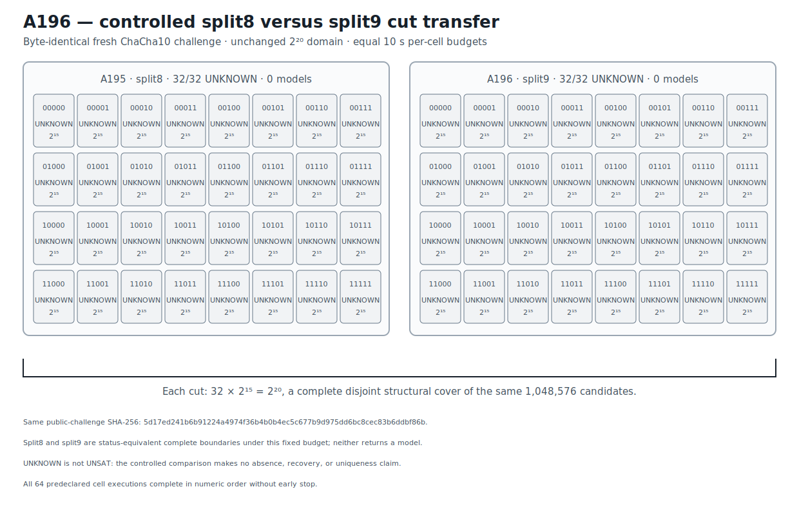

# ChaCha10 Split9 Controlled Cut Boundary v1

## Result

A196 evaluates a predeclared split9 representation on the byte-identical fresh
reduced ChaCha10 width-20 challenge retained by A195.  A195's complete split8
partition had returned 32 bounded `unknown` outcomes and no model, so the
hidden assignment and its correct prefix remained unavailable before A196 was
frozen and executed.

Both cuts represent the same unchanged domain as 32 disjoint cells with 15 free
bits each:

```text
32 * 2^15 = 2^20 = 1,048,576 candidates per complete cut.
```

Every A196 split9 cell executes in frozen numeric order under the same
Bitwuzla 0.9.1 bitblast/CaDiCaL 10-second budget and no early stop occurs.  All
32 cells return `unknown`; no model is returned and the confirmation list is
empty.  A195 split8 and A196 split9 are therefore status-equivalent complete
boundaries for this same challenge under the fixed per-cell budget.

This controlled comparison does not establish that the candidate domain lacks
a solution.  `unknown` is not `unsat`, and structural domain coverage is not
solver adjudication.  A196 makes no absence, recovery, or uniqueness claim.
Its exact evidence stage is `ROUND10_SPLIT9_CUT_BOUNDARY_RETAINED`.  The result
motivates a separately frozen finer complete partition while preserving both
cut-boundary records unchanged.

## Prospective freeze and same-challenge boundary

```text
protocol  677b18e5c9846aaf675f8db8e174cb3d52ce9a294ca46382ca1d89bb1807c20d
runner    a8378c8c768c90d66234d68922d55cff5775d3779034754504e3172badacbf95
```

The protocol anchors the complete A195 split8 boundary:

```text
A195 JSON          8d8fc41df65d98af3eb7a0e117b2255c07e465cc16638f67ebe7df39dcc7e107
A195 Causal        e0ed05f35b405f558797b2eb66d218cb70a0e4c9778dd9312376a05c2d2ae9a5
A195 Causal graph  552018924f0fdb83e82ed507aa6301440d1c46dba8e4ea992406905c73e80f01
```

The A195 solver outcomes were used only to select the predeclared alternative
split9 cut after the complete split8 boundary.  A195 returned neither a model
nor the correct prefix.  The public challenge is reused byte-for-byte, and its
hidden assignment remains absent from the protocol, source, and runner.  The
split9 cut, all 32 prefixes, formula construction, numeric order, uniform
budget, success rule, and no-early-stop policy were frozen before any A196
solver outcome.

```text
public challenge  5d17ed241b6b91224a4974f36b4b0b4ec5c677b9d975dd6bc8cec83b6ddbf86b
execution plan    10f4afe1a653f71c4306320615921b3ec831caed3cf118bae2ba5e845d5d4e72
known material    40044d942ad2dc135f1228bde509731f9d1416f0c1a9bb38de851db1f95af53d
control target    371b6b0aac44efe9552551ac05246b4334e42bb87e9deee0bc9ccbb3e4c1b669
```

## Exact split9 partition

Every formula uses the same one-block round-10 split9 relation and differs only
in the assertion fixing key-word-0 bits 19 through 15.  Every cell has:

```text
formula bytes       23,069
fixed coordinates  19,18,17,16,15
free coordinates   14..0
candidate count     32,768
budget              10,000 ms
```

The canonical ordered formula-plan digest is:

```text
f86439777fea0ec534d98b2ea7013ec101fcb557c5b9fd70a2f2432534023347
```

Representative exact formula bindings are:

| Prefix | Formula SHA-256 |
|---|---|
| `00000` | `e2acb837b4fa663dfeaa5e74dcf3bcf6554926c18273209d65017c13095080de` |
| `11111` | `2053bfdfd4ad8a2fd07158f86392395f3433647338c2e79ad20ce0e3cee8a6c7` |

The retained formula plan stores all 32 exact hashes.  The no-solver regression
gate reconstructs each formula byte-for-byte, checks every prefix assertion and
fixed/free coordinate set, and verifies the complete `2^20` structural union.

## Complete execution and controlled cut comparison

| Attempt | Cut | Challenge | Cell statuses | Models | Structural candidates |
|---|---|---|---|---:|---:|
| A195 | split8 | `5d17ed24…f86b` | 32 `unknown` | 0 | 1,048,576 |
| A196 | split9 | `5d17ed24…f86b` | 32 `unknown` | 0 | 1,048,576 |

Every A196 process returns normally, the complete order executes, and no early
stop occurs.  Volatile elapsed times are excluded from the canonical retained
execution evidence.

```text
execution     9cb9dfeeb6d1ae7db402e2d2bb29df84b98fea18dacb8b9d71dc9e794cd4face
confirmation  4f53cda18c2baa0c0354bb5f9a3ecbe5ed12ab4d8e11ba873c2f11161202b945
comparison    93103e23f6941ea06faf3b09aa07d811e9b611e5556729734ebc71aef3178f04
```

The A195 and A196 comparison objects are byte-equivalent after canonical JSON
serialization.  That equality means their status vectors, structural counts,
model lists, and retained-prediction booleans agree; it does not turn either
bounded run into a proof about the unadjudicated cells.

## Solver identity provenance

```text
solver       Bitwuzla 0.9.1
mode         bitblast
SAT backend  CaDiCaL
executable   9896c88b523114e3eae00d737f1183ca71fbd83a99e8e45fe294715747a2ce7a
```

Fast retained-artifact verification invokes no solver.

## Deterministic figure

```text
research/results/v1/chacha20_a196_round10_split8_split9_cut_boundary_v1.svg
SHA-256 64f1fe8b1595a827ce722d3211b5ea0a8a13dd667100ed8f799741781a667e58
```



## Causal Reader chain

The Causal artifact contains six explicit provenance-linked triplets: A195
split8 anchor, the reused still-secret round-10 challenge, the complete split9
partition, complete cell execution, empty independent-confirmation boundary,
and prospective same-challenge cut result.

```text
result JSON   722a2e0d6c697d47189f157b9878d723dc05e264f328c2386ef9189458b33eaa
Causal file   959467bf76271f8fec6d738cd698ccfc51e1c8eb10275455150dd33a2e9bbd5d
Causal graph  9d1909f592c522e0841ff0d9bb79c14011213e7e69715ccab302e9225899eb54
```

`CryptoCausalReader` validates the six triplets, their trigger/outcome links,
and the complete provenance chain.

## Reproduction

```bash
PYTHONPATH=.:src .venv/bin/python \
  research/experiments/chacha20_bitwuzla_round10_split9_transfer.py \
  --analyze-only
PYTHONPATH=.:src .venv/bin/python \
  research/experiments/chacha20_smt_round5_retained_figures.py --check
PYTHONPATH=.:src .venv/bin/pytest -q \
  tests/test_chacha20_bitwuzla_round10_split9_transfer.py \
  tests/test_chacha20_smt_round5_retained_figures.py
```

These commands validate retained evidence without executing a solver.  An
explicit fresh 32-cell execution is separate production work.
