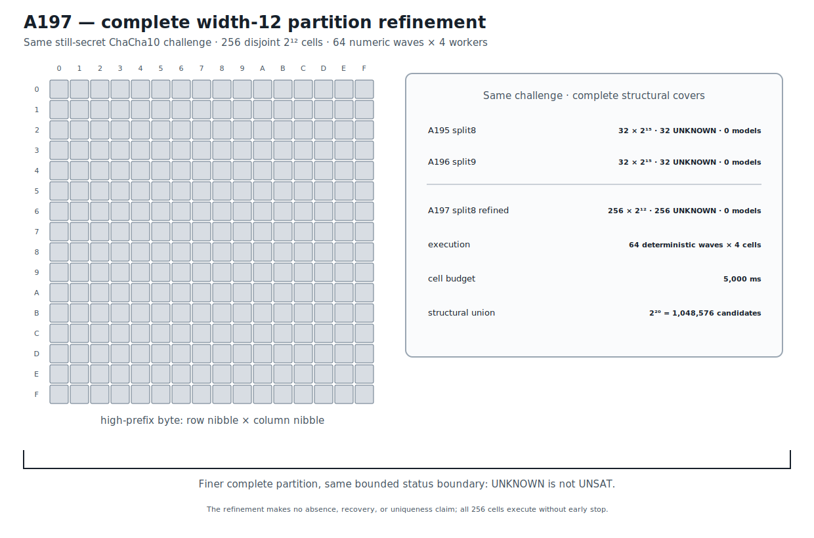

# ChaCha10 Width-12 Complete-Partition Refinement Boundary v1

## Result

A197 refines the complete round-10 width-20 domain from 32 cells with 15 free
bits to 256 cells with 12 free bits.  It reuses the byte-identical still-secret
challenge from A195 and A196.  Those prior complete split8 and split9 cuts both
returned only bounded `unknown` outcomes and no model, so neither the hidden
assignment nor its correct prefix was available before A197 was frozen.

The refinement preserves the original domain exactly:

```text
256 * 2^12 = 2^20 = 1,048,576 candidates.
```

All 256 cells are pairwise disjoint and execute as 64 deterministic consecutive
numeric waves of four workers.  Every cell receives the same Bitwuzla 0.9.1
bitblast/CaDiCaL 5-second budget.  The complete plan executes without early
stop; all 256 cells return `unknown`, no model is returned, and the confirmation
list is empty.

A197 therefore retains the exact width-12 refinement boundary.  The finer
complete partition does not establish that the domain lacks a solution:
`unknown` is not `unsat`, and structural coverage is not solver adjudication.
The result makes no absence, recovery, or uniqueness claim.  Its exact evidence
stage is `ROUND10_WIDTH12_REFINEMENT_BOUNDARY_RETAINED`.

## Prospective freeze and retained anchors

```text
protocol  041782b106f6d956dd74f5051c285d7aebe00abc7e614c44790dc6fe525d5b2e
runner    df45551daa0abb67337061bded931f54b3c18d6dedecf6a1f40f09104eab2fa6
```

The protocol anchors both complete width-15 boundaries:

```text
A195 split8 JSON    8d8fc41df65d98af3eb7a0e117b2255c07e465cc16638f67ebe7df39dcc7e107
A195 split8 Causal  e0ed05f35b405f558797b2eb66d218cb70a0e4c9778dd9312376a05c2d2ae9a5
A196 split9 JSON    722a2e0d6c697d47189f157b9878d723dc05e264f328c2386ef9189458b33eaa
A196 split9 Causal  959467bf76271f8fec6d738cd698ccfc51e1c8eb10275455150dd33a2e9bbd5d
```

Both anchors are reopened through their Causal Readers and exact graph hashes.
The same public challenge is reused byte-for-byte.  Prior attempts returned no
model or correct prefix.  The 8-bit prefix refinement, all 256 cells, numeric
order, wave grouping, four-worker maximum, per-cell budget, success rule, and
no-early-stop policy were fixed before any A197 solver outcome.  The hidden
assignment is absent from the protocol, source, partition order, and wave
schedule.

```text
public challenge  5d17ed241b6b91224a4974f36b4b0b4ec5c677b9d975dd6bc8cec83b6ddbf86b
execution plan    65a0f30c1c6b45f2d3bafca613460ef921a34c35b47274459cbceb2968120329
known material    40044d942ad2dc135f1228bde509731f9d1416f0c1a9bb38de851db1f95af53d
control target    371b6b0aac44efe9552551ac05246b4334e42bb87e9deee0bc9ccbb3e4c1b669
```

## Exact width-12 partition

Every formula uses the same one-block round-10 split8 relation and differs only
in the assertion fixing key-word-0 bits 19 through 12.  Every cell has:

```text
formula bytes       23,072
fixed coordinates  19,18,17,16,15,14,13,12
free coordinates   11..0
candidate count     4,096
budget              5,000 ms
```

The canonical ordered formula-plan digest is:

```text
5307cfeb49b31cc0f6ad6178d1cf99d0e8d3640003bfcadbba72191722e8c076
```

Representative exact formula bindings are:

| Prefix | Formula SHA-256 |
|---|---|
| `00000000` | `cc080eb7b77712482c6ededac2d0617cc55d04cac1e013b8aa6514551efb2124` |
| `11111111` | `0c9437fc91cec3fdbdbd2820b4ddebb0c166ca089a4224d1048f5eb713ced2e1` |

The retained formula plan stores all 256 exact hashes.  The no-solver
regression gate reconstructs every formula byte-for-byte, checks all prefix
assertions and fixed/free coordinate sets, and verifies the complete `2^20`
structural union.

## Complete deterministic-wave execution

```text
cells                    256
waves                     64
maximum parallel workers   4
statuses             256 UNKNOWN
returned models             0
confirmations               0
```

Every process returns normally, no external guard fires, every wave contains
the predeclared consecutive group of four variants, and all waves finish before
the next wave begins.

The retained volatile timing fields give exact local context:

```text
sum of all 256 cell wall observations  1282.9209600007161 s
sum of the 64 per-wave maxima           320.86534337420017 s
minimum cell observation                  5.0058112079277635 s
maximum cell observation                  5.030183792114258 s
```

The first quantity is aggregate cell wall time across four-way parallel work,
not elapsed command time.  The second is the sum of wave maxima, not a portable
benchmark.  Neither timing quantity changes the retained status boundary.

```text
execution     784676f6de00e328c190b5bcd23485cd5e01e54a5d803b06532ee1d347230ee1
confirmation  4f53cda18c2baa0c0354bb5f9a3ecbe5ed12ab4d8e11ba873c2f11161202b945
comparison    9c284d155210f6aab491ab65299e269616d46ff8f49f873f0a59dfe40c71e299
```

## Solver identity provenance

```text
solver       Bitwuzla 0.9.1
mode         bitblast
SAT backend  CaDiCaL
executable   9896c88b523114e3eae00d737f1183ca71fbd83a99e8e45fe294715747a2ce7a
```

Fast retained-artifact verification invokes no solver.

## Deterministic figure

```text
research/results/v1/chacha20_a197_round10_width12_refinement_boundary_v1.svg
SHA-256 e6bc70a5b3a05f92ffe36e17afa3c714a8bf4372fe22a8eb6d159689079cd700
```



## Causal Reader chain

The Causal artifact contains six provenance-linked triplets and four graph
parameters: the A195/A196 width-15 anchors, reused still-secret challenge,
complete width-12 formula refinement, deterministic-wave execution, empty
independent-confirmation boundary, and prospective refinement result.

```text
result JSON   177a76c130d3705e8e3ebcd35f517486b204c6f7d501adaae1cdba8dca90060c
Causal file   f180d14b244a91d5dcbe22acd4972590d9facfb8099ee8846fb3d0d5cae92561
Causal graph  c533fd9ce46f3db8cbe444d24cb0228391ee325cf09ad7cc4d74477658b28879
```

`CryptoCausalReader` validates all six triplets, their trigger/outcome links,
and the complete provenance chain.

## Reproduction

```bash
PYTHONPATH=.:src .venv/bin/python \
  research/experiments/chacha20_bitwuzla_round10_width12_refinement.py \
  --analyze-only
PYTHONPATH=.:src .venv/bin/python \
  research/experiments/chacha20_smt_round5_retained_figures.py --check
PYTHONPATH=.:src .venv/bin/pytest -q \
  tests/test_chacha20_bitwuzla_round10_width12_refinement.py \
  tests/test_chacha20_smt_round5_retained_figures.py
```

These commands validate retained evidence without executing a solver.  An
explicit fresh 256-cell execution is separate production work.
