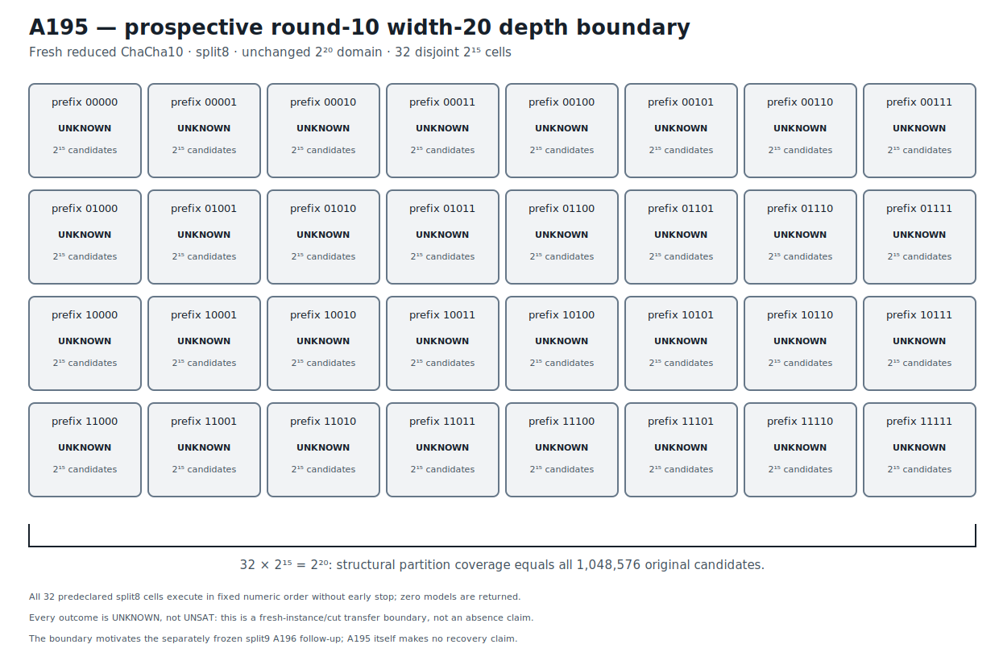

# ChaCha10 Width-20 Complete-Partition Boundary v1

## Result

A195 prospectively transfers A194's complete assignment-free width-20
partition to a fresh reduced ChaCha10/split8 instance.  The low 20 bits of key
word 0 are unknown and the other 236 key bits are known.  The hidden assignment
was used only to form eight public counter-related targets and was discarded
before the protocol was frozen.

All 32 five-bit prefix cells are constructed before execution.  Each cell
leaves 15 bits free, the cells are pairwise disjoint, and their structural union
equals the unchanged original domain:

```text
32 * 2^15 = 2^20 = 1,048,576 candidates.
```

Every cell executes in frozen numeric order under the same Bitwuzla 0.9.1
bitblast/CaDiCaL 10-second budget, with no early stop.  All 32 cells return
`unknown`; no model is returned and the confirmation list is empty.  The
predeclared recovery prediction is therefore not retained on this fresh
instance/cut pair.

This is an exact prospective round-10 split8 boundary.  It is not an absence
result over the complete `2^20` domain: the cells cover that domain
structurally, while `unknown` is a bounded solver outcome rather than `unsat`.
A195 makes no recovery or uniqueness claim.  Its exact evidence stage is
`ROUND10_WIDTH20_COMPLETE_PARTITION_BOUNDARY_RETAINED`.  The separately frozen
A196 split9 follow-up tests the representation consequence without changing
the A195 record.

## Prospective freeze and A194 anchor

```text
protocol  5aa5d23084dd79258b4a5d7b76c3220c70ab4e77d725a6bcc020c6004e47b975
runner    7739cfad67ada249a31f4673c230a870d1722e41cf8138a20d4fb269ad22cd6f
```

The protocol anchors A194's independently confirmed fresh round-9 recovery:

```text
A194 JSON          d1a8b58f313467851d5162998d1ed8a71e250f64ee5d98d5ea6024c0e814227b
A194 Causal        a09e00b6815febc9e5a2713f98680e12b0b2d194172913f19caf55be06325a08
A194 Causal graph  dffe8655d33d6379ce68a4012086283e33ebff6badf77fa5d9cd9946238b10e8
```

The fresh low-20 assignment was generated once from operating-system
cryptographic randomness, used only to form the public targets, and discarded
before freeze.  It is absent from the protocol and runner and was unavailable
to the runner before execution.  All 32 prefixes, split8, formula construction,
numeric order, uniform budget, success rule, and complete no-early-stop policy
were fixed before any A195 solver outcome.

```text
public challenge  5d17ed241b6b91224a4974f36b4b0b4ec5c677b9d975dd6bc8cec83b6ddbf86b
execution plan    533be9fdcd0700544f37e02f01767ffcaf2011f1814cc635c49043dac4d826b5
known material    40044d942ad2dc135f1228bde509731f9d1416f0c1a9bb38de851db1f95af53d
control target    371b6b0aac44efe9552551ac05246b4334e42bb87e9deee0bc9ccbb3e4c1b669
```

## Exact split8 partition

Every formula uses the same one-block round-10 split8 relation and differs only
in the assertion fixing key-word-0 bits 19 through 15.  Every cell has:

```text
formula bytes       23,069
fixed coordinates  19,18,17,16,15
free coordinates   14..0
candidate count     32,768
budget              10,000 ms
```

The canonical ordered formula-plan digest is:

```text
7bcea5cd3ebf73c775db9d890fbfa385af216fdb171c670a65c920aef79427fc
```

Representative exact formula bindings are:

| Prefix | Formula SHA-256 |
|---|---|
| `00000` | `ef57f84e4ad7fd1cff6c813bba9925ba7653c283fa531d4d597959361ad30f1b` |
| `11111` | `39cdd8bedef68ac4249a37032df73c75783e829e57466d0fa30562066d150bc8` |

The retained formula plan stores all 32 exact hashes.  The no-solver regression
gate reconstructs every formula byte-for-byte, checks every prefix assertion
and fixed/free coordinate set, and verifies the complete `2^20` structural
union.

## Complete execution boundary

```text
all 32 prefixes      UNKNOWN
SAT cells             0
UNSAT cells           0
returned models       0
confirmations         0
```

Every process returns normally, the complete order executes, and no early stop
occurs.  The retained artifact deliberately omits volatile elapsed time from
the canonical evidence.

```text
execution     35e2646e7fe2eafb396251a8e0832820b9ac0f665bd030bc2e0eb133f6f3e550
confirmation  4f53cda18c2baa0c0354bb5f9a3ecbe5ed12ab4d8e11ba873c2f11161202b945
comparison    93103e23f6941ea06faf3b09aa07d811e9b611e5556729734ebc71aef3178f04
```

The comparison's one-million-candidate count is a structural partition
cardinality.  It does not convert any `unknown` cell to `unsat` and does not
establish either recovery or uniqueness.

## Solver identity provenance

```text
solver       Bitwuzla 0.9.1
mode         bitblast
SAT backend  CaDiCaL
executable   9896c88b523114e3eae00d737f1183ca71fbd83a99e8e45fe294715747a2ce7a
```

Fast retained-artifact verification invokes no solver.

## Deterministic figure

```text
research/results/v1/chacha20_a195_round10_width20_partition_boundary_v1.svg
SHA-256 6ac8d351204d9bf77ba53b1ebaeb444b486b0ba6e971cc0c685adfcd09faee87
```



## Causal Reader chain

The Causal artifact contains six explicit provenance-linked triplets: A194
anchor, fresh round-10 challenge, complete split8 partition, complete cell
execution, empty independent-confirmation boundary, and prospective depth
transfer boundary.

```text
result JSON   8d8fc41df65d98af3eb7a0e117b2255c07e465cc16638f67ebe7df39dcc7e107
Causal file   e0ed05f35b405f558797b2eb66d218cb70a0e4c9778dd9312376a05c2d2ae9a5
Causal graph  552018924f0fdb83e82ed507aa6301440d1c46dba8e4ea992406905c73e80f01
```

`CryptoCausalReader` validates the six triplets, their trigger/outcome links,
and the complete provenance chain.

## Reproduction

```bash
PYTHONPATH=.:src .venv/bin/python \
  research/experiments/chacha20_bitwuzla_round10_width20_partition_transfer.py \
  --analyze-only
PYTHONPATH=.:src .venv/bin/python \
  research/experiments/chacha20_smt_round5_retained_figures.py --check
PYTHONPATH=.:src .venv/bin/pytest -q \
  tests/test_chacha20_bitwuzla_round10_width20_partition_transfer.py \
  tests/test_chacha20_smt_round5_retained_figures.py
```

These commands validate retained evidence without executing a solver.  An
explicit fresh 32-cell execution is separate production work.
