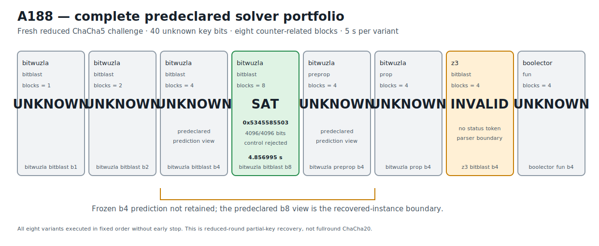

# ChaCha5 Portable SMT Portfolio and Bitwuzla b8 Recovery v1

## Result

A188 freezes another fresh reduced ChaCha round-5 challenge with 40 unknown key
bits and 216 known key bits. One portable SMT-LIB2 relation is instantiated over
1, 2, 4, or 8 counter-related blocks and executed as a complete eight-variant
portfolio across Bitwuzla 0.9.1, Z3 4.15.4, and Boolector 3.2.4. Every variant
receives a five-second engine budget, the complete order executes, and there is
no early stop.

The narrow prospective prediction was that both predeclared Bitwuzla b4 modes
would return the same fresh assignment. That prediction is not retained:
Bitwuzla bitblast b1, b2, and b4 and preprop b4 all return `unknown`.

The already-predeclared `bitwuzla_bitblast_b8` view returns `sat` at the stored
volatile observation 4.856995374895632 seconds and recovers:

```text
combined  357645702403 = 0x5345585503
word 0      1163416835 = 0x45585503
word-1 low byte       83 = 0x53
```

An independent NumPy ChaCha5 implementation recomputes all eight blocks, matches
all 4,096 output bits, and rejects the one-bit-flipped control. The exact result
is therefore a fresh, predeclared-portfolio, reduced-round 40-bit partial-key
recovery plus a b4-to-b8 instance boundary. It is not a fullround ChaCha20 result
and not a full 256-bit key recovery.

The stored `evidence_stage` remains exactly
`CROSS_ENGINE_ROUND5_RECOVERY_BOUNDARY_RETAINED`. The richer recovery statement
above follows directly from the immutable `execution.fully_confirmed_assignments`
and `confirmations` fields; those fields are read and validated without mutating
the retained artifact.

## Prospective freeze and information boundary

The frozen protocol and immutable runner are:

```text
protocol  73d029af9d75d6d463d03b311b8c5cff66fe42219685a35024a430b6f31cb2ef
runner    6d5517361c3399419352cf0d4b481e051841e0bf1b85745b2bac6e2963eb3df5
```

The protocol anchors A187's prospectively retained stacking result:

```text
A187 JSON          ec00786b9e778b3914cc2594919da11b763cfffa72f71fa110c2c90dc8e9e3e3
A187 Causal        6c3eda1c3f84cac90bf04e63267728cd88581f73f85fe18e971e72caa67fd68d
A187 Causal graph  3d4a769c40a1be6ff8b697bbd73b42b7ee89b840a2494d9e71907415d1542d50
```

The fresh 40-bit assignment is generated once from operating-system
cryptographic randomness, used only to form the eight public targets, and
discarded before protocol freeze. Its decimal and exact hexadecimal spellings
are absent from the protocol and runner. The execution order, five-second
budgets, b4 prediction, b8 block-count control, and engine controls are all
predeclared.

The canonical public-challenge and execution-plan digests are:

```text
public challenge  231ca751d07fefffbd54ce0715d8bc35f7a6d444df0f5c6f482b5b407e69ff9c
execution plan    f19a7653d73ee4bc2f66bba609766c3d5a7c037bcb009ed69d839378ebb5e0cf
```

The domain-separated SHAKE256 known-material derivation has digest:

```text
7f11a25515a8451c0c1cff9602121a84ce463592f334e42a36d2dc291e56300e
```

All eight public target-block digests and the control digest
`b8623baf5c484570a115395778928e504d4b99e8bc4ef942bac3f46b0b4e4268`
are recomputed from little-endian word bytes by the non-production gate.

## Portable formula portfolio

The formulas contain no solver-specific timeout or rlimit directive. Resource
limits are applied by each executable's command line. The declaration order,
block definition order, assertions, and `(check-sat)`/model request are otherwise
byte-identical where block count is identical.

| Variant | Engine/mode | Blocks | Bytes | Formula SHA-256 |
|---|---|---:|---:|---|
| `bitwuzla_bitblast_b1` | Bitwuzla bitblast + CaDiCaL | 1 | 12,361 | `b9174703c57ecd7dbbfb42f43f475c2b1b6d07d70622e5611be890eb3281748a` |
| `bitwuzla_bitblast_b2` | Bitwuzla bitblast + CaDiCaL | 2 | 23,780 | `c145e87c596d79fe3bed63e5c805740fffbc65263856a9c2d141dd0666b03b4d` |
| `bitwuzla_bitblast_b4` | Bitwuzla bitblast + CaDiCaL | 4 | 46,618 | `edf3d3cabda04fc470f9482fbcdcfffa327dc4718fddfb97b61d7a40219bfae1` |
| `bitwuzla_bitblast_b8` | Bitwuzla bitblast + CaDiCaL | 8 | 92,294 | `004bbb7ef6ab6ab19898dface90ad7bee953e5a9ca5a3134fab41ac275bae590` |
| `bitwuzla_preprop_b4` | Bitwuzla preprop + CaDiCaL | 4 | 46,618 | `edf3d3cabda04fc470f9482fbcdcfffa327dc4718fddfb97b61d7a40219bfae1` |
| `bitwuzla_prop_b4` | Bitwuzla prop | 4 | 46,618 | `edf3d3cabda04fc470f9482fbcdcfffa327dc4718fddfb97b61d7a40219bfae1` |
| `z3_bitblast_b4` | Z3 CLI | 4 | 46,618 | `edf3d3cabda04fc470f9482fbcdcfffa327dc4718fddfb97b61d7a40219bfae1` |
| `boolector_fun_b4` | Boolector fun + Lingeling | 4 | 46,618 | `edf3d3cabda04fc470f9482fbcdcfffa327dc4718fddfb97b61d7a40219bfae1` |

The canonical ordered formula-plan digest is:

```text
ef6b1485e607c44e1895d80c0d8f81c8c3ffd6a3976d8e6577c40926fe8f408b
```

## Complete portfolio outcome

| Order | Variant | Stored status | Model | Stored volatile seconds |
|---:|---|---|---|---:|
| 1 | `bitwuzla_bitblast_b1` | `unknown` | none | 5.0096407500095665 |
| 2 | `bitwuzla_bitblast_b2` | `unknown` | none | 5.007607291918248 |
| 3 | `bitwuzla_bitblast_b4` | `unknown` | none | 5.017956665717065 |
| 4 | `bitwuzla_bitblast_b8` | `sat` | `0x5345585503` | 4.856995374895632 |
| 5 | `bitwuzla_preprop_b4` | `unknown` | none | 5.01153774978593 |
| 6 | `bitwuzla_prop_b4` | `unknown` | none | 5.0179242910817266 |
| 7 | `z3_bitblast_b4` | `invalid` | none | 5.019524584058672 |
| 8 | `boolector_fun_b4` | `unknown` | none | 5.0089844590984285 |

The Z3 row is deliberately preserved as `invalid`. The CLI process exits with
return code zero after its wall-time option, emits statistics including
`rlimit-count = 55,402,653`, but emits no complete `sat`, `unsat`, or `unknown`
status token. `invalid` is therefore the exact parser boundary recorded by the
runner, not an inferred solver status. The integration never relabels that row.

The complete execution digest is:

```text
a340a50456ce9f0fbf7e80abebf5cfd85ebb34bce99bc8632afbeaeea23dcffb
```

## Independent 4,096-bit confirmation

The recovered assignment is evaluated independently over counters
`counter_start + 0` through `counter_start + 7`. Every candidate block digest
equals the corresponding public target digest. The confirmation records:

```text
block_count_checked          8
block_matches                true, true, true, true, true, true, true, true
all_blocks_match             true
output_bits_checked          4096
control_first_block_match    false
implementation               independent_NumPy_ChaCha5_blocks
```

The canonical confirmation and comparison digests are:

```text
confirmation  fbc625b84b07f0e0b241da42e5773073123309b297ff92075cffe87e84abf2dc
comparison    c0af73824da47d80d8ca9b16ec4dda937113fcf831d200c2a8f7d76d12afd8e3
```

The comparison explicitly records `prospective_prediction_retained = false`,
because neither predicted b4 view is confirmed, while the fully confirmed
assignment list contains the b8 recovery.

## Solver dependency provenance

The frozen production execution gates exact executable identities:

| Solver | Version | Executable SHA-256 | Frozen path |
|---|---|---|---|
| Bitwuzla | 0.9.1 | `9896c88b523114e3eae00d737f1183ca71fbd83a99e8e45fe294715747a2ce7a` | `/opt/homebrew/bin/bitwuzla` |
| Z3 | 4.15.4 | `ae6c8df33db9c9ae9a80b6044e77cd66529a141d8b25f0620f1e89b409594f48` | `/opt/homebrew/bin/z3` |
| Boolector | 3.2.4 | `ad08034940a968ab4641fd885c75a98220685443240224500b6de0ab23f11edb` | `/opt/homebrew/bin/boolector` |

Bitwuzla bitblast/preprop use the CaDiCaL backend selected on the command line;
Boolector uses the `fun` engine with Lingeling. These executables are external
CLI dependencies and are not represented as Python packages in
`requirements.txt`. Fast retained-artifact tests require none of them.

## Deterministic figure

The complete portfolio and b4-to-b8 boundary are rendered directly from the
retained JSON:

```text
research/results/v1/chacha20_a188_solver_portfolio_v1.svg
SHA-256 05ad13e0c16d8fa7eca0b960e17595e22d206553e032a32a0792033a04c035aa
```



## Causal Reader chain

The Causal artifact contains six explicit provenance-linked triplets:

1. the hash-pinned A187 stacking anchor;
2. the fresh A188 engine-transfer challenge;
3. the portable SMT-LIB2 formula family;
4. the complete eight-variant portfolio execution;
5. independent multiblock model confirmation;
6. the exact prospective-prediction and recovery-boundary assessment.

`CryptoCausalReader` verifies:

```text
result JSON   d1a75d6456f75257cbd0be41864fad0810540508aa5c30239b16bd3998eef73a
Causal file   a717e615cfc005fe985a24059f7e6bedcd8008c460b274bb313f6ddfc53e7c78
Causal graph  4db3b36f5a6b6c89d14905c861e6bb91035b5f5a9843af3345baf142dee294eb
```

## Reproduction

The default retained-artifact path reconstructs every formula byte stream,
validates target derivation, secret absence, all stored statuses, the Z3 parser
boundary, the independent 4,096-bit confirmation, control rejection, solver
identity provenance, deterministic figure, and Causal chain without invoking
any solver:

```bash
PYTHONPATH=.:src .venv/bin/python \
  research/experiments/chacha20_bitwuzla_round5_transfer.py \
  --analyze-only
PYTHONPATH=.:src .venv/bin/python \
  research/experiments/chacha20_smt_round5_retained_figures.py --check
PYTHONPATH=.:src .venv/bin/pytest -q \
  tests/test_chacha20_bitwuzla_round5_transfer.py \
  tests/test_chacha20_smt_round5_retained_figures.py
```

An explicit fresh portfolio execution requires all three hash-matched solver
binaries. It is production work and is excluded from the fast integration gate.
