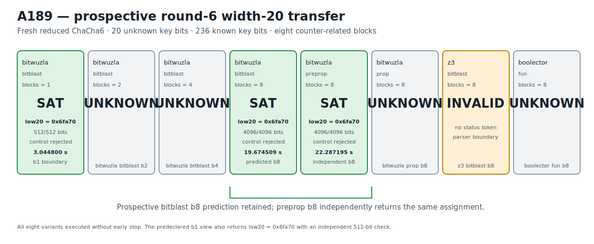

# ChaCha6 Bitwuzla Width-20 Prospective Recovery Transfer v1

## Result

A189 prospectively freezes a fresh reduced ChaCha round-6 challenge with the low
20 bits of key word 0 unknown and the other 236 key bits known. The same hidden
20-bit value is observed through eight counter-related blocks. A complete
eight-variant portable SMT-LIB2 portfolio executes across Bitwuzla 0.9.1, Z3
4.15.4, and Boolector 3.2.4 in frozen order and without early stop.

The prospective prediction is retained. The predeclared
`bitwuzla_bitblast_b8` view returns `sat` at the stored volatile observation
19.674508791882545 seconds and recovers:

```text
unknown low 20 bits  457328 = 0x6fa70
complete key word 0          = 0xd1f6fa70
```

An independent NumPy ChaCha6 implementation recomputes all eight blocks, matches
all 4,096 target bits, verifies the known-key constraints, and rejects the
one-bit-flipped control. The predeclared `bitwuzla_preprop_b8` view independently
returns the same assignment at 22.287194792181253 seconds and passes the same
4,096-bit gate.

The already-predeclared `bitwuzla_bitblast_b1` view also returns the same 20-bit
assignment at 3.0447999159805477 seconds. Its independent confirmation covers
the complete first 512-bit block and rejects the control. This b1 result is part
of the frozen block-count frontier; it is not a post-execution variant.

The exact retained status is
`PROSPECTIVE_BITWUZLA_ROUND6_20BIT_RECOVERY_TRANSFER_RETAINED`. A189 is a fresh
reduced-round 20-bit partial-key recovery with 236 known key bits. It is not a
fullround ChaCha20 result or a full 256-bit key recovery.

## Prospective freeze and information boundary

The frozen protocol and immutable runner are:

```text
protocol  88f9ba1cb557c1568689a46a42eaca69dc8f956de672fae99cb8d8988ae575cf
runner    8636ad0aa9fff62a7ee6bfa31d3d40fa6ba0244db3ce4f792884a83f13bad8c6
```

The protocol anchors A188's fresh, predeclared b8 recovery and its complete
Causal provenance chain:

```text
A188 JSON          d1a75d6456f75257cbd0be41864fad0810540508aa5c30239b16bd3998eef73a
A188 Causal        a717e615cfc005fe985a24059f7e6bedcd8008c460b274bb313f6ddfc53e7c78
A188 Causal graph  4db3b36f5a6b6c89d14905c861e6bb91035b5f5a9843af3345baf142dee294eb
```

The fresh 20-bit assignment is generated once from operating-system
cryptographic randomness, used only to form the eight public targets, and
discarded before protocol freeze. The decimal/exact-hex low-20 assignment, the
completed key word, and the solver's combined model spelling are absent from the
protocol and runner. Variant order, per-variant budgets, predicted b8 view, b1/b2
/b4 block controls, alternative Bitwuzla modes, and Z3/Boolector controls are
fixed before any A189 execution.

The canonical public challenge and execution-plan digests are:

```text
public challenge  c9a75c6f80b07baa31768146a6b5f3549723da56d8bd16b07d74d255dac19d39
execution plan    3aeba8db2d59e89def52b9104348800f82973a86d0f538bf7fbb6a5e482e51d7
```

Known material is derived through the domain-separated SHAKE256 label in the
protocol. The exact 48-byte derivation digest is:

```text
b33cf231cc7ea6c9f6b26f2af3c38fc4d5bda4f570d11bc6c3fc31781d27722a
```

All eight target-block digests are recomputed from little-endian word bytes by
the fast gate. The bit-flipped control digest is
`0c0241ae0946a7dde56e0f155a5611189ff9c697c374099383f0e0d266dd7a0e`.

## Exact portable formula plan

Every formula encodes the reduced six-round split5 relation, fixes the upper 12
bits of key word 0 and the complete adjacent key word, and leaves exactly 20
logical key bits unknown. Solver resource limits are applied through the command
line, not embedded in the portable formula.

| Variant | Engine/mode | Blocks | Budget | Bytes | Formula SHA-256 |
|---|---|---:|---:|---:|---|
| `bitwuzla_bitblast_b1` | Bitwuzla bitblast + CaDiCaL | 1 | 5 s | 14,545 | `df68f35bf6ede07faf8f40ce391dcf637e66d1579850dda54a12f109561a5699` |
| `bitwuzla_bitblast_b2` | Bitwuzla bitblast + CaDiCaL | 2 | 5 s | 28,084 | `dfe2584c25cef0ad4f68f9eafc149d1c8e44497b49ff0c3c57019a142868f085` |
| `bitwuzla_bitblast_b4` | Bitwuzla bitblast + CaDiCaL | 4 | 5 s | 55,162 | `b158737bb1cad45dbd5cc2fac1f9aa54cee156c7ba8b27bdc2efa12d3b7c8dec` |
| `bitwuzla_bitblast_b8` | Bitwuzla bitblast + CaDiCaL | 8 | 30 s | 109,318 | `bf097bac9b8f7b51e1b305ed3f00fe23730c52abf7473b58f65990141bbcb9fb` |
| `bitwuzla_preprop_b8` | Bitwuzla preprop + CaDiCaL | 8 | 30 s | 109,318 | `bf097bac9b8f7b51e1b305ed3f00fe23730c52abf7473b58f65990141bbcb9fb` |
| `bitwuzla_prop_b8` | Bitwuzla prop | 8 | 5 s | 109,318 | `bf097bac9b8f7b51e1b305ed3f00fe23730c52abf7473b58f65990141bbcb9fb` |
| `z3_bitblast_b8` | Z3 CLI | 8 | 5 s | 109,318 | `bf097bac9b8f7b51e1b305ed3f00fe23730c52abf7473b58f65990141bbcb9fb` |
| `boolector_fun_b8` | Boolector fun + Lingeling | 8 | 5 s | 109,318 | `bf097bac9b8f7b51e1b305ed3f00fe23730c52abf7473b58f65990141bbcb9fb` |

The canonical ordered formula-plan digest is:

```text
8471323ecb3da7ea4149504383b7d2d16641e705a425c7b945f5bd7af479f798
```

The non-production regression gate reconstructs all eight formula streams and
checks their exact byte lengths, hashes, fixed-known-key assertions, declaration
order, block definition order, and absence of the recovered low-20 literal.

## Complete portfolio outcome

| Order | Variant | Stored status | Independent confirmation | Stored volatile seconds |
|---:|---|---|---|---:|
| 1 | `bitwuzla_bitblast_b1` | `sat` | 512/512 bits, control rejected | 3.0447999159805477 |
| 2 | `bitwuzla_bitblast_b2` | `unknown` | none | 5.007602167315781 |
| 3 | `bitwuzla_bitblast_b4` | `unknown` | none | 5.017296375241131 |
| 4 | `bitwuzla_bitblast_b8` | `sat` | 4,096/4,096 bits, control rejected | 19.674508791882545 |
| 5 | `bitwuzla_preprop_b8` | `sat` | 4,096/4,096 bits, control rejected | 22.287194792181253 |
| 6 | `bitwuzla_prop_b8` | `unknown` | none | 5.013158916961402 |
| 7 | `z3_bitblast_b8` | `invalid` | none | 5.013778291177005 |
| 8 | `boolector_fun_b8` | `unknown` | none | 5.01783591741696 |

All three SAT rows return the same complete model and the same unknown low-20
assignment. The complete execution digest is:

```text
a2d5780c5850288c635169281831f97d8c136e38d600365fb8c320ebc1f6d8b1
```

The Z3 process exits with return code zero and emits
`rlimit-count = 20,698,099`, but no complete `sat`, `unsat`, or `unknown` status
token. The stored `invalid` label is the exact parser boundary and is not
reinterpreted as a solver outcome.

## Independent confirmation and prospective result

The confirmation artifact contains three rows in execution order:

- b1 bitblast: one complete block, 512 bits;
- b8 bitblast: all eight blocks, 4,096 bits;
- b8 preprop: all eight blocks, 4,096 bits.

Every row verifies the frozen known-key constraints, matches every checked block,
and rejects the control. Both b8 candidate-block digest lists equal the eight
public target digests exactly. The canonical confirmation and comparison
digests are:

```text
confirmation  ee89fcf1cb3ac46b62834af579b3306faff594fff879d47537e9a1a15dfccabd
comparison    78515deb3ff87577a169b4ce508a8049e3ec36c40b46b1743b33d285f9b83928
```

The comparison records exactly one fully confirmed unknown low-20 assignment,
the predicted `bitwuzla_bitblast_b8` view as confirmed, and
`prospective_prediction_retained = true`.

## Solver dependency provenance

A189 reuses and independently gates the exact A188 production solver identities:

| Solver | Version | Executable SHA-256 |
|---|---|---|
| Bitwuzla | 0.9.1 | `9896c88b523114e3eae00d737f1183ca71fbd83a99e8e45fe294715747a2ce7a` |
| Z3 | 4.15.4 | `ae6c8df33db9c9ae9a80b6044e77cd66529a141d8b25f0620f1e89b409594f48` |
| Boolector | 3.2.4 | `ad08034940a968ab4641fd885c75a98220685443240224500b6de0ab23f11edb` |

Fast retained-artifact verification requires none of these executables.

## Deterministic figure

The full portfolio is rendered directly from the retained JSON:

```text
research/results/v1/chacha20_a189_round6_width20_portfolio_v1.svg
SHA-256 ec6d4dcc0cc07514313fc9bca446076a36f3547c8fb929e98c5e7775c912d9cc
```



## Causal Reader chain

The Causal artifact contains six explicit provenance-linked triplets:

1. the hash-pinned A188 round-5 b8 recovery anchor;
2. the fresh round-6 width-20 challenge;
3. the portable split5 formula family;
4. the complete engine/block frontier;
5. independent b1 and b8 model confirmation;
6. the retained prospective depth/width transfer.

`CryptoCausalReader` verifies:

```text
result JSON   e57294c1aabf29f2e8fff87b9b06f0ed1ab0d8392cc9ea79f4f97745904e6b70
Causal file   bebcd7805592cd28805e7226c1efa216696544539605693dc197b88a70e44a37
Causal graph  1a5cd713921ecbfd79bc649a1f4bd30aaad440074bb88374a7ce28c68581ffc9
```

## Reproduction

The default gate reconstructs all formulas, validates target derivation and
literal-secret absence, exact status/model vectors, the Z3 parser boundary,
three independent confirmations, solver identity provenance, deterministic
figure, and Causal chain without invoking any solver:

```bash
PYTHONPATH=.:src .venv/bin/python \
  research/experiments/chacha20_bitwuzla_round6_width20_transfer.py \
  --analyze-only
PYTHONPATH=.:src .venv/bin/python \
  research/experiments/chacha20_smt_round5_retained_figures.py --check
PYTHONPATH=.:src .venv/bin/pytest -q \
  tests/test_chacha20_bitwuzla_round6_width20_transfer.py \
  tests/test_chacha20_smt_round5_retained_figures.py
```

An explicit fresh portfolio execution is separate production work and is not
part of the integration gate.
