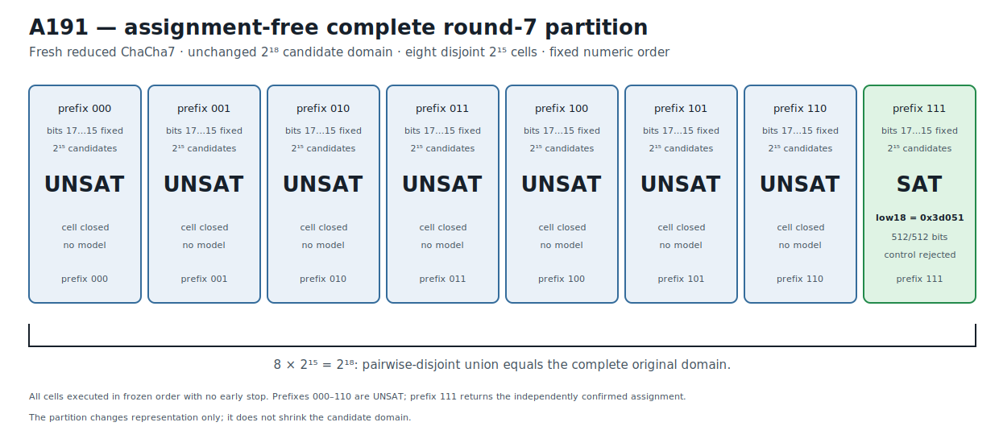

# ChaCha7 Assignment-Free Complete Partition Recovery v1

## Result

A191 prospectively freezes a fresh reduced ChaCha round-7 challenge with the
low 18 bits of key word 0 unknown and the other 238 key bits known.  Before any
A191 solver execution, the complete original `2^18` assignment domain is
partitioned by key-word-0 bits 17 through 15 into all eight binary prefixes:

```text
000, 001, 010, 011, 100, 101, 110, 111
```

Each cell leaves bits 14 through 0 free and therefore contains exactly `2^15`
candidates.  The cells are pairwise disjoint and their union contains

```text
8 * 2^15 = 2^18 = 262,144 candidates.
```

The partition and numeric execution order are assignment-free: the unknown
assignment is not used to choose, rank, omit, or stop any cell.  All eight cells
execute under the same predeclared Bitwuzla 0.9.1 bitblast/CaDiCaL 10-second
budget with no early stop.  Prefixes `000` through `110` return `unsat`; prefix
`111` returns `sat` and recovers:

```text
unknown low 18 bits  249937 = 0x3d051
complete key word 0           = 0xac7bd051
```

An independent NumPy ChaCha7 implementation matches all 512 target bits,
verifies the 238 known-key constraints, and rejects the one-bit-flipped control.
The retained evidence stage is
`PROSPECTIVE_ROUND7_WIDTH18_COMPLETE_PARTITION_RECOVERY_RETAINED`.

This is a complete-domain prospective reduced-round 18-bit partial-key recovery.
The representation changes from one monolithic relation to eight disjoint cells;
the candidate domain is not reduced.  It is not a fullround ChaCha20 result or a
full 256-bit key recovery.

## Prospective freeze and A190 anchor

The frozen protocol and immutable runner are:

```text
protocol  4f4b9839cccde0cd23110513a83d7d6bcc186bd0113f2390c73660ccc8b9f88c
runner    841a10feaf6a84b6db69da426cf01349aee959c4834f1f202bb711cf94a80b74
```

A191 is anchored to A190's prospectively measured monolithic/portfolio
instance boundary:

```text
A190 JSON          f1cdad782a7ed82e893517eb2bffc1973640652bd59bcdc6a76a8ce060659220
A190 Causal        bb400fa62b338833dd7b06e98ea34840da1926315624f2d024ea80220af472f6
A190 Causal graph  eca84970c765a5c9f017d98018835009b34a52150bfdfc3f9430de9789bd782a
```

The fresh A191 low-18 assignment was generated once from operating-system
cryptographic randomness, used only to form eight public counter-related
targets, and discarded before protocol freeze.  Its decimal and exact hex
spellings are absent from the protocol and runner.  The eight prefix formulas,
fixed coordinates, free coordinates, numeric order, uniform budget, complete
execution rule, and no-early-stop policy were frozen before any A191 outcome.

The public challenge and execution plan are bound by:

```text
public challenge  e92258e707ee18b7209643e0dbbf7f9c2c4390381ab10dded59e945ccc835b3f
execution plan    5b9357f11d6281c4eb65344cbd1244b7294156b2be8c05d1b5ac7ec21188a700
```

The 48-byte known-material derivation digest is:

```text
da324c9149b2477cb366dbd4a0e04b55fce2235ff838957185d510c3cd6d2cbb
```

All eight public target digests and the bit-flipped control digest
`b35594db6a34d1d759473711c6b988248695091fc05f87c34ed614ee3edd7ae8`
are independently reconstructed by the fast gate.

## Exact complete partition

Every cell uses the same one-block round-7 split6 relation.  The only formula
difference is the explicit three-bit prefix assertion.  Every formula has
16,718 bytes and one `check-sat` command.

| Order | Prefix | Fixed bits | Free bits | Candidates | Formula SHA-256 |
|---:|---|---|---|---:|---|
| 1 | `000` | 17,16,15 | 14..0 | 32,768 | `d4c89312a950228b65a618ab11f858dab2a3ed8c2dbe5a07af8b9164288b31be` |
| 2 | `001` | 17,16,15 | 14..0 | 32,768 | `1d1ad3062373cd2ec5914d366bdd6647d630617cdf2c876235cc90a4407474ba` |
| 3 | `010` | 17,16,15 | 14..0 | 32,768 | `26d798bb800594324990e762c77a7728289deacc2279fbca0ce133d70003e4dc` |
| 4 | `011` | 17,16,15 | 14..0 | 32,768 | `b1290f24ef8fe4101ebcce12cc410f53cdca4068c3aee293a681d3c8035bfcb7` |
| 5 | `100` | 17,16,15 | 14..0 | 32,768 | `72bb032f997ae8583042d0761666c81cb7b066f204454c279d58207859466aca` |
| 6 | `101` | 17,16,15 | 14..0 | 32,768 | `be1e1b44c80c572d00b2e3bb92f7e5aedf561f0396d72ce78e77d2bde7bb89c6` |
| 7 | `110` | 17,16,15 | 14..0 | 32,768 | `5dd2bd8cc206d9d353a407217f5ae54b2109be35b296bdc9b64f0962c0872f95` |
| 8 | `111` | 17,16,15 | 14..0 | 32,768 | `faf3e64bc828b68fe9e5da47afad9b149de5c1430624ae17f653743f222a0232` |

The ordered formula-plan digest is:

```text
8efc964ec069077adebad39a2ae9e9384962c25c70b795bc4d73072c22aa51a7
```

The regression gate reconstructs all formula bytes and proves complete coverage
from the coordinates themselves: every three-bit prefix occurs exactly once;
the cells share the same 15 free coordinates; each cell contains `2^15`
candidates; and their summed cardinality equals the original `2^18` domain.

## Complete execution

| Order | Prefix | Stored status | Model | Stored volatile seconds |
|---:|---|---|---|---:|
| 1 | `000` | `unsat` | none | 7.298930 |
| 2 | `001` | `unsat` | none | 7.087638 |
| 3 | `010` | `unsat` | none | 7.504754 |
| 4 | `011` | `unsat` | none | 6.886788 |
| 5 | `100` | `unsat` | none | 6.972348 |
| 6 | `101` | `unsat` | none | 6.561229 |
| 7 | `110` | `unsat` | none | 6.698584 |
| 8 | `111` | `sat` | `0x3d051` | 2.259334 |

All cells return normally, none reaches the external guard, the full order
executes, and no early stop occurs.  The canonical execution digest is:

```text
5e9acef4fda6ee5436193d889a6fcd49c6b4ca7c5204a2c9080e11054bf85840
```

## Independent confirmation and complete-domain comparison

The recovered model is bound to prefix `111` because its low-18 value satisfies
`0x3d051 >> 15 = 0b111`.  Independent recomputation records:

- all 238 known key constraints match;
- the complete 512-bit first block matches;
- candidate block SHA-256
  `f88f11d2854d4648c57f0b4cece8803f97433566c8732bb0dfdfb837a890505c`;
- the one-bit-flipped control does not match.

The confirmation and comparison digests are:

```text
confirmation  8d1c10412b305e8d6667797abed6249df8705f416649bc0d72c8d675717a7912
comparison    21effa88461bcf944e5913dd50f1f97a1330ad2520e5fc42ecd62064b9da7976
```

The comparison artifact states both candidate counts explicitly:

```text
original domain   262,144
partition union   262,144
```

It also records pairwise-disjoint complete coverage by construction, all eight
statuses, the single confirmed variant, and retention of the prospective
complete-partition prediction.

## Solver identity provenance

A191 uses the exact Bitwuzla identity already frozen in A188--A190:

```text
version     0.9.1
mode        bitblast
SAT backend CaDiCaL
executable  9896c88b523114e3eae00d737f1183ca71fbd83a99e8e45fe294715747a2ce7a
```

Fast retained-artifact verification does not invoke Bitwuzla.

## Deterministic figure

```text
research/results/v1/chacha20_a191_round7_complete_partition_v1.svg
SHA-256 85589e6ebadf0fbf8fdc6c8c43c2deb5b7e1dbd15734871d539996db206652ad
```



## Causal Reader chain

The Causal artifact contains six explicit provenance-linked triplets: A190
boundary anchor, fresh A191 challenge, complete prefix partition, complete cell
execution, independent model confirmation, and prospective partition transfer.

```text
result JSON   11911962fa7cdfaa3c1b996e2f45ccbbc3584948612ef98d88b3719099c31172
Causal file   c9197fe27adc0fafd5352f3b506c1533e9992f428504b24cfa87de347a39ac9a
Causal graph  4d4a8685bba61d4e373bd829f6a94c6006f3d04eb0901ac81a695caf4059f01e
```

`CryptoCausalReader` validates all triplets, each trigger/outcome link, and the
complete provenance chain.

## Reproduction

The default gate reconstructs all eight formulas, validates complete/disjoint
domain coverage, exact statuses and model, independent confirmation, control
rejection, figure, and Causal chain without invoking Bitwuzla:

```bash
PYTHONPATH=.:src .venv/bin/python \
  research/experiments/chacha20_bitwuzla_round7_partition_transfer.py \
  --analyze-only
PYTHONPATH=.:src .venv/bin/python \
  research/experiments/chacha20_smt_round5_retained_figures.py --check
PYTHONPATH=.:src .venv/bin/pytest -q \
  tests/test_chacha20_bitwuzla_round7_partition_transfer.py \
  tests/test_chacha20_smt_round5_retained_figures.py
```

An explicit fresh eight-cell solver execution is separate production work.
