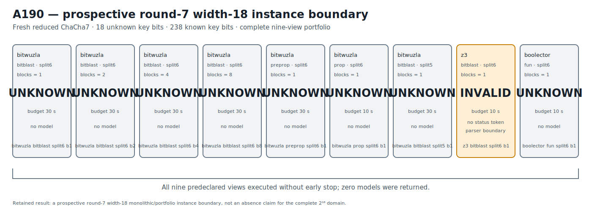

# ChaCha7 Bitwuzla Width-18 Prospective Instance Boundary v1

## Result

A190 prospectively freezes a fresh reduced ChaCha round-7 challenge with the
low 18 bits of key word 0 unknown and the other 238 key bits known.  The same
hidden 18-bit value is observed through eight counter-related blocks.  A
complete nine-view portable SMT-LIB2 portfolio executes in frozen order across
Bitwuzla 0.9.1, Z3 4.15.4, and Boolector 3.2.4 without early stopping.

The predeclared split6/b1 prediction is not retained on this fresh instance.
Every Bitwuzla and Boolector view returns `unknown`; Z3 exits normally but emits
no complete status token and therefore retains the exact `invalid` parser
label.  No view returns a model, the confirmation list is empty, and all nine
views are retained.  The exact evidence stage is
`ROUND7_WIDTH18_RECOVERY_BOUNDARY_RETAINED`.

This is a valuable prospective round-7 width-18 monolithic/portfolio instance
boundary.  It is not an absence result over the complete `2^18` candidate
domain: `unknown` is a bounded solver outcome, not `unsat`.  A191 subsequently
tests that complete domain through a representation change while preserving
its cardinality exactly.

## Prospective freeze and information boundary

The frozen protocol and immutable runner are:

```text
protocol  27c810f2086b0cb8e365126fac7be4d086a134511427362f65dbb216eb914a3b
runner    fb7ec319302a6dd7708411aced69c115a572311f625480f9a20400d8bfd21e69
```

The protocol anchors A189's independently confirmed prospective round-6
width-20 recovery:

```text
A189 JSON          e57294c1aabf29f2e8fff87b9b06f0ed1ab0d8392cc9ea79f4f97745904e6b70
A189 Causal        bebcd7805592cd28805e7226c1efa216696544539605693dc197b88a70e44a37
A189 Causal graph  1a5cd713921ecbfd79bc649a1f4bd30aaad440074bb88374a7ce28c68581ffc9
```

The fresh low-18 assignment was generated once from operating-system
cryptographic randomness, used only to form the eight public targets, and
discarded before protocol freeze.  It is absent from the protocol and runner
and was unavailable to the runner before execution.  The nine variants, their
order, block counts, cuts, solver modes, budgets, success rule, and no-early-stop
policy were fixed before any A190 solver execution.

The public challenge and complete execution plan are bound by:

```text
public challenge  dc1f9ac9b0d3f488d98d3712219dbe3fa370152f6194e1e4644a273ba247d836
execution plan    e1bfd7baf65802a210b5a4b917da376d329767d509ddf22ae59477006549532f
```

Known material is derived through the domain-separated SHAKE256 label stored in
the protocol.  Its exact 48-byte digest is:

```text
1eb8af8aa31fe3964cb150c59683d56418c5924136d7be46b06224ff28036461
```

Every target-block digest and the one-bit-flipped first-block control digest
`27cdf8df1789bc35e56b8c1fcf0e94eba0fae056dc6f096486769d34a1bb7753`
are recomputed by the fast gate.

## Exact portable formula family

Every formula fixes the known upper 14 bits of key word 0 and the adjacent key
word's low byte, leaving exactly 18 logical key bits unknown.  Solver limits are
command-line resources and are absent from the portable formula bytes.

| Variant | Engine/mode | Cut | Blocks | Budget | Bytes | Formula SHA-256 |
|---|---|---|---:|---:|---:|---|
| `bitwuzla_bitblast_split6_b1` | Bitwuzla bitblast + CaDiCaL | split6 | 1 | 30 s | 16,676 | `b7d54b70faadf3500753df87e80aef702955964654dc5ce2d48fff0505af8226` |
| `bitwuzla_bitblast_split6_b2` | Bitwuzla bitblast + CaDiCaL | split6 | 2 | 30 s | 32,335 | `264094156cf719d507b393de26e1fe5ea07ec2637ddc55a3324ff7771d02f735` |
| `bitwuzla_bitblast_split6_b4` | Bitwuzla bitblast + CaDiCaL | split6 | 4 | 30 s | 63,653 | `992de86fba00a4930182e4038345879e67c6fa7bdfd028fc15c6c04de95c534c` |
| `bitwuzla_bitblast_split6_b8` | Bitwuzla bitblast + CaDiCaL | split6 | 8 | 30 s | 126,289 | `5a61b805be1e4e372c2ff9134ea6eab34be298ca5ba6ac341326927d67c9e6d3` |
| `bitwuzla_preprop_split6_b1` | Bitwuzla preprop + CaDiCaL | split6 | 1 | 30 s | 16,676 | `b7d54b70faadf3500753df87e80aef702955964654dc5ce2d48fff0505af8226` |
| `bitwuzla_prop_split6_b1` | Bitwuzla prop | split6 | 1 | 10 s | 16,676 | `b7d54b70faadf3500753df87e80aef702955964654dc5ce2d48fff0505af8226` |
| `bitwuzla_bitblast_split5_b1` | Bitwuzla bitblast + CaDiCaL | split5 | 1 | 30 s | 16,676 | `c3e3fa270b7eb5ef466795314293c8cf390c3b8ea09eca0b3534daa5bebceb0d` |
| `z3_bitblast_split6_b1` | Z3 CLI | split6 | 1 | 10 s | 16,676 | `b7d54b70faadf3500753df87e80aef702955964654dc5ce2d48fff0505af8226` |
| `boolector_fun_split6_b1` | Boolector fun + Lingeling | split6 | 1 | 10 s | 16,676 | `b7d54b70faadf3500753df87e80aef702955964654dc5ce2d48fff0505af8226` |

The canonical ordered formula-plan digest is:

```text
93b1fdd8d8288c5735106ef229a31e7761f2ff2f93168d1cf976ba2db76be696
```

## Complete portfolio outcome

| Order | Variant | Stored status | Returned model | Stored volatile seconds |
|---:|---|---|---|---:|
| 1 | `bitwuzla_bitblast_split6_b1` | `unknown` | none | 30.010759 |
| 2 | `bitwuzla_bitblast_split6_b2` | `unknown` | none | 30.012033 |
| 3 | `bitwuzla_bitblast_split6_b4` | `unknown` | none | 30.014532 |
| 4 | `bitwuzla_bitblast_split6_b8` | `unknown` | none | 30.015306 |
| 5 | `bitwuzla_preprop_split6_b1` | `unknown` | none | 30.007341 |
| 6 | `bitwuzla_prop_split6_b1` | `unknown` | none | 10.012016 |
| 7 | `bitwuzla_bitblast_split5_b1` | `unknown` | none | 30.010659 |
| 8 | `z3_bitblast_split6_b1` | `invalid` | none | 10.012804 |
| 9 | `boolector_fun_split6_b1` | `unknown` | none | 10.010188 |

The complete execution, empty confirmation list, and comparison digests are:

```text
execution     e5f3bbc7b02eefcc979ee89222cf31ab8fc29c026a881f27c30358aaa789f77f
confirmation  4f53cda18c2baa0c0354bb5f9a3ecbe5ed12ab4d8e11ba873c2f11161202b945
comparison    8ac3ee3d91549efafd804d69c1cd3bd837a0ff6be3d12a5ff7a9eb83d5b866a8
```

Z3's process returns code zero and records `rlimit-count = 93,468,752`, but its
stdout contains no complete status token.  The retained `invalid` value is the
exact parser boundary and is not reinterpreted as a solver result.

## Solver identity provenance

| Solver | Version | Executable SHA-256 |
|---|---|---|
| Bitwuzla | 0.9.1 | `9896c88b523114e3eae00d737f1183ca71fbd83a99e8e45fe294715747a2ce7a` |
| Z3 | 4.15.4 | `ae6c8df33db9c9ae9a80b6044e77cd66529a141d8b25f0620f1e89b409594f48` |
| Boolector | 3.2.4 | `ad08034940a968ab4641fd885c75a98220685443240224500b6de0ab23f11edb` |

Fast retained-artifact verification does not invoke these executables.

## Deterministic figure

```text
research/results/v1/chacha20_a190_round7_width18_boundary_v1.svg
SHA-256 fd9c684ff353dd05cd40675b8835e8a8d1cdb014eb2cb944fe710e85d2958a6e
```



## Causal Reader chain

The Causal artifact contains six provenance-linked triplets: A189 recovery
anchor, fresh A190 challenge, portable cut/block family, complete portfolio,
independent-confirmation boundary, and prospective transfer result.

```text
result JSON   f1cdad782a7ed82e893517eb2bffc1973640652bd59bcdc6a76a8ce060659220
Causal file   bb400fa62b338833dd7b06e98ea34840da1926315624f2d024ea80220af472f6
Causal graph  eca84970c765a5c9f017d98018835009b34a52150bfdfc3f9430de9789bd782a
```

`CryptoCausalReader` validates all six triplets, their exact trigger/outcome
links, and the complete provenance chain.

## Reproduction

The default gate reconstructs all nine formulas, validates every hash and
status, confirms that all model and confirmation fields are empty, reproduces
the figure, and reads the Causal graph without invoking a solver:

```bash
PYTHONPATH=.:src .venv/bin/python \
  research/experiments/chacha20_bitwuzla_round7_width18_transfer.py \
  --analyze-only
PYTHONPATH=.:src .venv/bin/python \
  research/experiments/chacha20_smt_round5_retained_figures.py --check
PYTHONPATH=.:src .venv/bin/pytest -q \
  tests/test_chacha20_bitwuzla_round7_width18_transfer.py \
  tests/test_chacha20_smt_round5_retained_figures.py
```

An explicit fresh portfolio execution is separate production work.
