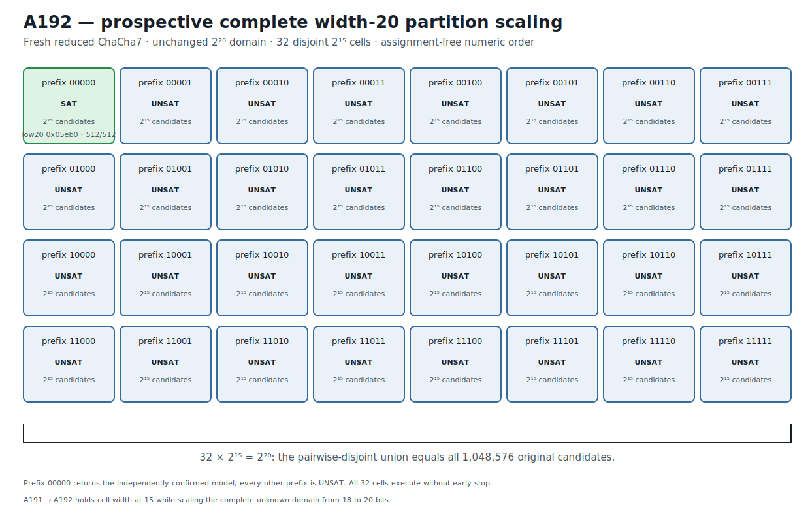

# ChaCha7 Width-20 Complete Partition Scaling Recovery v1

## Result

A192 prospectively scales A191's assignment-free complete partition from 18 to
20 unknown key bits on a fresh reduced ChaCha round-7 challenge.  The other 236
key bits are known.  Cell width remains fixed at 15 free bits: key-word-0 bits
19 through 15 form every five-bit prefix, producing 32 pairwise-disjoint cells.

```text
32 * 2^15 = 2^20 = 1,048,576 candidates.
```

The partition union is exactly the complete original `2^20` domain.  The
unknown assignment is not used for partition construction, cell order,
selection, or stopping.  Every cell executes under the same predeclared
Bitwuzla 0.9.1 bitblast/CaDiCaL 10-second budget in numeric prefix order and no
early stop occurs.

Prefix `00000` returns `sat`; all other 31 cells return `unsat`.  The recovered
assignment is:

```text
unknown low 20 bits  24240 = 0x05eb0
complete key word 0          = 0xc6005eb0
```

An independent NumPy ChaCha7 implementation matches all 512 target bits,
verifies the 236 known-key constraints, and rejects the one-bit-flipped control.
The exact retained stage is
`PROSPECTIVE_ROUND7_WIDTH20_COMPLETE_PARTITION_RECOVERY_RETAINED`.

This is a complete-domain prospective reduced-round 20-bit partial-key recovery
and a retained width-scaling transfer from A191.  The representation changes;
the candidate domain is not reduced.  It is not a fullround ChaCha20 result or
a full 256-bit key recovery.

## Prospective freeze and scaling rule

The frozen protocol and immutable runner are:

```text
protocol  f7fd55595cad5255af002e0fa4dee8af45d6224ae4283b1bcbe3baecc0181eb5
runner    e209a6268b55b587fa47c7765cec51e93cae77a6194a9ac2f5ccf9cfa8a6d9c2
```

The protocol anchors A191's fresh complete `2^18` partition recovery:

```text
A191 JSON          11911962fa7cdfaa3c1b996e2f45ccbbc3584948612ef98d88b3719099c31172
A191 Causal        c9197fe27adc0fafd5352f3b506c1533e9992f428504b24cfa87de347a39ac9a
A191 Causal graph  4d4a8685bba61d4e373bd829f6a94c6006f3d04eb0901ac81a695caf4059f01e
```

Before any A192 outcome, the scaling rule was fixed to:

- increase unknown width from 18 to 20 bits;
- increase fixed prefix width from 3 to 5 bits;
- hold every cell at 15 free bits;
- enumerate all 32 prefixes in numeric order;
- execute the complete plan with no early stop.

The fresh low-20 assignment was generated once from operating-system
cryptographic randomness, used only to construct eight public counter-related
targets, and discarded before protocol freeze.  Its decimal and exact hex
spellings are absent from protocol and runner.

The public challenge and complete execution plan are bound by:

```text
public challenge  5195f2da6977781e3679b34087b09074df8c9720dfc8f7c95f9a846aabbe1512
execution plan    a2b73c8236b4a9129eaa6348c2db6061148293f146390a587f3be9696483e9f3
```

The exact 48-byte domain-separated known-material digest is:

```text
62ed11ce9f1283bf968eb87d303663ba3eb4486f242abcb22c54404cd7792b48
```

The fast gate reconstructs all eight target hashes and the one-bit-flipped
control digest
`695391fae1cef7e6b1321bd0870d0f3edc3cd272cf164cf7ed2c28b610478790`.

## Exact complete `2^20` partition

Every cell uses the same one-block round-7 split6 relation.  The only varying
formula component is the explicit assertion fixing bits 19 through 15.  Each
formula has 16,709 bytes, exactly 15 free key coordinates, and 32,768
candidates.

| Prefix | Candidates | Formula SHA-256 |
|---|---:|---|
| `00000` | 32,768 | `d3e97d14a9dcb9ed9c02f01b7e6a923ecdfcd8e69fc8151acbc6495f44806bae` |
| `00001` | 32,768 | `64aeb2b23c37869ac085bfa4eb072cfc34f2b61819fbf0c9149466348b4de61e` |
| `00010` | 32,768 | `02f767bb02eab08cf72dd8a01fac1ca951d9ced9c8fbc96d43e9de977ee7504c` |
| `00011` | 32,768 | `d2b197413683fefd0cb728bb174c0d1fefacfa8982b420d6651aa14d88c94733` |
| `00100` | 32,768 | `201495343b671acecc7b39dff72f29c526eab1f4d7f5188c4f437481c5f8ac24` |
| `00101` | 32,768 | `2b3eeb91c5278ff737466a7c157fbdad1e8ad877ca407124400e1fb54b19ae15` |
| `00110` | 32,768 | `fb50aceeb24b5f0b30453396aa32091bcda14eb061756a5bea53e9f2c32b5fd2` |
| `00111` | 32,768 | `c66e43bede8a52798604056138b436f2bcb01a41ff3886356914fb27fc74abbf` |
| `01000` | 32,768 | `e046efbebfce9fd2675840d555f0c0cf9107269728a72b353e912ebbf038d6cc` |
| `01001` | 32,768 | `953ee83cbaf25ae2bc7786520851056f09f7dc1c033cb8fa044339a14800b5ad` |
| `01010` | 32,768 | `c9bbb442379c68ee6558e14387ac4a2adc92b7e555d2bd3083d51321bffc1295` |
| `01011` | 32,768 | `f5c06e78a24e37db61cf3f27db390a877ba265bc2b0e569aeda3c03df84f4057` |
| `01100` | 32,768 | `dcb76830f727f877f63b535e8634cf7fe14e22056a24b7ca9d8fe5fadedbf564` |
| `01101` | 32,768 | `3878010471876ec4a3f90172b2ea37d7de322424215834a7b54ab24f87c01177` |
| `01110` | 32,768 | `a3729a9d08a8d69f85c8cbea739a3d1ab622771df8c68a96007fdd92399e7028` |
| `01111` | 32,768 | `9c30f377e97a77c95bda21c8ba9ebc6901c1c627c2f05cbb2cb51c55f31f31a5` |
| `10000` | 32,768 | `861f464cbc7d060022c912ebf86c0c758b1b22c39628dd601f6c595b612c33d2` |
| `10001` | 32,768 | `8ba3518eca6549a15dc89723a56edfd47032d2f666338e684bfb09aeb17ece7c` |
| `10010` | 32,768 | `048653e5ad9e1b86504195d9270c5574f81fed4c5f4fbd99298b5270f2341893` |
| `10011` | 32,768 | `d5800713106f68b59f7b251f8fd46559f98ad8c82150c57fc994ed9446a3ed90` |
| `10100` | 32,768 | `d28ba4a0469ffb50236f391cae23d93edda38c8379e02ef7c5d500f97e8c3d2f` |
| `10101` | 32,768 | `06eb52075b08d17c779bb6aea769104b1f1eababf0cfe8b729550150ee6d45e5` |
| `10110` | 32,768 | `223768b2dff4298e3d1e7c0f3d314abd6e1a1f00aa4e2291a3b9e5584c903dc1` |
| `10111` | 32,768 | `b51d448e349998c7dcb8e51e565b4a82b22652df4848fdc4fe5bcb9310970eaa` |
| `11000` | 32,768 | `4930270715b1659aa40f542455a9b483b58ef1674e8f1aef10abfdce2b51468a` |
| `11001` | 32,768 | `ea0bca7aa9a1c4b66c2817093d20926e61c74184e245bec48c5c26680691171f` |
| `11010` | 32,768 | `d24045e162762b545efc2e0aea03f47911b6aaf6667a2e4a45155b2ed42386c5` |
| `11011` | 32,768 | `c9e45df04c22965917c9d5d17a5f7249f207f9d082a355273ddf83133fac7ef8` |
| `11100` | 32,768 | `23ee6761fe8b0ed10aabdda1a58f2175575d60c4a015e8da0cee84ff34537e4f` |
| `11101` | 32,768 | `bd1d3611b688328d32d7003d1e4a29593b25f9e73247adb0b16aa571d6b8bcf9` |
| `11110` | 32,768 | `507c110ea572b9688396b36c10025ed14312bc04cd2bbea058b63947989e53cc` |
| `11111` | 32,768 | `e20eb108d0b7af617288fd61664e2c96292fe630069987ef865f9a8067b8ff5d` |

The canonical ordered formula-plan digest is:

```text
cf72e83f98db85467d618bf9be6355a6015a03710bc0999ba42a887115971b27
```

The regression gate reconstructs all 32 formula streams byte-for-byte and
checks every prefix, fixed/free coordinate set, cardinality, and formula hash.
It proves complete coverage independently from the recovered assignment.

## Complete execution and confirmation

The stored status vector is exactly:

```text
prefix 00000       SAT
prefixes 00001–11111  UNSAT (31 cells)
```

All processes return normally and none reaches the external guard.  The SAT
cell's stored volatile observation is 2.208987 seconds; UNSAT observations
range from 6.309705 to 7.731301 seconds.  Timing is retained as operational
context and excluded from the claim identity.

The execution, confirmation, and comparison digests are:

```text
execution     563c7e8a524f1a6df1e4f941ca36b2d9a60de483df1a4b3285313b9e3edacc6b
confirmation  7516b0b980827abd3803630df5744a9366d66db257dbb5ded366bc31730047d9
comparison    04cfe9a5c1a1c9e409aef003d828370f889f9baa3cf218e1457286fbb9611969
```

The model lies in prefix `00000` because `0x05eb0 >> 15 = 0`.  Independent
confirmation records candidate block SHA-256
`bf9a0f5adf5ba959a98dd7de45319659548c8872384714d5cb9e5594422e7c46`,
512/512 matching bits, matching known-key constraints, and a rejected control.

The comparison artifact binds both cardinalities explicitly:

```text
original domain   1,048,576
partition union   1,048,576
```

## Solver identity provenance

```text
solver       Bitwuzla 0.9.1
mode         bitblast
SAT backend  CaDiCaL
executable   9896c88b523114e3eae00d737f1183ca71fbd83a99e8e45fe294715747a2ce7a
```

Fast retained-artifact verification invokes no solver.

## Deterministic figure

```text
research/results/v1/chacha20_a192_round7_width20_complete_partition_v1.svg
SHA-256 94f042a20b5867366eb9f4797fc4a6f2f35e1428d90e0a4f76b0ad89f1fbfff4
```



## Causal Reader chain

The Causal artifact contains six explicit provenance-linked triplets: A191
partition anchor, fresh A192 challenge, complete 32-cell cover, complete cell
execution, independent confirmation, and prospective width-scaling transfer.

```text
result JSON   0d29693fe454ca6827c2c7eb11179a62f79fc39459b99941a0f5b500dcf422c2
Causal file   fa881d95747bb70fcaa4672c0aabe6cc37983a1259d10d57665149c01ac5629f
Causal graph  8da763403ff908102d229ec2f6fbabae51145b2fa75ea783fbbc28a4d8b9a232
```

`CryptoCausalReader` validates every trigger/outcome link and the complete
six-triplet provenance chain.

## Reproduction

The default gate reconstructs all 32 formulas, verifies the complete unchanged
`2^20` domain, exact status/model vectors, independent 512-bit confirmation,
control rejection, deterministic figure, and Causal graph without invoking
Bitwuzla:

```bash
PYTHONPATH=.:src .venv/bin/python \
  research/experiments/chacha20_bitwuzla_round7_width20_partition_transfer.py \
  --analyze-only
PYTHONPATH=.:src .venv/bin/python \
  research/experiments/chacha20_smt_round5_retained_figures.py --check
PYTHONPATH=.:src .venv/bin/pytest -q \
  tests/test_chacha20_bitwuzla_round7_width20_partition_transfer.py \
  tests/test_chacha20_smt_round5_retained_figures.py
```

An explicit fresh 32-cell execution is separate production work.
