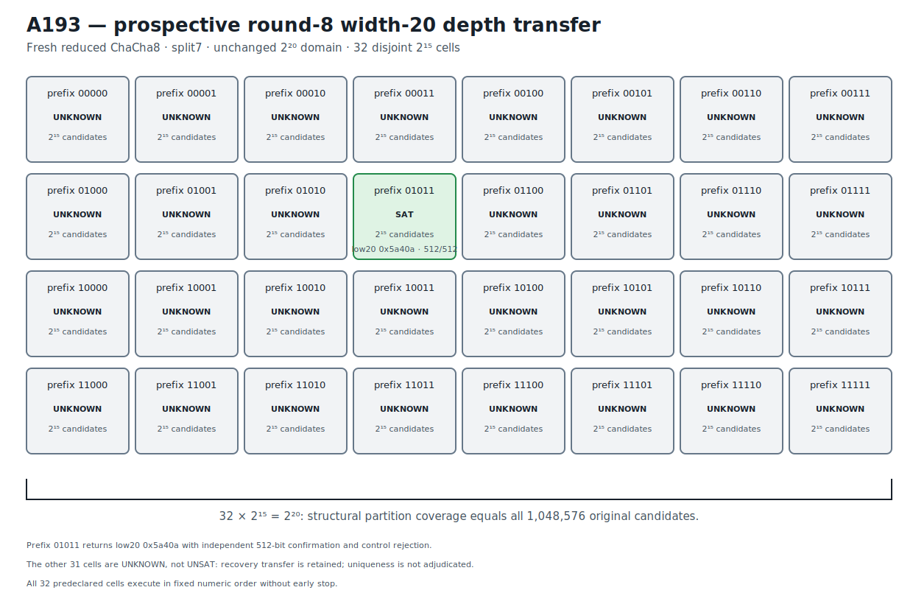

# ChaCha8 Width-20 Complete-Partition Recovery Transfer v1

## Result

A193 prospectively transfers A192's assignment-free complete width-20
partition one round deeper, from reduced ChaCha7/split6 to reduced
ChaCha8/split7.  The challenge is fresh: the low 20 bits of key word 0 are
unknown, the other 236 key bits are known, and the hidden assignment is used
only to form eight public counter-related targets before being discarded.

All 32 five-bit prefix cells are constructed before execution.  Each leaves 15
bits free, the cells are pairwise disjoint, and their structural union is the
unchanged original domain:

```text
32 * 2^15 = 2^20 = 1,048,576 candidates.
```

The complete cell order executes under a uniform predeclared Bitwuzla 0.9.1
bitblast/CaDiCaL 10-second budget with no early stop.  Prefix `01011` returns
`sat` and recovers:

```text
unknown low 20 bits  369674 = 0x5a40a
complete key word 0           = 0x28a5a40a
```

An independent NumPy ChaCha8 implementation matches all 512 target bits,
verifies the 236 known-key constraints, and rejects the bit-flipped control.
The prospective recovery-transfer prediction is retained.

The other 31 cells return `unknown`, not `unsat`.  Therefore A193 establishes
complete structural domain coverage and a confirmed recovery within that cover,
but it does not provide complete uniqueness adjudication across the 31 open
cells.  The exact stage is
`PROSPECTIVE_ROUND8_WIDTH20_COMPLETE_PARTITION_RECOVERY_RETAINED`.
This is reduced-round 20-bit partial-key recovery, not fullround ChaCha20 or
full 256-bit key recovery.

## Prospective freeze and depth transfer

```text
protocol  3897fa9e88895627e4852d542e0a19f0f6bb82a06d9c2e4132a655c1a406ddfe
runner    081975613398a08e998559840bf93dfb3c56b42317f00f1061177fee0bdba636
```

The protocol anchors A192's fresh complete round-7 width-20 partition recovery:

```text
A192 JSON          0d29693fe454ca6827c2c7eb11179a62f79fc39459b99941a0f5b500dcf422c2
A192 Causal        fa881d95747bb70fcaa4672c0aabe6cc37983a1259d10d57665149c01ac5629f
A192 Causal graph  8da763403ff908102d229ec2f6fbabae51145b2fa75ea783fbbc28a4d8b9a232
```

Retrospective depth/cut discovery was confined to the A192 recovered challenge.
The round-8 monolithic split6 and split7 formulas and the width-15 split5/split6
cells remained `unknown`; only the width-15 split7 cell returned the A192
assignment.  Before the new A193 assignment was generated, the protocol froze
split7, all 32 prefixes, numeric order, uniform budgets, complete execution,
and the no-early-stop rule.

The A193 assignment itself was generated once from operating-system
cryptographic randomness, used only to form targets, and discarded before
freeze.  It was unavailable to the runner and its decimal/exact-hex spellings
are absent from protocol and runner.

```text
public challenge  5a1bec1056921a3872b7d18e8254c902a87449b1025c0cf797ded4b4a92f1e85
execution plan    33ba0ca665a86e4740d438cf7f92b6b65701a6b07b0c633275b78d4dfff6cb11
known material    f94269fc107ae1acdeb9688b860fcaeebe01f093ea4c856cfede4296f9e8dbfd
control target    53ac585e69d70cff35b92bf481f7f752d7d7b8a6ed016a69dc5ba96c6fdab475
```

## Exact split7 partition

Every cell uses the same one-block round-8 split7 relation.  Only the assertion
fixing key-word-0 bits 19 through 15 changes.  Every formula has 18,829 bytes,
15 free key bits, and 32,768 structurally covered candidates.

| Prefix | Formula SHA-256 | Prefix | Formula SHA-256 |
|---|---|---|---|
| `00000` | `d257cccf48cc22acbef32f15bf4c85286b638d06d2109eb6732997bb36684d28` | `10000` | `41bfe819d63a450309587c9800dd37a7de017fa41130dffe0b6e33acf009e5e6` |
| `00001` | `c1b86099a87497aabc272d52ee0c1a1fb58de83601ad164eb09542baf0780b40` | `10001` | `20d07c8fe04a149b29fda6e0a8d812f4d64197c54ac8aa55543be1c63e601108` |
| `00010` | `239396e99306f2a1e3d62db325e430222383abb3a7de416420dffe338b7a5bd8` | `10010` | `19cde1019a88e4ae4ddb84c77bf7a217cd00608e7660f22482b1bb255e09376d` |
| `00011` | `342c8a78fee5494e1bb00a4a23c6dbd86b3e3091252a5431fc8d8fc455235a8a` | `10011` | `a1f3b3ae47bfca7277ad46fdb5587cf690bec5482e6f6cf12d4416ae5e217de3` |
| `00100` | `852070cfe9fc46fbc9eb851ed4d1a0627fe88c6b58199615fbbfedbb91b61705` | `10100` | `57d439842a1d9c63e1ba5d1c8eb524bba374827aa17a9e620c28cbc8d8e4e072` |
| `00101` | `b1b02b6257343047d947f0cb0ea71123a0ec2723edeb3b9964fbecc56bfc409d` | `10101` | `de3a0056e5b977bb80924365d9b8c91991b66e87555ce2ea0f20272875e1eb18` |
| `00110` | `be4727b0540610ed20c40a4df473135a0543a85d97aee1b7ae1231dde0a0180b` | `10110` | `53a59665655889498014cd80c4c7862c3948841ae18b1fb6054bbabb17232244` |
| `00111` | `a6ccc135658237f45b7cc55ec80797fa4c5c7b1eff7a97b2f4be7aaf15bc1424` | `10111` | `0bac18a5881d1284103d5a459e61ee80935dabada9533ae3fe4c43d315e74a6a` |
| `01000` | `8e42a7d15fa31556fcda1dd8e22f316ba8ad8f714c150414b234f0f1c0b9706a` | `11000` | `735fbc7cdc7eeee485a464415cc803dc2568b929be12792c77a390362337b0de` |
| `01001` | `13d134f5f374f736370ef70ffa6d16dd5dcef7e9020add61e2e98e4e128f8e4a` | `11001` | `0debe7aadaf3c9ace1bb6618d3ff8e54c0bb07a75c3d97431f62adf4e377ca40` |
| `01010` | `66182cd69d751d2d7f6bc4ee750bb06829557b5310a80fdde88c75e9f71b7e9f` | `11010` | `a66eaba69eb1a61deb9c12f8063b6248a44dfb5d613154c73ad3824e94e105c6` |
| `01011` | `4f0e61529fb9688cc2db2e17d352d57f644924032189d8013620d72bee53b515` | `11011` | `d92ef7090e8c300ffa4880944932e66655b66be9c6714f9d27e2e2f6463fde5d` |
| `01100` | `c2ddd18445619e4c6424118c6aa28b9701d5d1759cd277406d87361846c583d7` | `11100` | `debd861ec9d8352c4c2cc7d886ee762071646d7c8633ce305656f598c1a40e04` |
| `01101` | `68828abbc883e3c3de9474c9e6e82158b0a322c8cfaf5dc0d288d3cfac5726e0` | `11101` | `6771ff301598ed91ac3d01093b59ee212f0c7cd977ff563b68cac3a52a28e37a` |
| `01110` | `a81c537d48793ead09bc525fcd50c1cd282d35694a186cc0de5b46ec61195c5b` | `11110` | `7e2f6302dbd3a36a03020dbb3e65e403974e028b9142f1c593bd864ad52d6820` |
| `01111` | `97806b6faa78aa7b4bd4454c146ead1ff03a64d7257258e85990607254e4b0a5` | `11111` | `33772bf7022ee28019cbe6546a0d01c99176aff71ac344fe7b5e1b0a4c9881cb` |

```text
formula plan  a4eb18ce062378a43ad6260e1ce4c0ae2a5f8bf44aaac2ef7bcb233f852c9a98
```

The no-solver regression gate reconstructs all 32 formula streams, their exact
hashes, all prefix assertions, fixed/free coordinate sets, and the complete
`2^20` structural union.

## Execution, recovery, and open-cell boundary

The exact status distribution is:

```text
prefix 01011         SAT
all other prefixes   UNKNOWN (31 cells)
UNSAT cells           0
```

The SAT row's stored volatile time is 3.715649 seconds.  The other rows reach
their 10-second solver budget and remain open.  Every process returns normally,
the full order executes, and no early stop occurs.

```text
execution     c3a44f6d5e45440e8a307e45dc14e4e9ae8833790751d6a22ff4abb6834c66b1
confirmation  4baba285d9c0e8b85ba395360d4a0d93d28249e9093b92682ecd191ff1442641
comparison    298f63ff4fc97459bf6513315d446d34c2feec4489a833505660ad4b59bd6188
```

The recovered value satisfies `0x5a40a >> 15 = 0b01011`.  Independent
confirmation records candidate-block SHA-256
`84077dc5eff9e9c85233a7b2e55d5fdb515b395983851366bec0ab144b78934a`,
512/512 matching bits, matching known-key constraints, and a rejected control.

The comparison's `complete_domain_candidate_count = 1,048,576` describes exact
partition cardinality.  It does not convert the 31 `unknown` outcomes into
`unsat` and does not establish uniqueness.

## Solver identity provenance

```text
solver       Bitwuzla 0.9.1
mode         bitblast
SAT backend  CaDiCaL
executable   9896c88b523114e3eae00d737f1183ca71fbd83a99e8e45fe294715747a2ce7a
```

Fast retained-artifact verification invokes no solver.

## Deterministic figure

```text
research/results/v1/chacha20_a193_round8_width20_partition_transfer_v1.svg
SHA-256 416ff628af2e69d2c35c03c18fd2eeaa62914a50020a1508e45295eb84f34ecd
```



## Causal Reader chain

The Causal artifact contains six explicit provenance-linked triplets: A192
anchor, fresh round-8 challenge, complete split7 partition, complete cell
execution, independent model confirmation, and prospective depth transfer.

```text
result JSON   b4d146be64030e08ca6e7ce2e626acfa52ba8a4e6003ec5e605760b295053fae
Causal file   b8e6dfb148e1250c073b244ba6cecc23ecbe0c477c8021d0a2491af708c4971e
Causal graph  b97bed32cfac5d1313f1b0ed600edc3a66a67a38b521891da97792c2d1133274
```

## Reproduction

```bash
PYTHONPATH=.:src .venv/bin/python \
  research/experiments/chacha20_bitwuzla_round8_width20_partition_transfer.py \
  --analyze-only
PYTHONPATH=.:src .venv/bin/python \
  research/experiments/chacha20_smt_round5_retained_figures.py --check
PYTHONPATH=.:src .venv/bin/pytest -q \
  tests/test_chacha20_bitwuzla_round8_width20_partition_transfer.py \
  tests/test_chacha20_smt_round5_retained_figures.py
```

These commands reconstruct and validate retained evidence without executing a
solver.  An explicit fresh 32-cell execution is separate production work.
