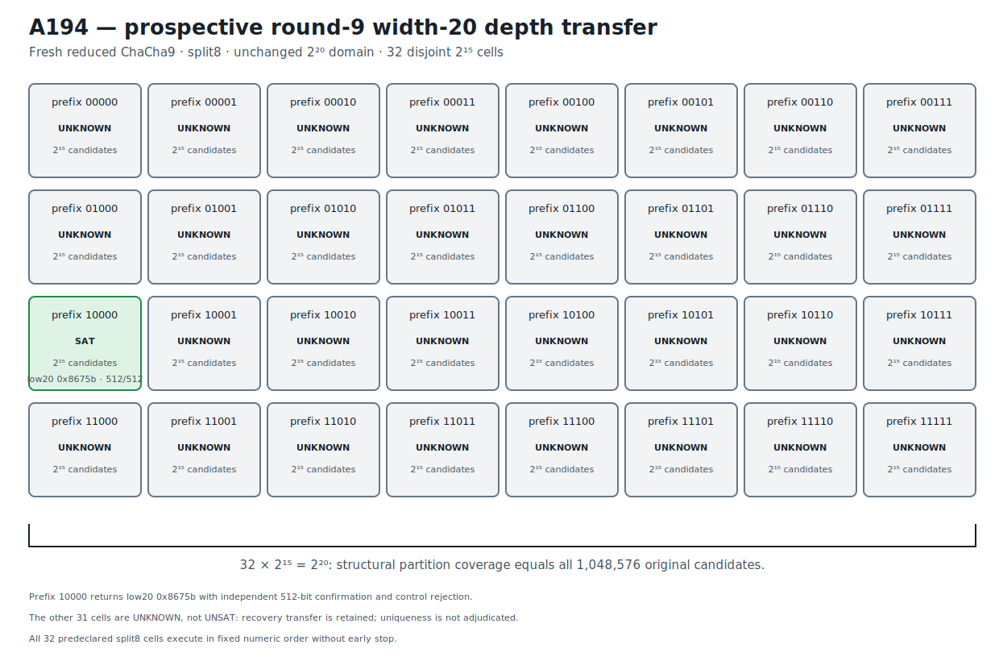

# ChaCha9 Width-20 Complete-Partition Recovery Transfer v1

## Result

A194 prospectively transfers the complete assignment-free width-20 partition
from reduced ChaCha8/split7 to a fresh reduced ChaCha9/split8 instance.  The low
20 bits of key word 0 are unknown and the other 236 key bits are known.

All 32 five-bit prefix cells are constructed before execution.  Each cell leaves
15 bits free, the cells are pairwise disjoint, and their structural union equals
the unchanged original domain:

```text
32 * 2^15 = 2^20 = 1,048,576 candidates.
```

Every cell executes in frozen numeric order under the same Bitwuzla 0.9.1
bitblast/CaDiCaL 10-second budget and no early stop occurs.  Prefix `10000`
returns `sat` and recovers:

```text
unknown low 20 bits  550747 = 0x8675b
complete key word 0           = 0x9dd8675b
```

The hexadecimal value is exactly `0x8675b`; it is verified directly from the
retained decimal model.  Independent NumPy ChaCha9 recomputation matches all
512 target bits, verifies the 236 known-key constraints, and rejects the
one-bit-flipped control.

The other 31 cells return `unknown`, not `unsat`.  A194 therefore retains the
prospective recovery/depth transfer and complete structural domain cover, but
does not adjudicate uniqueness across the 31 open cells.  The exact evidence
stage is `PROSPECTIVE_ROUND9_WIDTH20_COMPLETE_PARTITION_RECOVERY_RETAINED`.
This is reduced-round 20-bit partial-key recovery, not fullround ChaCha20 or
full 256-bit key recovery.

## Prospective freeze and A193 anchor

```text
protocol  d9aec1bb56e204a1f47625a34f780b92ad538fd878c25c2a49679a98b8740d10
runner    31e4007264c4c4d3585743d4d9e32c828e4d97100a7fcf6cc7604311ce9bafaa
```

The protocol anchors A193's confirmed fresh round-8 partition recovery:

```text
A193 JSON          b4d146be64030e08ca6e7ce2e626acfa52ba8a4e6003ec5e605760b295053fae
A193 Causal        b8e6dfb148e1250c073b244ba6cecc23ecbe0c477c8021d0a2491af708c4971e
A193 Causal graph  b97bed32cfac5d1313f1b0ed600edc3a66a67a38b521891da97792c2d1133274
```

Retrospective discovery used only the A193 recovered assignment re-encoded at
round 9.  The monolithic split8 view remained `unknown`; width-15 split6 and
split8 returned the anchored assignment while split7 remained `unknown`.
Split8 was the fastest confirmed discovery cut and was frozen before the fresh
A194 assignment was generated.

The fresh low-20 assignment was generated once from operating-system
cryptographic randomness, used only to form eight public counter-related
targets, and discarded before freeze.  It was unavailable to the runner.  All
32 prefixes, split8, formula construction, numeric order, uniform budget,
success rule, and complete no-early-stop execution were predeclared.

```text
public challenge  2022dbe26748c22a297d8e1e36daeea32ec6f0f9aea661bd5ad364a250c64302
execution plan    81013efeb4c533a527eec53440d945f74d855bdcf647d6c7fd733356abd5ee94
known material    e83d9c309213e761d08fcb2b17be1d99c8bd26cf10023910cf45b05dcf48585d
control target    86ca609ef43a1f56e2a0e918b97d76056f310b27abc170b48ea780f966dbd4f2
```

## Exact split8 partition

Every formula uses the same one-block round-9 split8 relation and differs only
in the assertion fixing key-word-0 bits 19 through 15.  Every cell has:

```text
formula bytes       20,949
fixed coordinates  19,18,17,16,15
free coordinates   14..0
candidate count     32,768
budget              10,000 ms
```

The canonical ordered formula-plan digest is:

```text
ea5ac8fbb1ccd3e46e39713478f274124776ffa1903736e6b6b719fb806d3307
```

Representative exact formula bindings are:

| Prefix | Formula SHA-256 |
|---|---|
| `00000` | `b2b00a91f3f7651a60cda2fac963f28a80b9ede16a4ee902bf95330aedc44855` |
| `10000` (SAT) | `7961d54e6eebd6d17d3b24c75fa01f4ef972be04fb1f6340cde159a8a6b9c413` |
| `11111` | `df01ea1b75142041acf0f17a0415df6fdfefc71a3bb474a8f0fe20e0807514b4` |

The retained formula plan stores all 32 exact hashes.  The no-solver regression
gate reconstructs every formula byte-for-byte, checks every prefix assertion
and fixed/free coordinate set, and proves the complete `2^20` structural union.

## Execution, recovery, and open-cell boundary

```text
prefix 10000         SAT
all other prefixes   UNKNOWN (31 cells)
UNSAT cells           0
```

The SAT row's stored volatile observation is 4.012485 seconds.  Every other row
reaches the bounded solver budget and remains open.  All processes return
normally, the complete order executes, and no early stop occurs.

```text
execution     be4840f6eaedbfe0b6b2c9d9c88aca3ce1e855c1fdaeb753aa7dbe08b3f8ac70
confirmation  4eb9942dbe7a2b018167b90fa8cc5377aaab86d864d9237a0f114852004dc056
comparison    70e25dd997b618c7dd20da128c95e3152a45c68185a8f229107649d2f72c3432
```

The model satisfies `0x8675b >> 15 = 0b10000`.  Independent confirmation
records candidate-block SHA-256
`609e14d435c8c5017c7be9f05e752bbf16da21c313af938617b4d6cb6556dc98`,
512/512 matching output bits, matching known-key constraints, and a rejected
control.

The comparison's one-million-candidate count is a structural partition
cardinality.  It does not convert any `unknown` cell to `unsat` and does not
establish uniqueness.

## Solver identity provenance

```text
solver       Bitwuzla 0.9.1
mode         bitblast
SAT backend  CaDiCaL
executable   9896c88b523114e3eae00d737f1183ca71fbd83a99e8e45fe294715747a2ce7a
```

Fast retained-artifact verification invokes no solver.

## Deterministic figure

```text
research/results/v1/chacha20_a194_round9_width20_partition_transfer_v1.svg
SHA-256 04623342965baea8d9490b8421ea2d21b76129d1e8de654b95687b4d15013b2f
```



## Causal Reader chain

The Causal artifact contains six explicit provenance-linked triplets: A193
anchor, fresh round-9 challenge, complete split8 partition, complete cell
execution, independent model confirmation, and prospective depth transfer.

```text
result JSON   d1a8b58f313467851d5162998d1ed8a71e250f64ee5d98d5ea6024c0e814227b
Causal file   a09e00b6815febc9e5a2713f98680e12b0b2d194172913f19caf55be06325a08
Causal graph  dffe8655d33d6379ce68a4012086283e33ebff6badf77fa5d9cd9946238b10e8
```

## Reproduction

```bash
PYTHONPATH=.:src .venv/bin/python \
  research/experiments/chacha20_bitwuzla_round9_width20_partition_transfer.py \
  --analyze-only
PYTHONPATH=.:src .venv/bin/python \
  research/experiments/chacha20_smt_round5_retained_figures.py --check
PYTHONPATH=.:src .venv/bin/pytest -q \
  tests/test_chacha20_bitwuzla_round9_width20_partition_transfer.py \
  tests/test_chacha20_smt_round5_retained_figures.py
```

These commands validate retained evidence without executing a solver.  An
explicit fresh 32-cell execution is separate production work.
