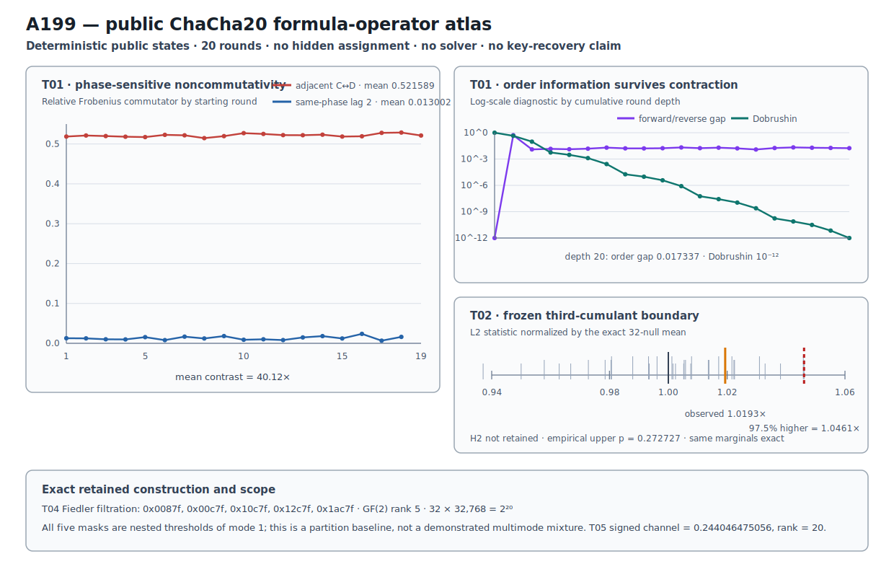

# ChaCha20 Public Formula-Operator Atlas v1

## Result

A199 prospectively executes five transfer families selected by the complete
source-first formula re-audit over all 2,411 atlas entries, nine papers, and 113
source pages.  The input is a deterministic public SHAKE256 state ensemble and
the measured objects are forward and aligned-inverse ChaCha20 influence
operators, round trajectories, their spectral diagnostics, and a public
key-coordinate graph.

The retained evidence stage is:

```text
PUBLIC_FORMULA_OPERATOR_ATLAS_MIXED_BOUNDARY_RETAINED
```

Four predictions are retained and one is not:

| Prediction | Exact outcome | Retained? |
|---|---|---:|
| H1 ordered products and commutators | adjacent phase-changing commutators are about 40.1 times the same-phase lag-2 mean; depth-20 order gap remains 0.017336635791 | yes |
| H2 genuine third-order dependence | observed L2 lies below the frozen higher 97.5% null threshold; empirical upper p = 0.272727272727 | no |
| H3 characteristic derivative roots | all 40 diagnostics pass; maximum gate error 6.798995e-09 below 1e-6 | yes |
| H4 exact public partition | GF(2) rank 5 and exactly 32 cells of 32,768 assignments each | yes |
| H5 forward/backward sum-difference view | signed relative Frobenius 0.244046475056 with both copy-swap identities exact | yes |

A199 contains no hidden assignment, invokes no key solver, and makes no key-
recovery claim.  It is a public deterministic representation result and a
partition-construction baseline for a later separately frozen solver test.

## Prospective freeze and anchors

```text
protocol  cd24c2e342a401b2c47c248ade39d791476b9e2388fcecad583cdfdbf937d93a
runner    f3004f369db934c1f29c791bf06cfbbc67d54095ea1e517b17b906f2bc330e80
```

Before any A199 measurement, the protocol fixes:

- transfers T01 through T05 and all five prediction rules;
- 20 ChaCha rounds, 20 key-bit coordinates, 16 operator samples, 64 triplet
  samples, all 1,140 round triplets, 32 null replicates, and five partition
  bits;
- the public seed label
  `f8-causal/A199/public-chacha20-operator-atlas/v1`;
- public-data-only partition-mask selection;
- no hidden cipher assignment and no solver execution.

The protocol reopens two pre-existing anchors byte-exactly:

```text
formula-atlas audit     feadca39a2cdb0caf38018e9d28ed6aecd56384f5771d7a6e6ab261f87ee1cc2
atlas candidate ledger  6b48da24730a5f2fd39497f1f7f34feab25860393382db8c2ce33f0976420d46
A198 retained JSON      693367464ab488c49d386c1d011e8c45e7fb094cceeb37352934dde121773373
A198 retained Causal    b7c4e1302594e266c7958057221fb4101fb5ef5ee284792d6ca93e43386dd514
```

A198 establishes the representation-change question: two complete eight-block
round-10 covers at different budgets remain `unknown`, so A199 derives a public
non-prefix geometry rather than repeating finer uniform prefixes.

## Public operator construction

SHAKE256 expands the frozen label into valid public ChaCha initial states.  The
first four words are the standard constants and the remaining twelve words are
public generated material.  There is no selected secret challenge.

The implementation first passes the RFC 8439 Section 2.3.2 block-function KAT.
It then checks exact inversion of every prefix depth 1 through 20 on all 16
operator states.  At each round cut, all 512 single-bit state interventions are
propagated through one forward round and through its aligned inverse.  Wordwise
Hamming influence counts are aggregated over samples and bit positions, then
normalized by input column to form two 20 x 16 x 16 column-stochastic operator
families.  The maximum stored column-sum error is zero.

```text
public 64-state ensemble  ffb8a0bc1841633127d1dcd9a0b9568782c73a5c0c4575224f0fd0fbc6674b24
public 16-state subset    8e00ac64be55ae0e486e8d0bc9b9b8d222ffb53c92d64ba8ae35f67db0352818
operator payload          67a22de6143cb81761b0f0b249a2664ba31185d2e714a3aa0573aa5510e63fe3
```

Every raw round-count matrix and both complete floating-point operator tensors
have independent hashes in the retained JSON.

## T01: ordered products expose phase structure

For adjacent round operators, A199 compares `A_(r+1) A_r` against
`A_r A_(r+1)` using relative Frobenius distance.  For the same-phase control,
it compares the lag-2 pair `A_(r+2) A_r` against its reverse.  ChaCha's
column/diagonal alternation makes these controls structurally meaningful rather
than arbitrary round pairings.

| Relative commutator | Minimum | Mean | Maximum |
|---|---:|---:|---:|
| adjacent column-to-diagonal or diagonal-to-column | 0.514697778819 | 0.521589218950 | 0.528689138102 |
| same-phase lag 2 | 0.006616527349 | 0.013002274002 | 0.023701318633 |

The adjacent mean is about 40.1 times the same-phase mean.  Chronological and
reverse products are also compared at every depth.  At depth 20, the
chronological Dobrushin coefficient has contracted to approximately 1e-12,
while the forward/reverse relative Frobenius gap remains 0.017336635791.  Thus
the normalized operator becomes strongly mixing without erasing its measured
product-order difference.  The exact adjoint-order identity has maximum error
zero.

```text
T01  a9a7b99948befc125d3ac9363da7eee03fb550631695878fa983979100b6cb75
```

## T02: exact third-cumulant boundary

All 20 low key-word coordinates are flipped independently across 64 public
states and tracked over 20 rounds.  Flattening sample and key-bit dimensions
gives 1,280 rows.  A199 computes every centered third product over
`C(20,3) = 1,140` distinct round triplets and takes the L2 norm.

The 32 null replicates independently permute samples inside every key-bit and
round coordinate.  This preserves every one-dimensional marginal exactly
while destroying joint sample alignment.  The null rule and its deterministic
permutations were frozen in advance.

```text
observed L2                 1.0990101174e-05
null higher 97.5% / maximum 1.1278944230e-05
observed / null mean        1.019311642184
empirical upper p           0.272727272727
```

H2 is not retained because the observed statistic does not exceed the frozen
threshold.  This result is a boundary for this trajectory codec, aggregate L2
statistic, sample size, and same-marginal null.  It is not an absence statement
about all higher-order ChaCha structure.

```text
T02  3ebadac5c333a05566f300ef73eaa4fe5763a1d2f6cc28adaf2629ad1979a234
```

## T03: characteristic and derivative-root diagnostics

A199 applies the characteristic-polynomial and derivative-root view to all 20
local operators and all 20 chronological products.  Every row stores the
eigenvalues, critical roots of the derivative, normalized residuals, and
coefficient reconstruction gates.

During numerical preflight, evaluating root residuals directly from the
Faddeev-LeVerrier coefficient sequence was found to be ill-conditioned near
zero roots because of floating-point cancellation.  The retained computation
therefore builds the residual polynomial from the eigenvalue product and keeps
Faddeev-LeVerrier as an independent coefficient cross-check on the same
matrix.  The prospectively frozen tolerance remained 1e-6; it was not relaxed
after observing the result.

All 40 diagnostics pass.  The maximum of all coefficient, root-residual, and
reconstruction gates is 6.798995e-09.

```text
T03  d6496150463ebd978d3ea57d87d7b6a41d177aa93631f0c84a0e0cd045e93481
```

## T05: aligned forward/backward channels

Forward key-bit profiles and inverse-cut key-bit profiles are aligned on the
same 20 key coordinates, 20 depths, and 16 words.  A199 forms their physical
sum, signed difference, and local difference-to-sum ratio.  Copy exchange
leaves the sum invariant and negates the difference exactly:

```text
signed-channel relative Frobenius  0.244046475056
sum copy-swap error                 0
difference copy-swap error          0
cross-copy effective rank           20
```

The complete cross-copy singular spectrum is retained; all 20 dimensions
exceed the fixed relative 1e-10 effective-rank threshold.

```text
T05  303ac7a4f1d66703757a74252fafcabd908df9c979919cb588949149ab75ebca
```

## T04: exact Fiedler-filtration partition

T05's forward, backward, ratio, and cross-copy SVD features produce a complete
20-coordinate public feature matrix.  A Gaussian similarity graph and its
normalized Laplacian define a deterministic spectral ordering.  Greedy GF(2)
rank selection returns:

```text
0x0087f  0x00c7f  0x10c7f  0x12c7f  0x1ac7f
```

These five masks have binary rank 5.  Their exact syndrome map partitions all
`2^20 = 1,048,576` values into 32 disjoint cells of 32,768 values each:

```text
syndrome map  7d5f36876224beb1fa9981a161c6217b227aaa31e7a8549dcd7ba64edff93507
```

Crucially, all five selected masks are nested thresholds of `mode_index = 1`,
the Fiedler vector.  A199 therefore retains an exact **Fiedler-filtration
partition baseline**, not a demonstrated mixture of independent Laplacian
modes.  Any generic transfer-family label containing “multimode” in the frozen
evidence record does not override this measured selection fact.  A separately
frozen A200 must enforce genuinely distinct modes if it is to test a multimode
construction.

The exact 32-cell cardinality follows from GF(2) independence; it does not by
itself establish improved solver behavior.  That question belongs to a later
same-challenge comparison against numeric and Gray-prefix controls.

```text
T04  bb39f9d359503b67dc037acb87fa5a280b43e1e1a5c30660e1ca851fc090da99
```

## Deterministic figure

```text
research/results/v1/chacha20_a199_formula_operator_atlas_v1.svg
SHA-256 ea1aca532e540a04c1bdecd2d9cee2744331e7c44aa6596b045bed3db5846cd0
```



The left panel shows every adjacent and lag-2 commutator, the upper-right panel
shows the order gap and Dobrushin contraction over depth on a logarithmic axis,
and the lower-right panel places the T02 observation inside its exact frozen
null ensemble.  The footer labels T04 as a Fiedler filtration.

## Causal Reader chain

The Causal artifact has two independent roots and eight explicit triplets.  It
links the complete formula-audit anchor to the public operator construction and
T01/T02/T03/T05 diagnostics, and links the independent A198 representation
boundary plus T05 public geometry to the exact T04 partition.

```text
result JSON   16c1025308bae64e2c45339804ec0a39d5fcb927c1cd0a1dcbf2ca8dfd3d5c48
Causal file   bb509b61239bf3bc4396bac2b882820204deba6683186f9f5a89f65c1968fc89
Causal graph  d8f154f8993f9e9fcb438f55cd290c5323a5e4e46934b72775d9584f569783d2
```

`CryptoCausalReader` validates all eight triplets and their complete
provenance.  The Causal file is a typed evidence graph, not an opaque sidecar.

## Reproduction

```bash
PYTHONPATH=.:src .venv/bin/python \
  research/experiments/chacha20_formula_operator_atlas.py
PYTHONPATH=.:src .venv/bin/python \
  research/experiments/chacha20_formula_operator_atlas_figure.py --check
PYTHONPATH=.:src .venv/bin/pytest -q \
  tests/test_chacha20_formula_operator_atlas.py \
  tests/test_chacha20_formula_operator_atlas_figure.py
shasum -a 256 -c research/results/v1/FULLROUND_TRANSFER_SHA256SUMS
PYTHONPATH=.:src .venv/bin/python scripts/validate_causal_artifacts.py
```

The first command deterministically rebuilds the public atlas; it performs no
solver execution.  The tests independently recompute all five transfer
families, hash every retained subobject, reopen the Causal graph, and compare
the SVG byte-for-byte.
