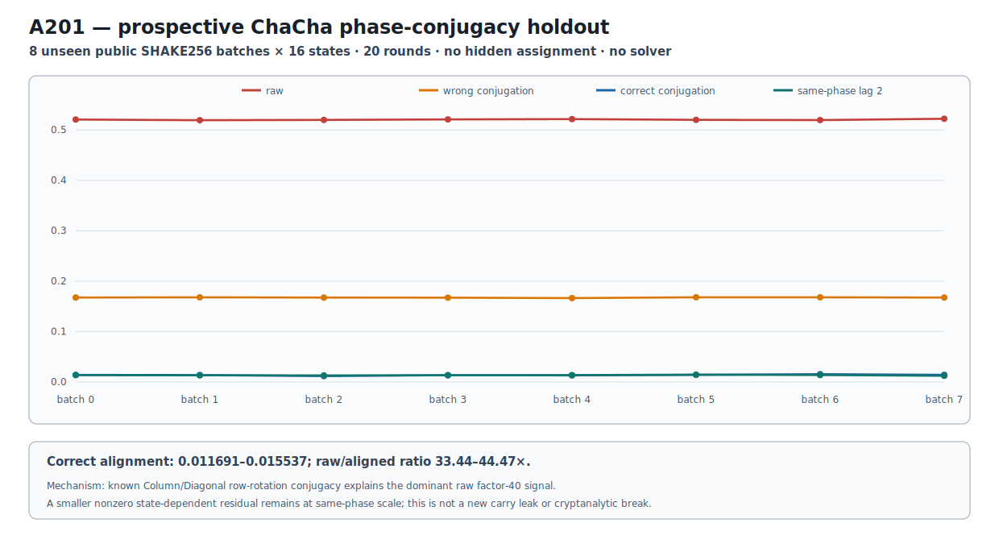

# ChaCha20 Phase-Conjugacy Holdout v1

## Result

A201 prospectively tests the mechanism behind A199's large adjacent-round
commutator contrast on eight completely unseen public SHAKE256 batches, each
containing 16 valid ChaCha states over all 20 rounds.  The row-rotation
permutation mapping Column to Diagonal layout was fixed before holdout.

All five predictions are retained in every batch.  Correct conjugation reduces
the raw adjacent mean from about 0.52 to 0.012--0.016, the same scale as the
same-phase lag-2 control.  Wrong-direction conjugation remains about 0.167.

```text
PUBLIC_CHACHA_PHASE_CONJUGACY_HOLDOUT_RETAINED
```

The exact attribution is: **known Column/Diagonal layout conjugacy explains the
dominant A199 factor-40 signal; a smaller nonzero state-dependent residual
remains at same-phase scale.**  The raw factor-40 effect is not a new carry leak
or cryptanalytic break.  A201 uses no hidden assignment and no solver.

## Frozen identities and measurements

```text
protocol     6a07e560faeb35883ce56d6f98f697c25d16c600e6a5eeb8d642d3f1e95212b1
runner       2e73950e1f4e703de015326b705a82bd1e8944f2c8d1534757b6a5dd465a4f2c
batches      0d35134eb1e8afe9766abf89bb00d29e2748c2df404ba39453e10131eaad43de
summary      37b42187a07e231aee8b66d6177911b9914a7bcb881688d747cc736be47bfb3a
predictions  7ac0f1a1dd05765e329c9490e388c4f9047ceff5a803300424c3466ad7fb3891
```

| Holdout diagnostic | Eight-batch range |
|---|---:|
| raw adjacent commutator mean | 0.519377937285--0.522234010744 |
| correctly aligned adjacent mean | 0.011691218573--0.015537430753 |
| raw / correctly aligned | 33.442854286179--44.473808424522 |
| aligned / same-phase lag 2 | 0.896365770018--1.152298962767 |
| aligned Column/Diagonal operator distance | 0.003605606397--0.006935675770 |
| wrong-direction conjugation mean | 0.166456108432--0.168060976184 |

H1 confirms layout dominance; H2 places the residual at same-phase scale; H3
confirms direct operator alignment; H4 rejects an arbitrary permutation-
alignment explanation; H5 confirms that the aligned residual is nonzero under
the frozen threshold.  Repetition over eight unseen batches separates the
known schedule conjugacy from an A199-instance coincidence.

## Figure and Causal Reader

```text
figure        e5c18f576e98310a1d2c8986da40577e6be52d8346579fd4a37e7db9ee3e9cd5
result JSON   c186da54770b520153f94b0b9f72e809d6b78d950a52bee39d74ea9c15194767
Causal file   adfb1e7e3390b67725587373dac8423b20a4873bd46a278bdd4d97ac672816d8
Causal graph  705d302c02ae943c8e4543ecc9c1265b84b07e53b99d00e5ca4d05a9bc41fe4a
```



The five-edge Reader graph records the A199 discovery anchor, frozen
conjugation, unseen public holdout, all-batch prediction results, and final
mechanism attribution.

## Reproduction

```bash
PYTHONPATH=.:src .venv/bin/python research/experiments/chacha20_phase_conjugacy_holdout.py
PYTHONPATH=.:src .venv/bin/python research/experiments/chacha20_phase_conjugacy_holdout_figure.py --check
PYTHONPATH=.:src .venv/bin/pytest -q \
  tests/test_chacha20_phase_conjugacy_holdout.py \
  tests/test_chacha20_phase_conjugacy_holdout_figure.py
```
