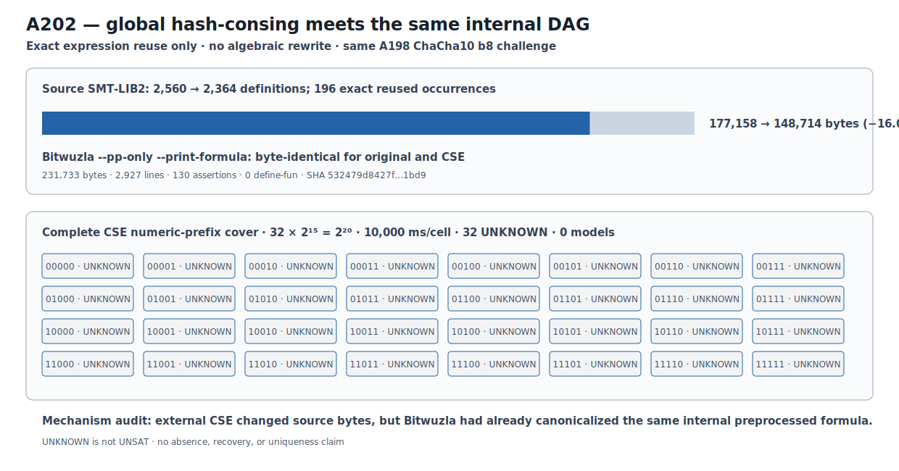

# ChaCha10 Eight-Block Global-CSE Boundary v1

## Result

A202 prospectively hash-conses byte-identical expressions globally across the
eight shared-key split8 blocks, without algebraic rewriting. Definitions fall
from 2,560 to 2,364: 196 occurrences are reused, exactly 28 in each block after
the first. Base formula bytes fall from 177,158 to 148,714, a reduction of
28,444 bytes or 16.0557242687%.

The complete unchanged numeric-prefix domain executes as 32 disjoint cells of
`2^15` candidates at 10,000 ms per cell. All 32 return `unknown` with return
code zero, no external timeout and no model. Neither prediction is retained.

```text
ROUND10_GLOBAL_CSE_COMPLETE_PARTITION_BOUNDARY_RETAINED
```

`unknown` is not `unsat`; this is not absence, recovery, or uniqueness.

## Exact identities

```text
protocol       e6a26b56c855fa3931897e350f6b905f2f933cb3fbf88e2ca1cc72b7b45eef00
runner         751761bdb4b583e422eb2091d24ab7268408e379f607eee4d7c89f0d2b8db063
CSE payload    2ff7187ce177a67ed6c58326f282e074b2b5b2e64943871b58340a9de1601fe3
execution plan 6dcba196f1bd064b52e5dcdb149d424ef13dcc4f3d5b9f33a9eb864a3762de06
formula plan   81d2468b21fa1296ce046303cc325fc7ef1e2cd4e4062a3ca7ec1d68b0275427
execution      6b8f470b34b47ddbc7a0d7358b85243e5a15bda4eb0dcb05802eea4820511e6b
comparison     6e17015ec51f7caacfbcc046a7bb73c2779bc7adfb7938f328b9a395b155d5f2
```

The original A198 cells are not rerun. The same still-secret challenge, b8
semantics, 4,096 target bits, split8 cover, cell order, and budget are retained.

## Post-result mechanism audit

For a representative cell, the original input is 177,202 bytes and the CSE
input 148,758 bytes. Yet Bitwuzla 0.9.1 with
`--pp-only --print-formula` produces byte-identical output for both:

```text
231,733 bytes · 2,927 lines · 130 assertions · 0 define-fun lines
SHA-256 532479d8427f02b6fa1304f9acc95c7f6806c53130d561fb438c5d61ef851bd9
```

Thus external CSE changes the source file, but Bitwuzla already canonicalizes
the exact same internal preprocessed DAG. This directly explains why the
bounded solver frontier is unchanged and localizes the next compiler question
beyond syntactic cross-block hash-consing.

Stored volatile cell times sum to 320.5861444566399 seconds; wave maxima sum to
80.1769292904064 seconds. These are local context, not portable complexity.

## Evidence and reproduction

```text
result JSON   4fbfc950984d3cb8eee85ba5532217cab2edae43e7ed8444ff2363259d3e990b
Causal file   fb2dd421e7a6ff89c668f908d6760a53a91728f2ce5881cde8188bff10522ac3
Causal graph  42f702cccf79f2abf0b65fd29c6b271ab6b71c9ec3d959f16abf6da2cc947e2d
figure        f2a55ed174737529869e1b01eac41b024257a642bfa22cddb1c26870dc4a692e
```



```bash
PYTHONPATH=.:src .venv/bin/python research/experiments/chacha20_round10_b8_global_cse.py --analyze-only
PYTHONPATH=.:src .venv/bin/python research/experiments/chacha20_round10_b8_global_cse_figure.py --check
PYTHONPATH=.:src .venv/bin/pytest -q tests/test_chacha20_round10_b8_global_cse.py tests/test_chacha20_round10_b8_global_cse_figure.py
```
