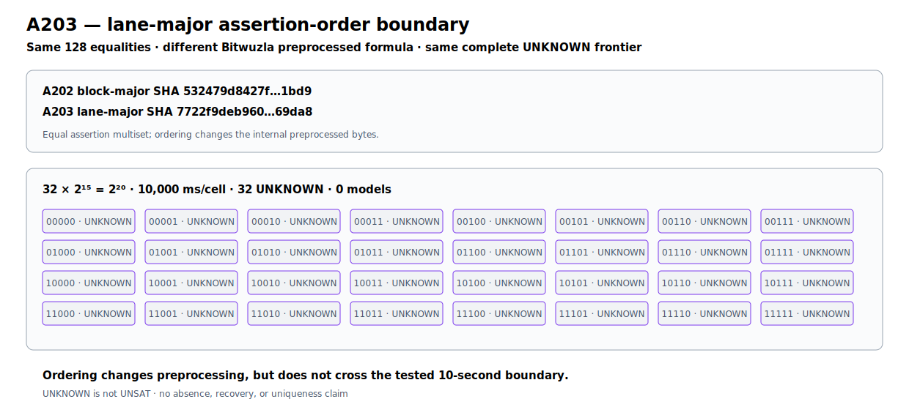

# ChaCha10 Lane-Major Assertion-Order Boundary v1

A203 prospectively reorders the same 128 midstate equalities from A202 block-
major to lane-major form. The complete unchanged numeric-prefix cover remains
32 cells of `2^15` candidates at 10 seconds each. All 32 return `unknown`, with
no timeout, model, resolved cell, recovery, or uniqueness claim.

The equality multiset is exact, but Bitwuzla preprocessing changes from SHA
`532479d8427f02b6fa1304f9acc95c7f6806c53130d561fb438c5d61ef851bd9`
to `7722f9deb96030d57244029facee525211b3b267027744fe80a7f79a34e69da8`.
Thus assertion order changes the internal preprocessed formula, but does not
cross this bounded frontier. `unknown` is not `unsat`.

```text
runner     37bf927443ab16e312f841f2bfec65e51cc102edbc949dd51ab9604bdf2dc40f
execution  109765c5051fbefd4f4b01a14f07f337305f117f85291b0ccfdd6bdf164a8d36
comparison 309f6187993e760621b26f6f9ee835e1337a41f2840f0771055fcd41974e5532
JSON       65fb21c0aec9cfe1b599b3c2c73ed9a2e34f0640899db3b31099b3c6d1d37d35
Causal     a8bfda40ac3220da210fe36847f5c71e9b2e79bed5aeac13c691d89488667c22
graph      7044f6294734f91991d050f5d09e21500591f5ed0d61f0261ac278dc4dee3152
```



Reproduce fast with `PYTHONPATH=.:src .venv/bin/python research/experiments/chacha20_round10_b8_lane_major.py --analyze-only` and the focused tests.
