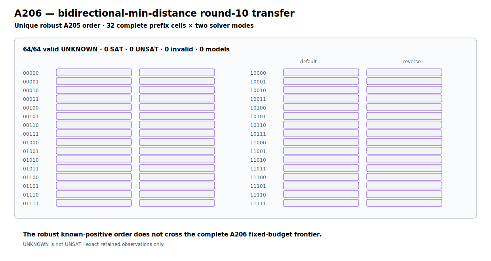

# ChaCha10 Bidirectional-Min-Distance Transfer Boundary v1

A206 prospectively transfers A205-r2's unique robust-both-mode structural order
to every cell of the complete A202 reduced-ChaCha10 width-20 cover.  Each of the
32 disjoint prefix cells is executed under both CaDiCaL default and reverse
modes at the frozen ten-second budget: 64 cell-mode observations in total,
with no early stop.

All 64 observations are valid `unknown`; no cell returns `sat` or `unsat`, no
model is emitted, and the independent confirmation list is empty.  The exact
graph transform, inverse mapping, complete `2^20` coverage, and per-cell solver
progress counters are retained.  The A205 known-positive structural outlier
therefore does not cross this A206 round-10 instance boundary.  `unknown` is
not `unsat`, and A206 makes no absence, recovery, or uniqueness claim.

```text
protocol  10ff5f93a346824cdb7e0d3a15b48f72fa7f27ad9ef31e42c5d05cd61856c858
runner    a53a983dfb0ebd88fa1e9b7d6f05786d7de078161003b9bb1d61e0d5fd889d15
JSON      c2d4b703c463d5cdd2c95f22d9a5627c0cf0157e8929df5090ef2e9fe8e02c25
Causal    15d06d3058e8843146366ae84056de66e4c724714e2166ef6ac2d5fdfd3b6046
graph     5c4877af9b0c83fd63a7abb6619d76eb656e74ed29ec3aaf145bb9bb21316e1f
```



Fast retained verification (no solver execution):

```bash
PYTHONPATH=.:src python -m pytest -q \
  tests/test_chacha20_round10_bidirectional_min_distance.py
```
