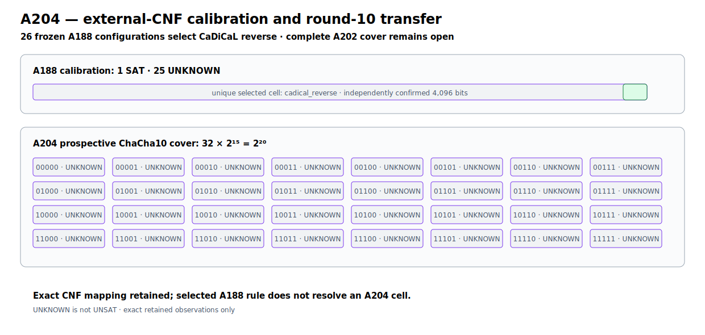

# ChaCha10 External-CNF Reverse Boundary v1

A204 exports the exact A188 and A202 Bitwuzla formulas to DIMACS, derives the
key-to-CNF literal map by 70 single-clause probes, and calibrates 26 frozen
standalone-SAT configurations on the known-positive A188 instance.  CaDiCaL
3.0.0 with reverse decision order is the unique five-second calibration cell
that returns `sat`; its decoded 40-bit model independently reproduces all eight
ChaCha5 blocks (4,096 bits) and rejects the control. Three fixed isolated
repeats of that selected command return `unknown`, `sat`, `unknown`; the one
returned witness is exact, while wall-time success is not treated as stable.

That rule is then transferred prospectively, without early stopping, to all 32
disjoint cells of the A202 reduced-ChaCha10 `2^20` cover.  Every cell executes
cleanly and returns `unknown` at ten seconds.  Therefore the calibration and
exact literal-map pipeline are retained, while neither the prospective recovery
prediction nor a resolved SAT/UNSAT cell transfers.  `unknown` is not `unsat`;
this result makes no absence, recovery, or uniqueness claim for round 10.

```text
protocol  82b62901d1925e6d7eda5d5f01bbdb2677c289ffccf1501605e2ddcdaf3b28b4
runner    1037ca70c74295da053ce31774ac8b74e75be48e1a994493e344984b97c6f20b
JSON      603eaf8a2a6bb85c3c4bb2fdf4b7466205ffd1d8005593d987c8a6461b7c8c22
Causal    f1ca39f964640d8aa2a5c6f6dab9bcfb48dfaddf6dda2e399275f77235ca71c3
graph     0cbdde4c25a7c804706a9e8b9823c71ec9bc74046191526cae4a7a55b5dbdc73
```



Fast retained verification (no solver execution):

```bash
PYTHONPATH=.:src python -m pytest -q \
  tests/test_chacha20_round10_external_cnf_reverse.py
```
