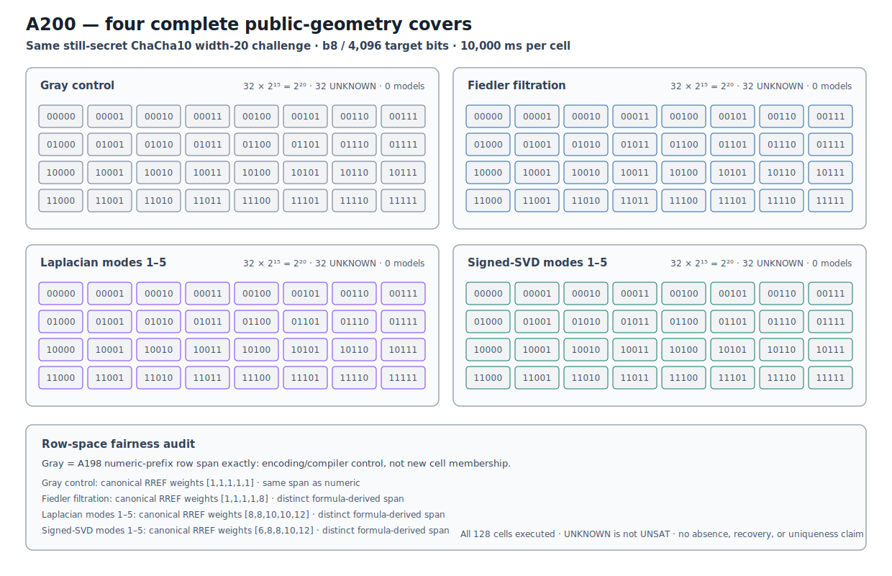

# ChaCha10 Public-Geometry Complete-Partition Boundary v1

## Result

A200 prospectively tests four complete public affine covers on the byte-
identical still-secret A198 reduced ChaCha10 width-20 challenge.  Every cell
uses the same split8 eight-block shared-key relation, exposes 4,096 target bits,
leaves 15 coordinates free, and receives 10,000 ms of Bitwuzla bitblast/CaDiCaL
time.  The A198 numeric-prefix cover is not rerun.

All 128 new cells execute in the frozen order without early stop.  Every
process returns code zero, no external timeout fires, all statuses are
`unknown`, and no model or confirmation is emitted.  Both the primary recovery
prediction and the comparative geometry prediction are therefore not retained.

```text
ROUND10_PUBLIC_GEOMETRY_COMPLETE_PARTITION_BOUNDARY_RETAINED
```

`unknown` is not `unsat`.  A200 is a complete structural-cover and
representation boundary, not an absence, recovery, or uniqueness result.

## Prospective identity

```text
protocol  0d220d919d5dbcd24cc2d358046622676b28500c84db0bb0d23d2d8da0677397
runner    68b4a3e78b37c0e42455de8bfc8613ed917c3ac0307f87b8a4ec68f8857ae93b
challenge 5d17ed241b6b91224a4974f36b4b0b4ec5c677b9d975dd6bc8cec83b6ddbf86b
geometry  9b05f02259ed38e9590092b5bbdc31512f2644a14863440c426fa471cef4b457
```

The masks, geometry/cell order, solver budget, complete-execution rule, and
predictions were frozen after A199's public derivation and before any A200
solver outcome.  The unknown assignment is absent from protocol and source and
was unavailable to the runner.

## Four complete covers

| Geometry | Cells | Candidates/cell | Statuses | Models |
|---|---:|---:|---|---:|
| Gray-prefix control | 32 | 32,768 | 32 `unknown` | 0 |
| Fiedler filtration | 32 | 32,768 | 32 `unknown` | 0 |
| Laplacian distinct modes 1--5 | 32 | 32,768 | 32 `unknown` | 0 |
| signed forward/backward SVD modes 1--5 | 32 | 32,768 | 32 `unknown` | 0 |

Each rank-5 system gives 32 disjoint affine cells and exactly
`32 * 2^15 = 2^20` candidates.  Thus every geometry covers the original
1,048,576-value domain once without shrinking it.

The 128 formulas each contain eight shared-key blocks, 4,096 target bits, five
affine equations, 2,709 lines, and 135 assertions.  The timeout is external to
the SMT-LIB2 bytes.

```text
execution plan  a9cc44aece75c0f13933e980dd8876eaaeae6cf747f4292196065ffdc111245f
formula plan    528e5a257ddb3762fda25c73d58002685bb3e3b91d6df570d3453a109a2b9c60
execution       9d49fdf952eb7e0df2e36e1400762c70dde704dde539380d0c4d815441cfc7fe
confirmation    4f53cda18c2baa0c0354bb5f9a3ecbe5ed12ab4d8e11ba873c2f11161202b945
comparison      59dd4f24f2603538cf4f202d6f412dbb031d9e7e024fe8cb05cbbc27a7c5524b
```

## Row-space fairness audit

Affine mask lists can look different while defining the same partition.  A200
therefore compares canonical GF(2) row-reduced spans rather than raw masks.

The Gray control's row span is exactly the A198 numeric-prefix span.  Gray is
therefore an encoding/compiler control, not new cell membership.  This is why
A200 does not count it as a novel geometric partition relative to A198.

The three formula-derived spans are pairwise distinct.  Their canonical RREF
row weights are:

| Geometry | Canonical RREF weights |
|---|---|
| numeric prefix / Gray | `[1,1,1,1,1]` |
| Fiedler filtration | `[1,1,1,1,8]` |
| Laplacian modes 1--5 | `[8,8,10,10,12]` |
| signed-SVD modes 1--5 | `[6,8,8,10,12]` |

All three raw formula-derived mask sets have total Hamming weight 50, but their
row spans differ.  Fiedler remains a nested-threshold basis, whereas the two
distinct-mode constructions are dense bases from separate modes.  Equal raw
weight therefore does not explain away the row-space comparison.

## Execution context

The stored local observations sum to 1,282.5427404944785 cell-seconds; the 32
four-worker wave maxima sum to 320.72843887191266 seconds.  These are volatile
local context, not portable complexity claims or elapsed-command guarantees.

```text
Bitwuzla 0.9.1 · bitblast · CaDiCaL
executable 9896c88b523114e3eae00d737f1183ca71fbd83a99e8e45fe294715747a2ce7a
```

## Deterministic figure

```text
research/results/v1/chacha20_a200_round10_public_geometry_boundary_v1.svg
SHA-256 3bec6b195d6a22549085961d1765a50a3761271584f38a0fd07608ac5668c777
```



The four panels display every executed cell.  The footer distinguishes the
Gray/numeric row-space identity from the three pairwise-distinct formula-
derived spans.

## Causal Reader and reproduction

```text
result JSON   a945e95c63499d84cf0c41932dbe056b1eb39adbaf6d7a2096887e1b108d99ad
Causal file   1d1680e04a829139f74fae832a6498164b994c35e636458b2262f66f973f2c93
Causal graph  5feeabefb0e46df3d7dafd4901df2e78b3e9de0354269955bc5b155e7280e08e
```

The Reader validates seven explicit triplets from the A198 boundary and A199
public atlas through the four exact covers, formula plan, complete execution,
empty confirmation, and final comparison.

Fast retained-artifact verification invokes no solver:

```bash
PYTHONPATH=.:src .venv/bin/python \
  research/experiments/chacha20_round10_public_geometry_partition.py \
  --analyze-only
PYTHONPATH=.:src .venv/bin/python \
  research/experiments/chacha20_round10_public_geometry_partition_figure.py --check
PYTHONPATH=.:src .venv/bin/pytest -q \
  tests/test_chacha20_round10_public_geometry_partition.py \
  tests/test_chacha20_round10_public_geometry_partition_figure.py
```
