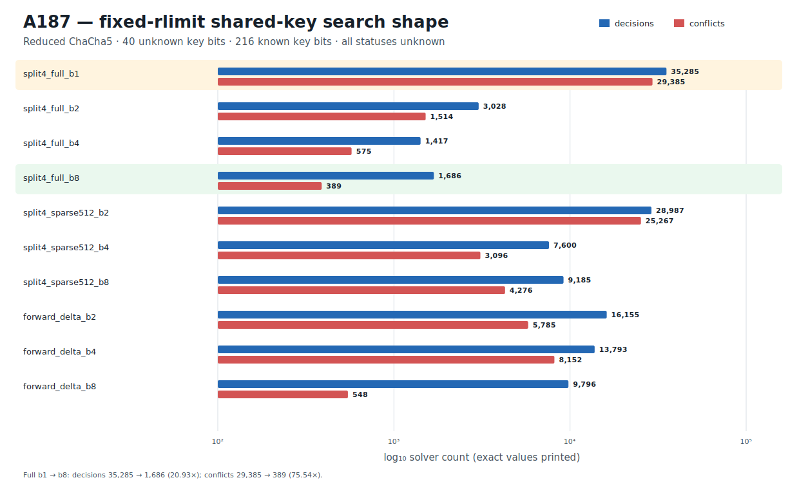

# ChaCha5 Shared-Key Multiblock Causal-Stacking Transfer v1

## Result

A187 prospectively freezes one fresh reduced ChaCha round-5 relation with 40
unknown key bits and 216 known key bits, then exposes the same hidden key through
eight counter-related 512-bit blocks. Ten predeclared formulas compare three
representation families at one fixed Z3 resource count:

1. complete `split4` block stacks at 1, 2, 4, and 8 blocks;
2. `split4` sparse stacks that keep the total observation at exactly 512 bits
   while distributing those bits across 2, 4, or 8 blocks;
3. forward modular-output-delta relations at 2, 4, and 8 blocks.

All ten formulas execute at `rlimit = 10,000,000`, in the frozen order, without
early stop. Every status is `unknown` and no model is returned. The prospective
claim concerns exact search shape, not a returned assignment:

- complete b8 reduces decisions from 35,285 to 1,686, a 20.93x reduction;
- complete b8 reduces conflicts from 29,385 to 389, a 75.54x reduction;
- every fixed-total-512-bit sparse view at b2, b4, and b8 reduces both decisions
  and conflicts relative to the complete b1 baseline.

Both predeclared inequalities are retained. The artifact status is exactly
`PROSPECTIVE_SHARED_KEY_CAUSAL_STACKING_TRANSFER_RETAINED`. A187 is a fresh
reduced-round compiler/search-shape result. It is neither a key recovery nor a
fullround ChaCha20 result.

## Prospective freeze and information boundary

The protocol and immutable runner are:

```text
protocol  ec9aa11875462f1220a118c9e50ae82f14ef55d45847791a772b62d4c58f6a62
runner    34a6c01f14b26d78f17c15f096d0dba9f2f2911c12e08194080dea58d81e8335
```

The protocol is frozen before any A187 solver execution. It anchors the retained
A186 JSON/Causal pair, including A186's complete six-view `unknown` vector:

```text
A186 JSON    c47722b6110bfdac9b4688454235339cdb7f297011b1e6c7f959a0c947e4a953
A186 Causal  043f2b52fd13ca8298f713e374edd1aaa720c7748daf0a4b6c39453b32dff62a
```

The fresh 40-bit assignment is generated once from operating-system
cryptographic randomness, used only to form the eight public targets, and
discarded before the protocol is frozen. The assignment, key word 0, and the low
byte of key word 1 are absent from the protocol and runner. Variant order,
resource count, and success inequalities are fixed before execution.

The public challenge canonical digest is:

```text
4ac8ea6d3f6fd61d3877fd63558e18dd3667fab700d74cc1637101c22193eb6c
```

Known key material, the base counter, and the nonce are derived from the
domain-separated SHAKE256 label embedded in the protocol. The exact 44-byte
derivation digest is:

```text
3601335d1f54c775dfed03db9421ab83965d2c07407ac796ed89b686fe0da488
```

The eight target-block digests are validated from little-endian word bytes by
the non-production regression gate. The control flips only bit zero of the first
target word and is pinned by digest
`7ae03d1569929bc02773867ac514f8f428246867932b668545131adc5118669f`.

## Frozen formula family

The canonical execution-plan digest is:

```text
0df1a9768f16a21339b53dd1c33303b23149c0af942577757329ce00da6d711d
```

Every formula declares the same 32-bit `k0` and 8-bit `lo8`, uses shared
`define-fun` DAGs, swaps declaration order to `lo8, k0`, and binds the identical
10-million resource limit. The exact formula plan is:

| Variant | Family | Blocks | Observed bits | Bytes | SHA-256 |
|---|---|---:|---:|---:|---|
| `split4_full_b1` | complete split4 | 1 | 512 | 12,465 | `aad139ea2f49321d85233234dc0b176d0706c4a3da35bd8c3a98bb0b2ef8178a` |
| `split4_full_b2` | complete split4 | 2 | 1,024 | 23,884 | `90958bbdfb018b4ab761a6fcc5e73c7bc4b84b8af91e74cc31d912b1f2fead07` |
| `split4_full_b4` | complete split4 | 4 | 2,048 | 46,722 | `14040a57a5ebe1daeace507a48510e0f6edaaaf34a5256bef675c2525f4f1259` |
| `split4_full_b8` | complete split4 | 8 | 4,096 | 92,398 | `5d1d1e50b7dd9e721fa85a079ff615188e6a15d0e8880872143648b599791e17` |
| `split4_sparse512_b2` | sparse split4 | 2 | 512 | 23,420 | `54b31294b1a07fe227fd2ea2eb834da5fe705ee1d0bec59fce02666eb0fed4e7` |
| `split4_sparse512_b4` | sparse split4 | 4 | 512 | 45,330 | `e1d2e0933f4e45d9740f4500d11582ce736468d989d55e07b9bc146fc6189794` |
| `split4_sparse512_b8` | sparse split4 | 8 | 512 | 89,150 | `b33d6e2b8eb4f877b3837e15a7a221b7a9cf4ee95867c7dba9b9259e7cf7fc9a` |
| `forward_delta_b2` | modular delta | 2 | 512 | 23,100 | `594338c0a808976049ccdcbe0c90a83da7bef0a4e40cb489a7f7b84d5c8302ab` |
| `forward_delta_b4` | modular delta | 4 | 1,536 | 46,536 | `948dfd9e5dfe8c46c4bcedab240479cf51e2d4abd9ec87a7466405234fd1b5b4` |
| `forward_delta_b8` | modular delta | 8 | 3,584 | 93,408 | `fd303ac5cb23e5498dc6e8fb20fa71424c5b4ec975aea355738423e208de2eee` |

The ordered formula-plan digest is:

```text
46c0e4e0576d5fe000b81b6391d476d79a300a5bad3809a58d833553286b494b
```

## Exact fixed-resource measurements

| Variant | Decisions | Conflicts | Propagations 2-ary | Propagations n-ary | Restarts |
|---|---:|---:|---:|---:|---:|
| `split4_full_b1` | 35,285 | 29,385 | 3,082,948 | 7,410,764 | 2,717 |
| `split4_full_b2` | 3,028 | 1,514 | 2,963,771 | 6,611,011 | 125 |
| `split4_full_b4` | 1,417 | 575 | 2,997,368 | 5,679,663 | 42 |
| `split4_full_b8` | 1,686 | 389 | 2,765,656 | 4,313,189 | 77 |
| `split4_sparse512_b2` | 28,987 | 25,267 | 3,358,773 | 7,191,469 | 4,376 |
| `split4_sparse512_b4` | 7,600 | 3,096 | 2,324,555 | 7,419,649 | 381 |
| `split4_sparse512_b8` | 9,185 | 4,276 | 2,408,096 | 7,050,475 | 722 |
| `forward_delta_b2` | 16,155 | 5,785 | 2,589,628 | 6,696,591 | 841 |
| `forward_delta_b4` | 13,793 | 8,152 | 2,703,874 | 5,330,149 | 1,384 |
| `forward_delta_b8` | 9,796 | 548 | 2,033,340 | 2,608,075 | 72 |

Z3 reports rlimit counters from 10,000,534 through 10,003,894 because formula
initialization consumes a representation-dependent number of resource units.
The configured rlimit itself is identical for all ten views. The comparison is
therefore resource-fixed and records complete exact counters rather than
wall-clock rankings.

The execution, comparison, and empty-confirmation digests are:

```text
execution     7d3da2a1f7255bbfbdc4b95dd8e39af18f12b226aab8ab02c4201d1e4efde430
comparison    fe2758dcc62bc3aff1c78d69cf80d5aba72a52b36e56396da5ead91bbaa49300
confirmation  4f53cda18c2baa0c0354bb5f9a3ecbe5ed12ab4d8e11ba873c2f11161202b945
```

## Deterministic figure

The exact fixed-resource frontier is rendered directly from the retained JSON
as deterministic SVG:

```text
research/results/v1/chacha20_a187_fixed_rlimit_search_shape_v1.svg
SHA-256 7b857aef108c5b6735ce5929a80f42073a689974036fe0ad0eab7e688a195be5
```

The figure script uses only the standard library and invokes no solver.



## Causal Reader chain

The Causal artifact contains six explicit provenance-linked triplets:

1. the hash-pinned A186 single-block boundary;
2. the fresh eight-block A187 challenge;
3. the complete/sparse/delta formula compilation;
4. the complete fixed-resource execution;
5. the two retained prospective inequalities;
6. the empty independent model-confirmation boundary.

`CryptoCausalReader` verifies:

```text
result JSON   ec00786b9e778b3914cc2594919da11b763cfffa72f71fa110c2c90dc8e9e3e3
Causal file   6c3eda1c3f84cac90bf04e63267728cd88581f73f85fe18e971e72caa67fd68d
Causal graph  3d4a769c40a1be6ff8b697bbd73b42b7ee89b840a2494d9e71907415d1542d50
```

## Reproduction

The retained-artifact path reconstructs and hashes all ten formula byte streams,
validates targets, status/statistics vectors, comparisons, the empty confirmation
boundary, the deterministic figure, and Causal provenance without invoking Z3:

```bash
PYTHONPATH=.:src .venv/bin/python \
  research/experiments/chacha20_smt_shared_key_multiblock_transfer.py \
  --analyze-only
PYTHONPATH=.:src .venv/bin/python \
  research/experiments/chacha20_smt_round5_retained_figures.py --check
PYTHONPATH=.:src .venv/bin/pytest -q \
  tests/test_chacha20_smt_shared_key_multiblock_transfer.py \
  tests/test_chacha20_smt_round5_retained_figures.py
```

The explicit solver command is a separate production execution and is not part
of the fast integration gate.
